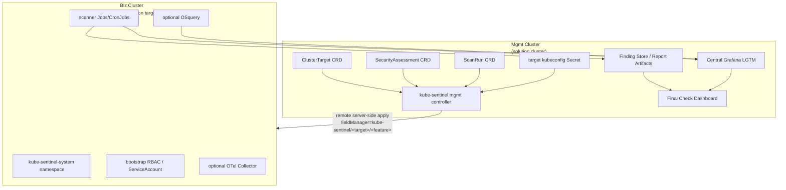

# Architecture

## Overview

kube-sentinel is centered on a management controller that runs in the Mgmt
Cluster and remotely applies assessment resources to Biz Clusters through
stored kubeconfigs.

Terminology:

| Term | Meaning |
| --- | --- |
| Mgmt Cluster | The cluster where the kube-sentinel solution is installed. It stores CRDs, controller, dashboard/API, finding store integration, and target credentials. |
| Biz Cluster | A business/application cluster that is inspected by kube-sentinel. It is a scan target, not a place where kube-sentinel CRDs or operators are installed. |

Biz Clusters do not run a per-cluster kube-sentinel operator and do not need the
kube-sentinel CRDs installed. They only need the namespace, RBAC, workload,
scanner, and optional telemetry resources that the Mgmt Cluster controller
applies remotely.

Primary custom resources live in the Mgmt Cluster:

| CRD | Purpose |
| --- | --- |
| `ClusterTarget` | Biz Cluster connection, namespace, capability, and output tenant configuration. |
| `SecurityAssessment` | Desired assessment template and selected target list. |
| `ScanRun` | One execution of an assessment against one or more targets. |

The management controller reconciles these CRs into remote Kubernetes objects,
central LGTM routing, normalized findings, and status conditions.

## Remote apply mode

Remote apply mode is the default architecture.



Design decisions:

- `ClusterTarget`, `SecurityAssessment`, and `ScanRun` exist only in the Mgmt
  Cluster.
- Biz Clusters do not install kube-sentinel CRDs.
- Biz Clusters do not run a kube-sentinel operator.
- The management controller uses each Biz Cluster's kubeconfig Secret to apply
  DaemonSets, Deployments, ConfigMaps, RBAC, Jobs, and CronJobs remotely.
- Remote objects cannot use ownerReferences back to Mgmt Cluster CRs.
  They must be tracked by labels and annotations.

## Target prerequisites

Each Biz Cluster must provide:

| Prerequisite | Purpose |
| --- | --- |
| `kube-sentinel-system` namespace | Default namespace for remote resources. It is created by a platform/bootstrap step before scans. |
| target kubeconfig or ServiceAccount token | Stored in the Mgmt Cluster and used by the management controller for remote apply. |
| bootstrap RBAC | Grants only the verbs/resources needed by enabled features. |
| image pull access | Pull scanner and optional collector images. |
| egress to central LGTM | Send findings, metrics, logs, or traces to central backends. |
| capability declaration | Records whether privileged workloads, hostPath, and BTF are available. |

Required target RBAC should be split by capability:

| Capability | Required access |
| --- | --- |
| Apply scanner resources | create/update/patch/delete Jobs, CronJobs, ConfigMaps, ServiceAccounts, Roles, RoleBindings |
| Apply optional collectors | create/update/patch/delete DaemonSets, Deployments, Services |
| Inspect applied config | get/list/watch Pods, Deployments, DaemonSets, StatefulSets, ReplicaSets, RBAC, ServiceAccounts, Services, Ingresses |
| Inspect nodes | get/list/watch Nodes when node or BTF capability checks are enabled |
| Secret references | inspect workload references only; do not read raw Secret data |

The target kubeconfig Secret is the most sensitive Mgmt Cluster asset. It
requires encryption at rest, narrow RBAC, rotation, and audit logging.

Namespace ownership decision:

- Default PoC behavior: the Biz Cluster `targetNamespace` is pre-created by a
  human or platform bootstrap process.
- The Mgmt Controller validates that `spec.targetNamespace` exists and records
  `NamespaceMissing` in `ClusterTarget.status` when it does not.
- The default Biz Cluster kubeconfig does not need `namespaces create/update`
  permission.
- Automatic namespace creation is a future/optional bootstrap capability. If
  enabled, it must be explicit on `ClusterTarget.spec.capabilities` and require
  separate RBAC review.

## Target registration and kubeconfig storage

Biz Clusters appear in the dashboard only after a `ClusterTarget` CR exists in
the Mgmt Cluster. The `ClusterTarget` stores non-secret metadata and a
reference to a kubeconfig Secret; it must not inline kubeconfig data.

Registration flow:

1. An operator creates or imports a restricted ServiceAccount in the Biz
   Cluster.
2. The target ServiceAccount token or kubeconfig is stored as a Mgmt Cluster
   Secret.
3. A `ClusterTarget` CR references that Secret through `spec.kubeconfigRef`.
4. The management controller validates connectivity and permissions.
5. The controller writes connection, capability, and inventory summary fields
   into `ClusterTarget.status`.
6. The dashboard cluster list reads `ClusterTarget` objects and status from the
   Mgmt Cluster, never kubeconfig Secret data.

Recommended Secret shape:

```yaml
apiVersion: v1
kind: Secret
metadata:
  name: dev-a-kubeconfig
  namespace: kube-sentinel-system
  labels:
    app.kubernetes.io/managed-by: kube-sentinel
    security.kube-sentinel.io/credential-type: kubeconfig
type: Opaque
data:
  kubeconfig: <base64 kubeconfig>
```

`ClusterTarget` should carry display and routing metadata only:

```yaml
apiVersion: security.kube-sentinel.io/v1alpha1
kind: ClusterTarget
metadata:
  name: dev-a
spec:
  displayName: dev-a
  environment: dev
  kubeconfigRef:
    namespace: kube-sentinel-system
    name: dev-a-kubeconfig
    key: kubeconfig
  targetNamespace: kube-sentinel-system
  namespaceAllowlist:
    - app
    - platform
  output:
    lgtmTenantID: dev-a
```

`ClusterTarget.status` should be the source for cluster list UI state:

| Status field | Purpose |
| --- | --- |
| `phase` | `Pending`, `Ready`, `Degraded`, `AuthFailed`, `Unreachable`, `PermissionDenied` |
| `lastValidatedAt` | Last successful connectivity and permission validation time |
| `kubernetesVersion` | Biz Cluster version from discovery |
| `capabilities` | Effective capability result for privileged, hostPath, BTF, egress, image pull |
| `namespaces` | Namespaces visible within the allowlist |
| `conditions[]` | Detailed validation failures and remediation hints |

Kubeconfig storage rules:

- Store kubeconfigs only in Mgmt Cluster Secrets or an external secret
  manager synced into Secrets.
- Enable Kubernetes encryption at rest for Secrets in the Mgmt Cluster.
- Grant Secret read access only to the kube-sentinel management controller and
  a narrow break-glass administrator role.
- Never expose kubeconfig data through dashboard APIs, logs, reports, status, or
  events.
- Rotate target credentials and record `status.lastCredentialRotationAt`.
- Prefer target ServiceAccount credentials with the minimum RBAC needed for the
  selected profiles.
- If a target is removed, delete or revoke the target credential and run
  label-based remote garbage collection.

## API examples

```yaml
apiVersion: security.kube-sentinel.io/v1alpha1
kind: ClusterTarget
metadata:
  name: dev-a
spec:
  displayName: dev-a
  environment: dev
  kubeconfigRef:
    namespace: kube-sentinel-system
    name: dev-a-kubeconfig
    key: kubeconfig
  targetNamespace: kube-sentinel-system
  namespaceAllowlist:
    - app
    - platform
  output:
    lgtmTenantID: dev-a
  capabilities:
    privilegedDaemonSet: false
    hostPath: false
    btf: false
---
apiVersion: security.kube-sentinel.io/v1alpha1
kind: SecurityAssessment
metadata:
  name: final-check-2026-06
spec:
  targets:
    - dev-a
  profiles:
    - SourceSecurity
    - ImageSupplyChain
    - KubernetesConfig
    - RBACAndSecretReference
    - BuildAndDeploy
```

## Main components

| Component | Responsibility |
| --- | --- |
| `ClusterTarget` CRD | Biz Cluster connection, target namespace, capability, and tenant configuration. |
| `SecurityAssessment` CRD | User-facing assessment template, scan profiles, features, and target selection. |
| `ScanRun` CRD | One execution record with per-target status, scan health, and final decision summary. |
| Management controller | Reconciles desired state, remotely applies target resources, performs label-based garbage collection, and updates status. |
| Feature registry | Builds enabled features in deterministic priority order. |
| Desired state store | Collects local management objects and remote target objects before apply. |
| Remote apply client | Uses target kubeconfig Secrets to apply resources to Biz Clusters. |
| Override layer | Applies global node-agent overrides and feature-specific overrides. |
| OTel config builder | Merges receiver/exporter fragments into Node Collector and Gateway configs. |
| Security assessment feature | Runs delivery artifact and applied cluster configuration scans, normalizes findings, and records scan health. |
| Dashboard model | Provides one Final Check Dashboard with Overview, Source & Secrets, Images & Integrity, Kubernetes Config & RBAC, Dockerfile & Scripts, Scan Health, and Exceptions & Remediation menus. |
| Feature packages | Own tool-specific defaults, config validation, resources, OTel fragments, and readiness checks. |

## Managed infrastructure boundary

The kube-sentinel management controller does not create Loki, Mimir, Tempo,
Grafana, or their storage backends.

The `otel_pipeline` feature manages only kube-sentinel collection components:

- OTel Node Collector DaemonSet and ConfigMap.
- OTel Gateway Deployment, Service, ConfigMap, and related RBAC.
- Pipeline wiring from enabled feature receiver fragments to the configured
  LGTM endpoints.

Loki, Mimir, Tempo, and Grafana are prerequisites. PoC installation assets may
live under `config/lgtm/`, but they are applied manually or by a separate
platform workflow during M1. The management controller reads target and
assessment output configuration and reports connection failures through
`ClusterTarget.status` and `ScanRun.status`; it must not reconcile LGTM backend
custom resources.

The `security_assessment` feature manages only assessment jobs, config, and
report volumes for the selected final-check scope. It may inspect delivery
artifacts and applied cluster configuration metadata, but it must not collect
raw Secret values.

## Feature priorities

| Priority | Feature | Reason |
| --- | --- | --- |
| 10 | `otel_pipeline` | Collection infrastructure must exist before sensors emit data. |
| 50 | `security_assessment` | Delivery artifact and applied cluster configuration findings should be normalized before dashboards evaluate delivery readiness. |
| 100 | `osquery` | Inventory sensor. |
| 200 | `trivy` | Delivery image vulnerability, SBOM, and digest findings depend on Trivy reports and normalized finding output. |

## Reconcile flow

1. Add finalizer to Mgmt Cluster CRs.
2. Load `ClusterTarget`, `SecurityAssessment`, and `ScanRun` specs.
3. Resolve target kubeconfig Secret and validate target capabilities.
4. Validate scan profiles, feature names, and feature config.
5. Build active features in priority order.
6. Ask each feature to contribute management-local and target-remote resources.
7. Collect OTel receiver/exporter fragments and generate configs.
8. Apply overrides.
9. Apply management-local objects using server-side apply.
10. Apply target-remote objects through the remote apply client.
11. Garbage collect disabled or stale remote resources by labels.
12. Assess per-target readiness and patch `ClusterTarget.status` /
    `ScanRun.status`.

## Override policy

Overrides are allowlisted, not arbitrary patches.

Allowed override fields:

| Path | Allowed fields |
| --- | --- |
| `override.nodeAgent` | `resources`, `nodeSelector`, `affinity`, `tolerations` |
| `override.otelGateway` | `resources`, `replicas`, `nodeSelector`, `affinity`, `tolerations` |
| `override.osquery` | `resources`, `nodeSelector`, `affinity`, `tolerations` |
| `override.trivy` | `resources`, `scanSchedule`, `severityThreshold` |

Forbidden override behavior:

- Adding arbitrary containers, init containers, volumes, hostPath mounts, service
  account names, image names, image pull policies, security contexts, commands,
  or arguments.
- Adding `tolerations: [{ operator: Exists }]`.
- Tolerating control-plane taints unless the operator is configured with an
  explicit installation-time allow-control-plane setting.
- Raising privileges beyond each feature's built-in security context.

Toleration validation must be implemented before applying overrides. Invalid
overrides set the relevant feature to `ConfigError` and must not be applied.

## HostPath policy

HostPath mounts are feature-owned and fixed by code. Overrides cannot add or
change them.

Minimum intended hostPath set:

| Feature | Path | Access | Purpose |
| --- | --- | --- | --- |
| `otel_pipeline` | `/var/log/pods` | read-only | Optional collection path for stdout-based findings or future sensors. |
| `otel_pipeline` | `/var/log/containers` | read-only | Runtime log symlink compatibility. |
| `otel_pipeline` | `/var/log/kube-sentinel` | read-write | Shared sensor file-log directory. |
| `osquery` | `/var/log/kube-sentinel/osquery` | read-write | OSquery result logs. |

Additional host paths require an architecture update and a security review.

## Ownership model

Remote objects are split by lifecycle.

| Lifecycle | Examples | Required labels | GC rule |
| --- | --- | --- | --- |
| Target-scoped | OTel Collector DaemonSet, OTel Gateway Deployment, OSquery DaemonSet, shared ConfigMaps, ServiceAccounts, Roles, RoleBindings | `target`, `feature`, `scope=target` | Reconcile by `target + feature`; do not delete during per-ScanRun cleanup. |
| Run-scoped | Security Assessment Jobs, report ConfigMaps, temporary scan volumes, per-run scanner resources | `target`, `scan-run`, `feature`, `scope=run` | Reconcile and delete by `target + scan-run + feature`. |

Target-scoped remote object labels:

```yaml
metadata:
  labels:
    app.kubernetes.io/managed-by: kube-sentinel
    security.kube-sentinel.io/target: <cluster-target-name>
    security.kube-sentinel.io/feature: <feature-id>
    security.kube-sentinel.io/scope: target
  annotations:
    security.kube-sentinel.io/spec-hash: <sha256>
```

Run-scoped remote object labels:

```yaml
metadata:
  labels:
    app.kubernetes.io/managed-by: kube-sentinel
    security.kube-sentinel.io/target: <cluster-target-name>
    security.kube-sentinel.io/scan-run: <scan-run-name>
    security.kube-sentinel.io/feature: <feature-id>
    security.kube-sentinel.io/scope: run
  annotations:
    security.kube-sentinel.io/spec-hash: <sha256>
```

Remote objects cannot use ownerReferences to Mgmt Cluster CRs. Garbage
collection must use lifecycle-specific label selectors.

Target-scoped GC:

```text
security.kube-sentinel.io/target=<target>
security.kube-sentinel.io/feature=<feature>
security.kube-sentinel.io/scope=target
```

Run-scoped GC:

```text
security.kube-sentinel.io/target=<target>
security.kube-sentinel.io/scan-run=<scan-run>
security.kube-sentinel.io/feature=<feature>
security.kube-sentinel.io/scope=run
```

Server-side apply field managers should include target, feature, and lifecycle:

```text
kube-sentinel/<target>/<feature-id>/target
kube-sentinel/<target>/<feature-id>/run
```

## Data routing

| Source | Collection path | LGTM destination | CTEM phase |
| --- | --- | --- | --- |
| OSquery | File log through OTel Node Collector | Loki `{category="inventory"}` + Mimir inventory counters | Scope |
| Trivy | Delivery image scan report from registry digest or image tar | Loki `{category="vulnerability"}` + Mimir vulnerability counters | Discovery / Priority |
| Security Assessment | Scanner reports and applied cluster configuration snapshot | Loki `{category="security_finding"}` + Mimir finding counters + report artifact | Discovery / Priority |

Dashboard menus should be derived from normalized finding categories rather than
scanner tool names:

| Menu | Finding categories |
| --- | --- |
| Overview | `scan_health`, Critical/High finding counters, exception-required counters |
| Source & Secrets | `sast`, `secret` |
| Images & Integrity | `image_vulnerability`, `integrity`, `sbom` |
| Kubernetes Config & RBAC | `kubernetes`, `rbac`, `secret_ref`, `network` |
| Dockerfile & Scripts | `dockerfile`, `script` |
| Scan Health | `scan_health` |
| Exceptions & Remediation | findings where `exception_required=true`, approved exceptions, expired exceptions |

## OTel resiliency policy

The OTel config builder must generate bounded failure behavior. LGTM endpoint
outages must not cause unbounded memory growth.

Required defaults:

- `memory_limiter` processor enabled in Node Collector and Gateway.
- `batch` processor enabled with bounded batch sizes.
- LGTM exporter timeout set explicitly.
- Exporter sending queue enabled with a bounded queue size.
- Retry enabled with finite backoff and finite max elapsed time.
- Data is dropped after retry exhaustion and reflected in collector metrics.
- Persistent disk queue is out of scope for the PoC unless explicitly enabled in
  a later production profile.

The config builder types should represent this explicitly, for example:

```go
type OTelExporterConfig struct {
    Endpoint          string
    Timeout          metav1.Duration
    QueueSize         int
    NumConsumers      int
    RetryInitial      metav1.Duration
    RetryMax          metav1.Duration
    RetryMaxElapsed   metav1.Duration
    MemoryLimitMiB    int
    MemorySpikeMiB    int
}
```

Operational status should surface export failures through OTel metrics and the
`otel_pipeline` feature condition.

## Mgmt controller RBAC

The controller needs two permission sets:

- Mgmt Cluster RBAC for kube-sentinel CRDs, target kubeconfig Secrets, status,
  reports, and dashboard/API integration.
- Biz Cluster RBAC embedded in each target kubeconfig for remote apply and
  read-only inspection.

Kubebuilder markers apply only to Mgmt Cluster permissions. Biz Cluster
permissions are documented as bootstrap RBAC and validated through
`ClusterTarget.status`.

Mgmt Cluster resources:

- `clustertargets`: get, list, watch, create, update, patch, delete
- `clustertargets/status`: get, update, patch
- `clustertargets/finalizers`: update
- `securityassessments`: get, list, watch, create, update, patch, delete
- `securityassessments/status`: get, update, patch
- `securityassessments/finalizers`: update
- `scanruns`: get, list, watch, create, update, patch, delete
- `scanruns/status`: get, update, patch
- `scanruns/finalizers`: update
- `secrets`: get
- `configmaps`: get, list, watch, create, update, patch, delete
- `events`: create, patch

Biz Cluster remote apply resources:

- `namespaces`: get, list, watch
- `nodes`: get, list, watch
- `pods`: get, list, watch
- `configmaps`: get, list, watch, create, update, patch, delete
- `secrets`: do not grant by default; inspect Secret references from workload
  specs without reading raw Secret data
- `services`: get, list, watch, create, update, patch, delete
- `serviceaccounts`: get, list, watch, create, update, patch, delete

Workload resources:

- `apps/daemonsets`: get, list, watch, create, update, patch, delete
- `apps/deployments`: get, list, watch, create, update, patch, delete
- `batch/jobs`: get, list, watch, create, update, patch, delete
- `batch/cronjobs`: get, list, watch, create, update, patch, delete

RBAC resources:

- `rbac.authorization.k8s.io/roles`: get, list, watch, create, update, patch, delete
- `rbac.authorization.k8s.io/rolebindings`: get, list, watch, create, update, patch, delete
- `rbac.authorization.k8s.io/clusterroles`: get, list, watch, create, update, patch, delete
- `rbac.authorization.k8s.io/clusterrolebindings`: get, list, watch, create, update, patch, delete

Trivy Operator `VulnerabilityReport` ingestion is a Next Version extension. The
current M6 scope uses delivery image scan reports from registry digests or image
tar artifacts.

Runtime event sensors are Next Version extensions. They are not part of the
current final-check assessment architecture.

Secrets are not read by default. The controller must not create or mutate LGTM
credentials in Biz Clusters. Applied cluster configuration assessment may
report Secret references, projected volumes, `env`/`envFrom`, and
ServiceAccount token automount settings, but it must not read or persist Secret
data.

## Status model

The Mgmt Cluster status model should expose target health and scan execution
separately.

`ClusterTarget.status`:

- `status.observedGeneration`
- `status.phase`: `Pending`, `Ready`, `Degraded`, `AuthFailed`,
  `Unreachable`, or `PermissionDenied`
- `status.lastValidatedAt`
- `status.lastCredentialRotationAt`
- `status.kubernetesVersion`
- `status.capabilities`
- `status.namespaces`
- `status.conditions[]`

`ScanRun.status`:

- `status.observedGeneration`
- `status.phase`: `Pending`, `Running`, `Completed`, `Failed`, or `Canceled`
- `status.artifactScan`: Code / Artifact Scan phase, timestamps, and conditions
- `status.clusterScan`: Biz Cluster Scan phase, timestamps, and conditions
- `status.features[]`
- `status.targets[]`
- `status.remoteResources[]`
- `status.finalDecision`

`SecurityAssessment.status`:

- `status.observedGeneration`
- `status.lastRunRef`
- `status.summary`

Feature status reasons should include:

- `Disabled`
- `Ready`
- `ConfigError`
- `ApplyError`
- `NotReady`

Unknown feature names are configuration errors and must not create resources.
