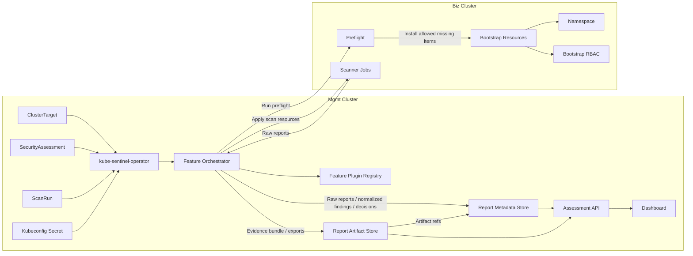

# 아키텍처

## 개요

kube-sentinel은 Mgmt Cluster에 설치되는 단일 `kube-sentinel-operator`를 중심으로 동작한다.
Biz Cluster에는 kube-sentinel operator와 CRD를 설치하지 않고, Mgmt operator가 저장된 kubeconfig를 사용해 검사에 필요한 리소스만
원격 적용한다.

용어:

| 용어 | 의미 |
| --- | --- |
| Mgmt Cluster | kube-sentinel 솔루션이 설치되는 cluster. CRD, operator, dashboard/API, metadata DB, Artifact Store 연동, target credential을 보관한다. |
| Biz Cluster | kube-sentinel이 검사하는 business/application cluster. 검사 대상이며 kube-sentinel CRD/operator 설치 대상이 아니다. |

Mgmt Cluster의 주요 구성:

- `kube-sentinel-operator`
  - `ClusterTarget` reconciler
  - `SecurityAssessment` reconciler
  - `ScanRun` reconciler
  - Feature orchestrator
  - Feature plugin registry
- Dashboard / API
- Metadata DB
- Artifact Store abstraction

Biz Cluster의 주요 구성:

- `kube-sentinel-system` namespace
- bootstrap RBAC
- scanner Job / ConfigMap / ServiceAccount
- optional Trivy Operator `VulnerabilityReport` read-only 조회

주요 custom resource는 Mgmt Cluster에만 존재한다.

| CRD | 목적 |
| --- | --- |
| `ClusterTarget` | Biz Cluster 접속 정보, namespace, capability, output tenant 설정. |
| `SecurityAssessment` | 검사 템플릿과 선택 target 목록. |
| `ScanRun` | 하나 이상의 target에 대해 실행되는 검사 실행 단위. |

Mgmt operator는 이 CR들을 assessment Job, read-only inspection, normalized finding, report artifact,
dashboard record, status condition으로 reconcile한다.

## Remote apply mode

Remote apply mode가 기본 아키텍처다.



설계 결정:

- `ClusterTarget`, `SecurityAssessment`, `ScanRun`은 Mgmt Cluster에만 존재한다.
- Biz Cluster에는 kube-sentinel CRD와 operator를 설치하지 않는다.
- Mgmt operator는 각 Biz Cluster의 kubeconfig Secret을 사용해 검사에 필요한 Job, ConfigMap, ServiceAccount, Role,
  RoleBinding만 원격 적용한다.
- 검사 전 preflight로 namespace, RBAC, image pull, report upload, Trivy Operator CRD 여부를 확인한다.
- 누락된 항목은 `설치 필요` 상태로 표시하고, 정책상 허용된 bootstrap 항목만 Mgmt operator가 설치한다.
- Remote apply는 finding과 report 생성을 위한 검사 리소스로 제한한다.
  고객 application workload, 기존 RBAC, Service, Ingress, Secret을 자동 개선하거나 수정하지 않는다.
- 검사 결과는 감사/재현성을 위한 immutable artifact와 dashboard/API 조회를 위한 metadata/index record로 나누어 저장한다.
- Remote object는 Mgmt Cluster CR을 향한 ownerReference를 사용할 수 없다.
  label과 annotation으로 추적한다.

## Middleware and version baseline

This baseline separates first-scope required middleware from optional inputs and Phase 2 extensions.
Versions are a PoC validation baseline as of 2026-06-18.
Implementation must pin exact tool versions in build scripts, container image tags, or scanner
baseline reports.
Do not treat floating tags such as `latest` as a valid final-check baseline.

### First-scope platform baseline

| Area | Component | Baseline version | Requirement |
| --- | --- | --- | --- |
| Mgmt Cluster | Kubernetes API server | `v1.36.2` validated, support `v1.34`-`v1.36` | Runs kube-sentinel CRDs, controller, target credential Secrets, Report Store integration, and dashboard/API. |
| Biz Cluster | Kubernetes API server | support `v1.34`-`v1.36` | Target cluster inspected through kubeconfig. No kube-sentinel CRDs or per-cluster operator are installed. |
| CLI | `kubectl` | match target minor, `v1.36.x` for validation | Used for preflight, manual validation, and troubleshooting. |
| Controller build | Go | `go.mod` directive `1.23.0`, built with Go `1.26.x` toolchain | Skeleton baseline. Bump in lockstep with controller-runtime if upgraded. |
| Controller scaffold | Kubebuilder layout | v4-compatible, hand-scaffolded (no `kubebuilder` CLI) | `operator/PROJECT` records the layout; codegen via `controller-gen`. |
| Controller runtime | `sigs.k8s.io/controller-runtime` | `v0.19.3` (k8s client libs `k8s.io/*` `v0.31.2`) | Reconciler, client, cache, server-side apply, status updates, envtest. |
| CRD generation | `controller-tools` / `controller-gen` | `v0.16.5` | CRD, RBAC marker, and deepcopy generation. |
| Local test API | `envtest` | Kubernetes `v1.31.x` | Controller tests pin envtest instead of depending on the developer machine. |
| Manifest rendering | Helm | `v4.2.2` validated | Renders customer charts and kube-sentinel installation manifests. |
| Manifest rendering | Kustomize | `v5.8.1` validated | Optional render path for Kustomize-based delivery manifests. |
| Utility CLI | `jq` | `1.8.1` validated | JSON report and status processing in scripts. |
| Utility CLI | `yq` | `v4.53.3` validated | YAML manifest, Helm values, and artifact input processing. |
| Result metadata | PostgreSQL | `18.x` recommended for product mode | Queryable index for ScanRun, Finding, FinalDecision, ExceptionReview, artifact metadata, and dashboard filters. |
| Result artifact | Artifact Store backend plugin | deployment-specific | SBOM, evidence bundle, scanner baseline, artifact-input manifest, exported human report 같은 파생·증적 산출물을 저장하는 추상화 계층. raw report와 normalized finding의 query 정본은 PostgreSQL이며 Artifact Store에 두지 않는다. 특정 backend에 고정하지 않는다. |

### First-scope scanner baseline

| Scan area | Component | Baseline version | Requirement |
| --- | --- | --- | --- |
| SAST | SonarQube Server | organization-approved LTA or managed SonarQube Cloud | Optional external integration. Semgrep/gosec remain the portable baseline. |
| SAST | Semgrep | `v1.167.0` | Source security rules and custom policies. |
| SAST | gosec | `v2.27.1` | Go-specific security anti-pattern detection. |
| Secret scan | Gitleaks | `v8.30.1` | Hardcoded secret, token, credential, and account detection. |
| Image CVE | Trivy | `v0.71.1` | Primary delivery image vulnerability and SBOM scanner. |
| Image CVE | Grype | `v0.114.0` | Secondary image vulnerability scanner or comparison source. |
| SBOM | Syft | `v1.45.1` | SBOM generation and package inventory. |
| Image signing | Cosign | `v3.1.1` | Sigstore-based signature verification when policy uses Cosign. |
| Image signing | Notation | `v1.3.2` | Notation-based signature verification when policy uses Notary Project. |
| Image digest | Crane / go-containerregistry | `v0.21.7` | Registry digest resolution and image metadata inspection. |
| Kubernetes policy | kube-linter | `v0.8.3` | Pod/workload security checks for rendered manifests. |
| Kubernetes policy | conftest / OPA | `v0.68.2` | Rego policy evaluation for Kubernetes YAML and RBAC. |
| Dockerfile | Hadolint | `v2.14.0` | Dockerfile risk checks. |
| Script | ShellCheck | `v0.11.0` | Shell script risk checks. |

### Artifact Store backend plugin

Artifact Store는 S3/MinIO에 고정하지 않는다.
제품 코드는 다음 interface에 의존하고, 실제 저장소는 backend plugin으로 선택한다.

```go
type ArtifactStore interface {
    PutArtifact(ctx context.Context, ref ArtifactRef, r io.Reader) error
    GetArtifact(ctx context.Context, ref ArtifactRef) (io.ReadCloser, error)
    ListArtifacts(ctx context.Context, prefix string) ([]ArtifactRef, error)
    DeleteArtifact(ctx context.Context, ref ArtifactRef) error
    GenerateDownloadURL(ctx context.Context, ref ArtifactRef) (string, error)
}
```

| Backend | 용도 |
| --- | --- |
| Filesystem | 로컬 PoC와 단일 노드 개발 환경 |
| S3-compatible | 일반 운영 환경의 object storage 연동 |
| MinIO | 사내망 PoC 또는 자체 object storage |
| SeaweedFS | 경량 분산 file/object storage. S3 호환 모드 또는 native filer API plugin으로 연동 가능 |
| NFS/PVC | 단순 내부망 배포와 폐쇄망 PoC |
| OCI artifact | 향후 evidence bundle 배포/보관 후보 |

Metadata DB(PostgreSQL)는 raw scanner output, normalized finding, scan health, final decision의 query
정본을 담당하고, Artifact Store는 감사와 재현성을 위한 파생·증적 산출물(SBOM, evidence bundle, scanner baseline,
artifact-input manifest, exported report)을 보관한다.
어떤 backend를 사용하더라도 artifact path, checksum, schema version, scanner baseline metadata는 동일하게 유지한다.

### Optional first-scope inputs

| Component | Baseline version | Requirement |
| --- | --- | --- |
| Trivy Operator | `v0.31.1` | Optional read-only `VulnerabilityReport` input only. kube-sentinel does not install or operate Trivy Operator in the first MVP. |
| Kyverno/Gatekeeper policy bundles | organization-approved policy version | Optional policy-pack input for `kubernetes_manifest`. First MVP baseline은 kube-linter/conftest이며 kube-sentinel은 Kyverno/Gatekeeper controller를 설치·운영하지 않는다. |
| Kubescape | organization-approved CLI version | Optional CLI-only scanner plugin input for `kubernetes_manifest`. First MVP baseline은 kube-linter/conftest를 교체하지 않는다. installed controller 형태는 "Biz Cluster에 operator를 두지 않는다" 원칙과 충돌하므로 채택하지 않는다. |
| rbac-police | organization-approved version | Optional CLI input for `rbac_review`. First MVP baseline은 conftest + read-only applied RBAC inspection이다. |
| Artifact Store backend | deployment-specific | Filesystem, S3-compatible, MinIO, SeaweedFS, NFS/PVC 등에서 선택한다. 코드와 API는 backend plugin interface 뒤에 둔다. |

### Phase 2 only

| Component | Status |
| --- | --- |
| OpenTelemetry Collector | Phase 2 telemetry/export extension. Not required for first-scope final-check reports. |
| Loki / Mimir / Tempo / Grafana LGTM | Phase 2 observability/export extension. Report Store remains the first MVP source of truth. |
| OSQuery | Phase 2 inventory extension. |
| Runtime sensors and long-running DaemonSets | Phase 2 runtime assessment extension. |

Version governance:

- Every `ScanRun` must record scanner binary versions, vulnerability DB dates, policy bundle
  versions, and image digests for scanner images.
- Scanner images must be pinned by digest in final-check environments.
- Tool upgrades must update this baseline or record an explicit exception in the evidence bundle.
- A scan with missing tool version or DB/rule baseline must produce `scan_health=Fail` or
  `scan_health=Warning` according to the final-check policy.
- AI remediation advisor가 활성화되면 model id/version과 prompt template hash를 scanner version과 동급으로 기록한다.
  model version 미기록 scan은 `scan_health=Warning`으로 처리한다.
  상세는 [AI_REMEDIATION.md](./AI_REMEDIATION.md).

## Target prerequisites

Each Biz Cluster must provide:

| Prerequisite | Purpose |
| --- | --- |
| `kube-sentinel-system` namespace | Remote resource 기본 namespace. 검사 전 preflight에서 존재 여부를 확인하고, bootstrap 정책이 허용하면 Mgmt operator가 생성한다. |
| target kubeconfig or ServiceAccount token | Stored in the Mgmt Cluster and used by the management controller for remote apply. |
| bootstrap RBAC | Grants only the verbs/resources needed by enabled features. |
| image pull access | Pull scanner images when remote scanner Jobs are enabled. |
| report store access | Persist raw reports, normalized findings, and final decisions in PostgreSQL; evidence bundles and exports in the Artifact Store. |
| capability declaration | Records whether scanner Jobs, read-only inspection, registry access, and report upload are available. |

Required target RBAC should be split by capability:

| Capability | Required access |
| --- | --- |
| Apply scanner resources | create/update/patch/delete kube-sentinel-owned Jobs, CronJobs, ConfigMaps, ServiceAccounts, Roles, RoleBindings in the target namespace |
| Inspect applied config | get/list/watch Pods, Deployments, DaemonSets, StatefulSets, ReplicaSets, RBAC, ServiceAccounts, Services, Ingresses |
| Secret references | inspect workload references only; do not read raw Secret data |

The target kubeconfig Secret is the most sensitive Mgmt Cluster asset.
It requires encryption at rest, narrow RBAC, rotation, and audit logging.

Bootstrap decision:

1. 검사 전 preflight를 실행한다.
2. namespace, RBAC, image pull, report upload, Trivy Operator CRD 여부를 확인한다.
3. 없는 항목은 `설치 필요` 또는 `CapabilityMissing` 상태로 표시한다.
4. `ClusterTarget.spec.bootstrapPolicy`가 허용한 항목만 Mgmt operator가 생성하거나 설정한다.
5. 고객 workload, 기존 Secret, 기존 Service/Ingress, 기존 application RBAC는 자동 수정하지 않는다.

| 구분 | 자동 설치 가능 | 자동 수정 금지 |
| --- | --- | --- |
| `kube-sentinel-system` namespace | 가능. 단, 명시적 bootstrap 허용 필요 | 고객 application namespace |
| kube-sentinel 전용 ServiceAccount/RBAC | 가능 | 기존 application ServiceAccount/RBAC |
| scanner Job/ConfigMap | 가능 | 기존 workload |
| imagePullSecret 참조 | 제한적으로 가능. Secret 이름 참조만 허용 | Secret 값 생성/수정 |
| Trivy Operator | 1차에서는 설치하지 않음 | 기존 operator 설정 변경 |

기본 Biz Cluster credential은 `namespaces create/update` 권한을 요구하지 않는다.
자동 namespace 생성이 필요한 환경은 별도 bootstrap capability와 RBAC review를 거쳐야 한다.

## Target registration and kubeconfig storage

Biz Clusters appear in the dashboard only after a `ClusterTarget` CR exists in the Mgmt Cluster.
The `ClusterTarget` stores non-secret metadata and a reference to a kubeconfig Secret; it must not
inline kubeconfig data.

Registration flow:

1. An operator creates or imports a restricted ServiceAccount in the Biz Cluster.
2. The target ServiceAccount token or kubeconfig is stored as a Mgmt Cluster Secret.
3. A `ClusterTarget` CR references that Secret through `spec.kubeconfigRef`.
4. The management controller validates connectivity and permissions.
5. The controller writes connection, capability, and discovery summary fields into
   `ClusterTarget.status`.
6. The dashboard cluster list reads `ClusterTarget` objects and status from the Mgmt Cluster, never
   kubeconfig Secret data.

Recommended Secret shape:

```yaml
apiVersion: v1
kind: Secret
metadata:
  name: dev-a-kubeconfig
  namespace: kube-sentinel-system
  labels:
    app.kubernetes.io/managed-by: kube-sentinel
    security.kube-sentinel.io/credential-type: kubeconfig
type: Opaque
data:
  kubeconfig: <base64 kubeconfig>
```

`ClusterTarget` should carry display and routing metadata only:

```yaml
apiVersion: security.kube-sentinel.io/v1alpha1
kind: ClusterTarget
metadata:
  name: dev-a
spec:
  displayName: dev-a
  environment: dev
  kubeconfigRef:
    namespace: kube-sentinel-system
    name: dev-a-kubeconfig
    key: kubeconfig
  targetNamespace: kube-sentinel-system
  namespaceAllowlist:
    - app
    - platform
  output:
    reportTenantID: dev-a
```

`ClusterTarget.status` should be the source for cluster list UI state:

| Status field | Purpose |
| --- | --- |
| `phase` | `Pending`, `Ready`, `Degraded`, `AuthFailed`, `Unreachable`, `PermissionDenied` |
| `lastValidatedAt` | Last successful connectivity and permission validation time |
| `kubernetesVersion` | Biz Cluster version from discovery |
| `capabilities` | Effective capability result for read-only inspection, scanner Job execution, report upload, image pull, and optional Trivy Operator reports |
| `namespaces` | Namespaces visible within the allowlist |
| `conditions[]` | Detailed validation failures and remediation hints |

Kubeconfig storage rules:

- Store kubeconfigs only in Mgmt Cluster Secrets or an external secret manager synced into Secrets.
- Enable Kubernetes encryption at rest for Secrets in the Mgmt Cluster.
- Grant Secret read access only to the kube-sentinel management controller and a narrow break-glass
  administrator role.
- Never expose kubeconfig data through dashboard APIs, logs, reports, status, or events.
- Rotate target credentials and record `status.lastCredentialRotationAt`.
- Prefer target ServiceAccount credentials with the minimum RBAC needed for the selected profiles.
- If a target is removed, delete or revoke the target credential and run label-based remote garbage
  collection.

## API examples

```yaml
apiVersion: security.kube-sentinel.io/v1alpha1
kind: ClusterTarget
metadata:
  name: dev-a
spec:
  displayName: dev-a
  environment: dev
  kubeconfigRef:
    namespace: kube-sentinel-system
    name: dev-a-kubeconfig
    key: kubeconfig
  targetNamespace: kube-sentinel-system
  namespaceAllowlist:
    - app
    - platform
  output:
    reportTenantID: dev-a
  capabilities:
    scannerJobs: true
    readOnlyInspection: true
    trivyOperatorReports: false
    hostPath: false
  bootstrapPolicy:
    installMissingNamespace: false
    installManagedRBAC: true
    installScannerResources: true
    attachImagePullSecretRef:
      name: scanner-pull-secret
---
apiVersion: security.kube-sentinel.io/v1alpha1
kind: SecurityAssessment
metadata:
  name: final-check-2026-06
spec:
  targets:
    - dev-a
  profiles:
    - SourceSecurity
    - ImageSupplyChain
    - KubernetesConfig
    - RBACAndSecretReference
    - BuildAndDeploy
```

## Main components

| Component | Responsibility |
| --- | --- |
| `ClusterTarget` CRD | Biz Cluster connection, target namespace, capability, and tenant configuration. |
| `SecurityAssessment` CRD | User-facing assessment template, scan profiles, features, and target selection. |
| `ScanRun` CRD | One execution record with per-target status, scan health, and final decision summary. |
| kube-sentinel operator | Mgmt Cluster에 설치되는 단일 operator. target 등록, assessment template, scan execution, status, remote apply, GC를 관리한다. |
| Feature orchestrator | ScanRun lifecycle 안에서 enabled feature를 priority 순서로 실행하고 preflight, desired state build, artifact collection, finding normalization을 조율한다. |
| Feature plugin registry | 새 검사 기능을 Reconciler 수정 없이 추가할 수 있도록 feature factory와 priority를 등록한다. |
| Desired state store | Collects local management objects and remote scan objects before apply. |
| Remote apply client | Uses target kubeconfig Secrets to apply resources to Biz Clusters. |
| Security assessment feature | Runs delivery artifact and applied cluster configuration scans, normalizes findings, and records scan health. |
| Trivy integration | Runs delivery image scans and optionally reads Trivy Operator VulnerabilityReports when the CRD exists in a Biz Cluster. |
| Report store | Stores raw reports, normalized findings, scan health, and final decisions in PostgreSQL; evidence bundles and other artifacts live in the Artifact Store. |
| Report metadata store | Stores queryable ScanRun, raw_reports, Finding, ScanHealth, FinalDecision, ExceptionReview, and artifact index records for dashboard/API retrieval. |
| Report artifact store | Stores SBOMs, digest reports, scanner baselines, artifact input manifests, exported reports, and evidence bundles. raw scanner reports and normalized findings are stored in PostgreSQL, not here. |
| Assessment API | Reads report metadata and artifact references for dashboard, report download, and review workflows. |
| Dashboard model | Provides one Final Check Dashboard with Overview, Targets, Assessments, Findings, Reports, and Governance views. |

## Assessment reliability layer

Scanner execution is not enough for a final-check product.
The first MVP must also preserve the information required to explain why a scan is reliable,
reproducible, and safe to review.

Required first-scope support features:

| Support feature | Architecture responsibility |
| --- | --- |
| Target preflight check | Separate target environment failures from actual security findings before Biz Cluster scans run. |
| Artifact input manifest | Provide a reproducible declaration of source paths, images, digest lists, manifests, RBAC, Dockerfiles, and scripts. `SecurityAssessment.spec.artifactInput`으로 선언하고, Code / Artifact Scan Mgmt-local Job의 init container가 `emptyDir` 공유 volume으로 전달하며 preflight에서 존재·checksum을 검증한다. |
| Scanner version / DB baseline capture | Store scanner versions, vulnerability DB dates, and policy/rule versions with each ScanRun. |
| Finding stable ID / deduplication | Generate deterministic IDs and avoid duplicate counts across repeated scans or Trivy input paths. |
| Secret redaction guard | Block raw Secret values from reports, logs, dashboard records, and evidence bundles. |
| Evidence bundle export | Package raw reports, normalized findings, scan health, final decision, and exception candidates for review. |
| Exception review artifact | Track owner, reason, expiry, and approval status for findings that require exception review. |
| Scan health summary | Treat scanner errors, unsupported targets, stale baselines, and missing artifacts as reportable failures. |

Optional first-scope support features are documented in
[ASSESSMENT_SUPPORT_FEATURES.md](./ASSESSMENT_SUPPORT_FEATURES.md).
Trivy Operator `VulnerabilityReport` is one of those optional inputs and remains inside the
first-scope architecture when the CRD and read-only permission are already available.

## Managed infrastructure boundary

The kube-sentinel management controller does not create or manage customer application
infrastructure.
It also does not require Loki, Mimir, Tempo, or a full LGTM stack for the first MVP.

The first MVP stores assessment outputs in a split Report Store:

- Report Metadata Store (PostgreSQL) for queryable ScanRun, raw_reports, Finding, ScanHealth,
  FinalDecision, ExceptionReview, and artifact index records.
- Report Artifact Store for SBOMs, integrity reports, scanner baselines, artifact input manifests,
  exported human reports, and evidence bundles.
- Assessment API for loading metadata records, resolving artifact references, and serving
  dashboard/report download requests.

Grafana LGTM, OTel collectors, long-running sensors, and runtime telemetry are Phase 2 telemetry
extensions.
If enabled later, they must be designed as an optional export path from normalized findings and
report events, not as the primary source of truth for final-check results.

The `security_assessment` feature manages only assessment jobs, config, and report volumes for the
selected final-check scope.
It may inspect delivery artifacts and applied cluster configuration metadata, but it must not
collect raw Secret values.

## Feature-as-Plugin architecture

검사 기능은 Reconciler에 하드코딩하지 않는다.
각 기능은 Feature plugin으로 구현하고 registry에 자기 등록한다.
Reconciler는 workflow, status, remote apply, GC만 관리하고 scanner별 세부 로직은 Feature가 담당한다.

```go
type Feature interface {
    ID() string
    Priority() int
    Validate(ctx FeatureContext) []Condition
    Preflight(ctx FeatureContext) []CheckResult
    Build(ctx FeatureContext) DesiredState
    Collect(ctx FeatureContext) []ArtifactRef
    Normalize(ctx FeatureContext) []Finding
}
```

Feature별 책임:

| Feature | 역할 |
| --- | --- |
| `target_preflight` | kubeconfig, API reachability, namespace, RBAC, image pull, report upload, optional CRD 상태 확인 |
| `bootstrap` | 정책상 허용된 namespace/RBAC/scanner resource bootstrap 생성 |
| `source_security` | SonarQube/Semgrep/gosec 기반 source security finding 생성 |
| `secret_scan` | Gitleaks 기반 hardcoded secret, token, credential 탐지 |
| `image_vulnerability` | Trivy/Grype 기반 delivery image CVE finding 생성 |
| `image_integrity` | digest, signature, approved digest list 검증 |
| `sbom` | Syft/Trivy SBOM 생성 및 artifact 저장 |
| `kubernetes_manifest` | Helm/YAML/kube-linter/conftest 기반 manifest finding 생성 |
| `applied_cluster_config` | Biz Cluster read-only workload/securityContext/volume/image 설정 검사 |
| `rbac_review` | RBAC 과권한, wildcard, cluster-admin binding 검사 |
| `dockerfile_scan` | Hadolint 기반 Dockerfile 위험 설정 finding 생성 |
| `script_scan` | ShellCheck 기반 deployment script 위험 finding 생성 |
| `secret_reference` | Secret raw value 없이 env/envFrom/volume/ServiceAccount token reference 검사 |
| `trivy_operator_reports` | 기존 Trivy Operator `VulnerabilityReport` 선택 read-only 수집 |
| `remediation_enrichment` | (선택, 기본 OFF) final decision 확정 후 AI 조치 가이드 advisory 생성. 상세는 [AI_REMEDIATION.md](./AI_REMEDIATION.md) |
| `report_export` | final report와 evidence bundle 생성 |

Priority 기본값:

| Priority | Feature | 이유 |
| --- | --- | --- |
| 10 | `target_preflight` | target 환경 실패와 scanner finding을 먼저 분리 |
| 20 | `bootstrap` | 허용된 누락 리소스를 검사 전에 준비 |
| 50 | `source_security`, `secret_scan` | code/artifact finding을 먼저 생성 |
| 100 | `image_vulnerability`, `image_integrity`, `sbom` | image digest 기준 CVE/SBOM/무결성 finding 생성 |
| 150 | `kubernetes_manifest`, `rbac_review`, `dockerfile_scan`, `script_scan` | 납품 manifest/RBAC/Dockerfile/script 정책 점검 |
| 200 | `applied_cluster_config`, `secret_reference`, `trivy_operator_reports` | Biz Cluster 적용 상태와 선택 입력 정규화 |
| 250 | `remediation_enrichment` | final decision 확정 후 AI 조치 가이드 생성 (선택, 기본 OFF) |
| 300 | `report_export` | 모든 finding과 scan health를 종합해 report/evidence 생성 |

### Profile / features → registry feature ID 매핑 (정본)

`SecurityAssessment.spec.profiles[]`는 registry feature ID **base set**을 결정하고, `spec.features[]`는
umbrella 확장·enable/disable·config override를 적용한다.
아래 표가 profile→registry feature ID→`findings.category` 단일 정본이며, `category` 값은
[DATABASE.md](./DATABASE.md) `findings.category` enum과 일치한다 (feature ID
`image_integrity`/`secret_reference`/`source_security`와 category `integrity`/`secret_ref`/`sast`는
의미는 같고 표기가 다름에 유의).

| `spec.profiles[]` 값 | Workflow | enabled registry feature ID | 생성 `findings.category` |
|---|---|---|---|
| `SourceSecurity` | Code / Artifact Scan | `source_security`, `secret_scan` | `sast`, `secret` |
| `ImageSupplyChain` | Code / Artifact Scan | `image_vulnerability`, `image_integrity`, `sbom` | `image_vulnerability`, `integrity`, `sbom` |
| `KubernetesConfig` | Code / Artifact Scan | `kubernetes_manifest`, `rbac_review` | `kubernetes`, `rbac` |
| `BuildAndDeploy` | Code / Artifact Scan | `dockerfile_scan`, `script_scan` | `dockerfile`, `script` |
| `RBACAndSecretReference` | Biz Cluster Scan | `applied_cluster_config`, `rbac_review`, `secret_reference` | `kubernetes`, `rbac`, `secret_ref`, `network` |

umbrella `features[].name` 확장:

| umbrella `name` | registry feature ID |
|---|---|
| `trivy` | `image_vulnerability`, `image_integrity`, `sbom`, `trivy_operator_reports` |
| `security_assessment` | `source_security`, `secret_scan`, `kubernetes_manifest`, `rbac_review`, `dockerfile_scan`, `script_scan`, `applied_cluster_config`, `secret_reference` |

`scan_health`는 특정 profile이 아니라 scanner pipeline 전반의 실패에서 생성되는 공통 category이므로 위 표에 행별로 넣지 않는다.
`target_preflight`/`bootstrap`/`report_export`는 profile과 무관한 lifecycle feature이고,
`trivy_operator_reports`는 `ImageSupplyChain`과 target capability 허용 시, `remediation_enrichment`는
`aiRemediation.enabled=true`일 때만 enabled된다.

**features 병합 규칙** — orchestrator는 다음 순서로 enabled feature set을 deterministic하게 resolve한다.

1. `ScanRun.spec.profiles[]`가 비어 있지 않으면 `SecurityAssessment.spec.profiles[]` 대신 사용한다(override).
2. effective profiles를 위 표로 registry feature ID 집합(base set)으로 union한다.
   중복 profile은 한 번만 적용한다.
3. `features[].name`을 umbrella 표로 registry feature ID 목록으로 확장한다.
4. `features[].enabled=true`는 base set에 추가(∪), `enabled=false`는 제거(−)한다.
5. `features[].config`는 해당 feature에 항상 우선 적용한다(profile 기본 config override).
   동일 feature ID가 여러 번이면 마지막 `features[]` 항목이 이긴다.
6. 최종 enabled set = (profiles 확장 ∪ `features[].enabled=true`) − (`features[].enabled=false`).
   priority 오름차순, 같은 priority는 feature ID 사전순으로 정렬한다.

umbrella 명칭·registry feature ID·profile 매핑 표 어디에도 없는 `features[].name` 또는 `profiles[]` 값은
`ConfigError`로 status(`status.features[].reason=ConfigError` 또는 `status.conditions`)에 기록하고 해당 항목만
무시한다.
unknown 항목 하나가 전체 scan을 실패시키지 않으며, 나머지 valid feature는 정상 실행한다.

## Reconcile flow

1. Mgmt Cluster CR에 finalizer를 추가한다.
2. `SecurityAssessment`를 로드한다.
3. 선택된 `ClusterTarget`을 로드한다.
4. `ScanRun` 실행 context를 생성한다.
5. `profiles[]`를 매핑 정본 표로 base set으로 확장하고 `features[]`(enable/disable·config override)와 병합해 enabled
   feature를 deterministic하게 resolve한 뒤, priority → feature ID 사전순으로 정렬한다.
   unknown profile/feature는 `ConfigError`로 기록하고 제외한다.
   5.5.
   ScanRun `metadata.annotations`의 `security.kube-sentinel.io/retry-scope`(backend `PATCH
   /api/v1/scan-runs/{id}/retry`가 patch)가 있으면 부분 재실행 분기로 진입한다.
   `ArtifactOnly`는 `status.artifactScan`만, `ClusterOnly`는 `status.clusterScan`만 `Pending`으로 되돌리고 나머지
   phase·이미 저장된 finding은 보존한다.
   `FinalDecisionOnly`는 두 scan phase를 재실행하지 않고 상관 분석/finalDecision 재계산만 수행한다.
   `Full` 또는 annotation 없음(최초 생성)은 전체 phase를 실행한다.
   재실행으로 생성된 finding은 `findings`에 finding_id 기준 멱등 upsert되며(I-8 규칙), reconcile 완료 후 reconciler가
   retry-scope annotation을 observed 처리(clear)한다.
6. feature별 `Validate()`를 실행한다.
7. feature별 `Preflight()`를 실행해 target 환경 실패를 scanner finding과 분리한다.
8. bootstrap 정책상 허용된 누락 항목만 `Build()` 결과에 포함한다.
9. feature별 `Build()`로 Code / Artifact Scan은 Mgmt-local Job desired state(artifact-fetch init
   container + input/output `emptyDir`)를, Biz Cluster Scan은 read-only inspection과 옵션 Biz-remote
   scanner Job desired state를 분리 생성한다.
10. Mgmt-local object(Code / Artifact Job 포함)를 server-side apply로 적용한다.
11. Biz Cluster Scan용 bootstrap 또는 옵션 remote scanner object만 remote apply client로 적용한다.
12. Mgmt-local Job·Biz read-only inspection·옵션 remote scanner Job에서 raw report를 수집해 PostgreSQL
    `raw_reports`에 저장한다(Artifact Store에 raw 정본 경로를 만들지 않음 — §Runner placement and artifact input
    delivery).
13. feature별 `Collect()`로 artifact reference를 수집한다.
14. feature별 `Normalize()`로 normalized finding과 scan health를 생성한다.
15. Code / Artifact Scan과 Biz Cluster Scan 결과를 상관 분석하고 final decision을 확정한다.
16. Evidence Bundle 내용과 Exception Review 후보를 생성한다.
    evidence bundle 생성 시 `findings`에 저장될 normalized finding set에서 `normalized/findings.jsonl`
    immutable snapshot을 준비한다.
17. queryable ScanRun, raw scanner output(`raw_reports`), normalized finding(`findings`), scan
    health, 확정된 final decision, exception review row를 PostgreSQL Report Metadata Store에 upsert한다.
18. SBOM, scanner baseline, artifact-input manifest, exported report, evidence bundle 같은 파생·증적 산출물을
    Report Artifact Store에 기록하고 `artifact_index` row를 upsert한다.
19. disabled/stale remote resource를 label 기반으로 GC한다.
20. `ClusterTarget.status`와 `ScanRun.status`를 갱신한다.

## Runner placement and artifact input delivery

Runner placement는 검사 그룹이 deterministic하게 결정하므로 `runnerPolicy`/`placement` CRD 필드를 추가하지 않는다.
Code / Artifact Scan은 항상 Mgmt-local Job이고, Biz Cluster Scan은 항상 Mgmt operator read-only
inspection(+옵션 remote scanner Job)이다.

| Workflow | runner 위치 | 생성 주체 | raw report 수집 |
|---|---|---|---|
| Code / Artifact Scan | Mgmt Cluster Mgmt-local Job (`kube-sentinel-system`) | Mgmt operator SSA | Job 출력 → operator `Collect()` → PostgreSQL `raw_reports` |
| Biz Cluster Scan (read-only) | Mgmt operator 프로세스(Biz kubeconfig) | Mgmt operator | API snapshot → PostgreSQL `raw_reports` |
| Biz Cluster Scan (optional scanner Job) | Biz Cluster remote Job | Mgmt operator remote SSA | Job 출력 → operator `Collect()` → PostgreSQL `raw_reports` |

### Artifact input 전달 규약

Code / Artifact Scan은 `SecurityAssessment.spec.artifactInput`(`sourceRef`/`imageList`/
`digestList`/`manifestRef`)을 Mgmt-local Job의 init container가 `emptyDir`(또는 run-scoped PVC) 공유
volume으로 전달하고, scanner container는 그 volume을 read-only로 mount한다.
Biz Cluster에는 artifact 원문을 복제하지 않는다.

1. **Preflight**: `artifactInput` 참조(path/artifactStorePath/imageList/digestList) 존재와, `checksum`이
   있으면 fetch 전후 digest 일치를 검증한다.
   누락·checksum 불일치는 `scan_health=Fail`(필수 산출물 누락)로 기록하고 `ScanRun.status.artifactScan`을 `Failed`로 둔다.
2. **Staging(init container)** — `emptyDir`(또는 run-scoped PVC) 공유 volume:

| `ArtifactInputSpec` 필드 | 전달 방식 |
|---|---|
| `sourceRef.path` / `manifestRef.path` | operator가 준비한 입력 mount(PVC 등)에서 `emptyDir`로 복사 |
| `sourceRef.artifactStorePath` / `manifestRef.artifactStorePath` | Artifact Store에서 fetch 후 checksum 검증 |
| `imageList[].tarPath` | offline image tar를 `emptyDir`로 fetch |
| `imageList[].image` / `digestList[]` | registry digest 조회·pull(registry credential 사용) |

3. **Scanner container**는 staging mount만 읽고, raw output은 PostgreSQL `raw_reports`에 저장한다(저장 정본은
   PostgreSQL).

Reconciler는 scanner별 세부 구현을 알지 않는다.
새 scanner 또는 저장소 backend는 Feature plugin 또는 Artifact Store backend plugin으로 추가하며, Reconciler의 핵심
workflow는 변경하지 않는다.

## Scan resource configuration policy

Scan resource configuration is allowlisted, not arbitrary patches.

Allowed scan resource config fields:

| Path | Allowed fields |
| --- | --- |
| `scanResources.securityAssessment` | `resources`, `ttlSecondsAfterFinished`, `nodeSelector`, `tolerations` |
| `scanResources.trivy` | `resources`, `scanSchedule`, `severityThreshold`, `useOperatorReports` |

Forbidden behavior:

- Adding arbitrary containers, init containers, volumes, hostPath mounts, service account names,
  image names, image pull policies, security contexts, commands, or arguments.
- Adding `tolerations: [{ operator: Exists }]`.
- Tolerating control-plane taints unless the assessment is configured with an explicit
  installation-time allow-control-plane setting.
- Raising privileges beyond each scan job's built-in security context.

Toleration validation must be implemented before applying scan resource config.
Invalid config sets the relevant workflow to `ConfigError` and must not be applied.

## HostPath policy

HostPath mounts are not required for the first MVP.
Code / Artifact Scan runs as a Mgmt-local Job and stages `artifactInput` through an init container
and an `emptyDir` (or run-scoped PVC) shared volume; Biz Cluster Scan runs through Kubernetes API
read-only inspection and an optional allowed remote scanner Job.
hostPath mounts are not used.
Any future hostPath usage requires an architecture update, explicit customer approval, and a
security review.

## Ownership model

Remote objects are split by lifecycle.

| Lifecycle | Examples | Required labels | GC rule |
| --- | --- | --- | --- |
| Target-scoped | Shared ConfigMaps, ServiceAccounts, Roles, RoleBindings | `target`, `feature`, `scope=target` | Reconcile by `target + feature`; do not delete during per-ScanRun cleanup. |
| Run-scoped | Security Assessment Jobs, report ConfigMaps, temporary scan volumes, per-run scanner resources | `target`, `scan-run`, `feature`, `scope=run` | Reconcile and delete by `target + scan-run + feature`. |

Target-scoped remote object labels:

```yaml
metadata:
  labels:
    app.kubernetes.io/managed-by: kube-sentinel
    security.kube-sentinel.io/target: <cluster-target-name>
    security.kube-sentinel.io/feature: <feature-id>
    security.kube-sentinel.io/scope: target
  annotations:
    security.kube-sentinel.io/spec-hash: <sha256>
```

Run-scoped remote object labels:

```yaml
metadata:
  labels:
    app.kubernetes.io/managed-by: kube-sentinel
    security.kube-sentinel.io/target: <cluster-target-name>
    security.kube-sentinel.io/scan-run: <scan-run-name>
    security.kube-sentinel.io/feature: <feature-id>
    security.kube-sentinel.io/scope: run
  annotations:
    security.kube-sentinel.io/spec-hash: <sha256>
```

Remote objects cannot use ownerReferences to Mgmt Cluster CRs.
Garbage collection must use lifecycle-specific label selectors.

Target-scoped GC:

```text
security.kube-sentinel.io/target=<target>
security.kube-sentinel.io/feature=<feature>
security.kube-sentinel.io/scope=target
```

Run-scoped GC:

```text
security.kube-sentinel.io/target=<target>
security.kube-sentinel.io/scan-run=<scan-run>
security.kube-sentinel.io/feature=<feature>
security.kube-sentinel.io/scope=run
```

Server-side apply field managers should include target, feature, and lifecycle:

```text
kube-sentinel/<target>/<feature-id>/target
kube-sentinel/<target>/<feature-id>/run
```

## Result persistence and routing

Assessment data is written to both storage layers.
The artifact layer preserves the evidence; the metadata layer serves dashboard/API queries.

| Source | Input path | Artifact Store write | Metadata Store write | Decision phase |
| --- | --- | --- | --- | --- |
| Trivy | Delivery image scan report from registry digest, image tar, or optional VulnerabilityReport | SBOM, integrity report, evidence bundle export | `raw_reports`, `image_vulnerability`, `sbom`, `integrity` finding rows and artifact references | Discovery / Priority |
| Security Assessment | Scanner reports and applied cluster configuration snapshot | applied snapshot, scanner baseline, evidence bundle export | `raw_reports`, `sast`, `secret`, `kubernetes`, `rbac`, `dockerfile`, `script`, `scan_health`, final decision, exception review rows | Discovery / Priority / Validation |
| Final report | Final decision and linked evidence | Markdown/PDF/HTML export and evidence bundle | report index row with artifact references | Validation / Exception Review |

Dashboard menus should be decision-oriented.
Scanner categories should appear as tabs or filters inside the larger menu groups, not as top-level
navigation.

| Top-level menu | Primary categories and data |
| --- | --- |
| Overview | final decision, `scan_health`, Critical/High counters, exception-required counters |
| Targets | `ClusterTarget.status`, connectivity, namespace allowlist, capability status |
| Assessments | Code / Artifact workflow, Biz Cluster workflow, retry/resume state |
| Findings | `sast`, `secret`, `image_vulnerability`, `integrity`, `sbom`, `kubernetes`, `rbac`, `secret_ref`, `network`, `dockerfile`, `script` |
| Reports | final-check report, raw reports, normalized findings, scan health summary, evidence bundle |
| Governance | findings where `exception_required=true`, approved exceptions, expired exceptions, remediation tracking |

## Report store policy

The Report Store is the first MVP source of truth.
It must preserve enough evidence to reproduce the final decision without requiring a telemetry
backend.
Report Artifact Store는 backend plugin으로 교체 가능해야 하며, S3/MinIO 전용 구현에 의존하면 안 된다.
SeaweedFS는 S3-compatible backend 또는 native filer backend 중 하나로 붙일 수 있다.

Required defaults:

- Store raw scanner reports in PostgreSQL `raw_reports`, separate from normalized findings.
- Store normalized findings in PostgreSQL `findings` with stable `finding_id` values.
- Store scan health records for scanner errors, skipped scans, unsupported targets, stale DB/rule
  baselines, and missing artifacts.
- Store final decision summaries with links to the ScanRun, target, artifacts, exception candidates,
  and evidence bundle.
- Do not store raw Secret values.
- Keep report artifact paths stable across dashboard, export, and audit views.
- Treat dashboard records as read models derived from PostgreSQL query tables; evidence bundle
  exports are immutable snapshots, not the only copy of the assessment result.

### Result storage format

> 전체 테이블 DDL: [docs/DATABASE.md](./DATABASE.md)

저장 모델은 PostgreSQL과 Artifact Store를 역할별로 분리한다.

- PostgreSQL: raw scanner 분석 결과, normalized finding, scan health, final decision, exception review,
  artifact index.
  모든 dashboard/API 쿼리는 PostgreSQL에서 수행한다.
- Artifact Store: SBOM(CycloneDX), evidence bundle, human report, scanner baseline,
  artifact-input.yaml.
  대용량·표준 포맷·배포 증적 산출물을 보관한다.

PostgreSQL에서 JSONB를 사용하는 이유:
- `raw_reports.data JSONB` + GIN 인덱스로 scanner 출력 내부 필드를 직접 조회할 수 있다.
- TOAST 자동 오프로드로 대형 JSONB가 row scan 속도를 저하시키지 않는다.
- `TEXT[]` 네이티브 타입으로 `target_names`, `namespace_allowlist` 등 배열 필드를 별도 테이블 없이 저장할 수 있다.
- MariaDB는 GIN 인덱스와 ARRAY 타입을 지원하지 않으므로 이 설계에서는 PostgreSQL만 사용한다.

Recommended formats:

| Data | Format | Storage | Reason |
| --- | --- | --- | --- |
| Raw scanner output | JSON 또는 SARIF → JSONB. 비구조화 text → TEXT | PostgreSQL `raw_reports` | GIN 인덱스로 scanner 출력 내부 쿼리 가능. 재정규화(parser 변경 후 재처리) 가능. |
| Normalized findings | `security.finding/v1` JSON Schema, one row per finding | PostgreSQL `findings` | severity, category, scanner, namespace, exception_status 필터 및 집계. |
| Finding index | PostgreSQL rows with indexed columns plus `details JSONB` | PostgreSQL `findings` | Fast dashboard filters. |
| Scan health | PostgreSQL row + `details JSONB` | PostgreSQL `scan_health` | Scanner failure and missing-artifact states must be queryable. |
| Final decision | `security.finalDecision/v1` object `{status, reasons[], decidedAt}`, JSONB snapshot in `scan_runs.summary`; `status` is projected to the `scan_runs.final_decision` column | PostgreSQL `scan_runs` | Pass/Fail/Warning, failure reasons, and counters queryable without join. |
| Exception review | PostgreSQL rows + status machine | PostgreSQL `exception_reviews` | Queryable by status, expiry, owner. |
| SBOM | CycloneDX JSON; SPDX JSON accepted | Artifact Store | 수 MB 표준 포맷 파일. digest 기준 경로로 저장. |
| Image digest/signature report | `security.imageIntegrity/v1` JSON | Artifact Store + `artifact_index` row | digest, verification result, key reference. |
| Evidence bundle | `tar.gz` with manifest, normalized findings export, final decision, exception review, checksums | Artifact Store | 배포/검수 증적 패키지. DB가 없어도 감사 가능. |
| Human report | Markdown source, optional PDF/HTML (`artifact_index.artifact_type='human_report'`) | Artifact Store | 사람이 읽는 최종 보고서. PDF는 문서 정보·개선 권고 요약/상세·예외 검토·승인 이력·만료 예정 섹션으로 구성한다. raw JSON/SARIF/TXT/SBOM은 PDF에 병합하지 않고 `raw_reports`/download API로 연결한다. DB와 evidence bundle이 source of truth이며 PDF는 그 파생물이다. |
| Scanner baseline | JSON (scanner version, DB date, rule hash) | Artifact Store + `artifact_index` row | 재현성 보장. |
| Artifact input manifest | YAML | Artifact Store | scan 입력 재현 선언. |

### raw_reports 테이블 스키마

```sql
CREATE TABLE raw_reports (
    id           BIGSERIAL    PRIMARY KEY,
    scan_run_id  VARCHAR(255) NOT NULL REFERENCES scan_runs(id),
    scanner      VARCHAR(100) NOT NULL,   -- trivy, semgrep, gitleaks, grype, kube-linter, ...
    target_name  TEXT,                    -- image ref, file path, k8s resource name
    format       VARCHAR(20)  NOT NULL,   -- json, sarif, text
    data         JSONB,                   -- format=json or sarif
    data_text    TEXT,                    -- format=text (비구조화 fallback)
    created_at   TIMESTAMPTZ  NOT NULL
);
CREATE INDEX idx_raw_reports_scanrun  ON raw_reports(scan_run_id, scanner);
CREATE INDEX idx_raw_reports_data_gin ON raw_reports USING GIN (data)
    WHERE data IS NOT NULL;
```

scanner별 저장 포맷:

| Scanner | 출력 포맷 | `format` 값 | 비고 |
| --- | --- | --- | --- |
| Trivy (CVE/config) | JSON | `json` | `--format json` |
| Grype | JSON | `json` | `--output json` |
| Semgrep | SARIF 또는 JSON | `sarif` / `json` | `--sarif` or `--json` |
| gosec | SARIF 또는 JSON | `sarif` / `json` | `-fmt sarif` |
| Gitleaks | JSON | `json` | `--report-format json` |
| kube-linter | JSON | `json` | `--format json` |
| conftest | JSON | `json` | `--output json` |
| Hadolint | JSON 또는 SARIF | `json` / `sarif` | `--format json` |
| ShellCheck | JSON 또는 SARIF | `json` / `sarif` | `--format json` |
| Cosign/Notation | JSON | `json` | verification result |
| Crane | JSON | `json` | digest metadata |

Normalized `findings.jsonl` is an evidence-bundle export generated from PostgreSQL `findings`;
PostgreSQL `findings` is the canonical query source.
Each line must contain at least:

```json
{
  "schema_version": "security.finding/v1",
  "finding_id": "stable-id",
  "scan_run_id": "final-check-2026-06-001",
  "scanner": "trivy",
  "category": "image_vulnerability",
  "severity": "Critical",
  "target_type": "image",
  "target_name": "registry.example.com/app/api",
  "image_digest": "sha256:...",
  "rule_id": "CVE-2026-0000",
  "message": "finding summary",
  "remediation": "upgrade package or approve exception",
  "exception_required": true,
  "scan_status": "Fail",
  "raw_report_id": 42,
  "created_at": "2026-06-18T00:00:00Z"
}
```

Artifact path convention:

raw scanner output은 PostgreSQL `raw_reports` 테이블에 저장하므로 `raw/` 경로는 Artifact Store에 없다.
Artifact Store에는 SBOM, evidence bundle, human report, scanner baseline, artifact input manifest만
보관한다.

```text
reports/
  <assessment-name>/
    <scan-run-id>/
      manifest.json                            # artifact index, checksums
      sbom/<image-digest>.cyclonedx.json       # SBOM (Artifact Store 전용)
      integrity/<image-digest>.json            # image digest/signature report
      exceptions/exception-review.yaml         # human review artifact
      exports/final-report.md                  # human report
      evidence/evidence-bundle.tar.gz          # 배포/감사 증적 패키지
      baseline/scanner-baseline.json           # scanner version, DB date
      input/artifact-input.yaml                # scan 입력 재현 선언
      normalized/remediation-advisory.jsonl    # AI advisor opt-in 시
      normalized/remediation-provenance.json   # AI advisor opt-in 시
```

Retrieval rule:

- Dashboard/API reads all list, filter, detail views from PostgreSQL.
  raw scanner output 재조회도 PostgreSQL `raw_reports` 테이블에서 수행한다.
- SBOM, evidence bundle, exported report download는 `artifact_index`의 path를 참조해 Artifact Store에서
  가져온다.
- `artifact_index`는 Artifact Store 파일의 path, checksum, scanner version, DB baseline date를 기록한다.
  PostgreSQL이 유실되어도 Artifact Store의 `manifest.json`과 SBOM에서 artifact_index를 재생성할 수 있어야 한다.
- `raw_reports.data JSONB`는 재정규화(parser 변경 후 finding 재처리)의 입력으로 사용할 수 있다.
  따라서 scanner 원본 출력을 손상 없이 저장해야 한다.

## Mgmt controller RBAC

The controller needs two permission sets:

- Mgmt Cluster RBAC for kube-sentinel CRDs, target kubeconfig Secrets, status, reports, and
  dashboard/API integration.
- Biz Cluster RBAC embedded in each target kubeconfig for remote apply and read-only inspection.

Kubebuilder markers apply only to Mgmt Cluster permissions.
Biz Cluster permissions are documented as bootstrap RBAC and validated through
`ClusterTarget.status`.

Mgmt Cluster resources:

- `clustertargets`: get, list, watch, create, update, patch, delete
- `clustertargets/status`: get, update, patch
- `clustertargets/finalizers`: update
- `securityassessments`: get, list, watch, create, update, patch, delete
- `securityassessments/status`: get, update, patch
- `securityassessments/finalizers`: update
- `scanruns`: get, list, watch, create, update, patch, delete
- `scanruns/status`: get, update, patch
- `scanruns/finalizers`: update
- `secrets`: get (list/watch는 부여하지 않는다. controller-runtime cached client는 watch한 타입에 list/watch가
  필요하므로, kubeconfig Secret은 cached client가 아니라 uncached `APIReader`(`mgr.GetAPIReader`)로 get만 수행한다)
- `configmaps`: get, list, watch, create, update, patch, delete
- `events`: create, patch

Biz Cluster remote apply resources:

- `namespaces`: get, list, watch.
  create/update는 bootstrap 정책이 명시적으로 허용된 target에서만 별도 권한으로 부여
- `pods`: get, list, watch
- `configmaps`: get, list, watch, create, update, patch, delete
- `secrets`: do not grant by default; inspect Secret references from workload specs without reading
  raw Secret data
- `services`: get, list, watch
- `serviceaccounts`: get, list, watch, create, update, patch, delete

Workload resources:

- `apps/daemonsets`: get, list, watch
- `apps/deployments`: get, list, watch
- `apps/statefulsets`: get, list, watch
- `apps/replicasets`: get, list, watch
- `batch/jobs`: get, list, watch, create, update, patch, delete
- `batch/cronjobs`: get, list, watch, create, update, patch, delete

RBAC resources:

- `rbac.authorization.k8s.io/roles`: get, list, watch, create, update, patch, delete
- `rbac.authorization.k8s.io/rolebindings`: get, list, watch, create, update, patch, delete
- `rbac.authorization.k8s.io/clusterroles`: get, list, watch
- `rbac.authorization.k8s.io/clusterrolebindings`: get, list, watch

Optional Trivy Operator resources:

- `aquasecurity.github.io/vulnerabilityreports`: get, list, watch

Create/update/delete verbs in Biz Cluster credentials are for kube-sentinel scan resources only.
They must not be used to mutate customer application workloads, application RBAC, Services,
Ingresses, or Secrets as an automatic remediation action.

Biz Cluster credential guardrails:

- Create/update/delete is limited to resources labeled `app.kubernetes.io/managed-by=kube-sentinel`.
- Namespace create/update는 기본 bootstrap RBAC에 포함하지 않는다.
  필요한 경우 `ClusterTarget.spec.bootstrapPolicy`와 별도 승인된 credential에서만 허용한다.
- Role and RoleBinding creation is limited to the `ClusterTarget.spec.targetNamespace`.
- ClusterRole and ClusterRoleBinding are read-only in the first MVP.
- Secret read permission is not granted by default.
  If a target credential includes Secret read access, preflight must report it as a risk and scanner
  logic still must not read raw Secret data.
- imagePullSecret은 Secret 값을 생성하거나 수정하지 않는다.
  허용된 Secret 이름 참조만 scanner Job template에 연결할 수 있다.
- Generated Roles must not include wildcard verbs, wildcard resources, `secrets get/list/watch`, or
  `cluster-admin` binding.

Trivy Operator `VulnerabilityReport` ingestion is a current optional input path.
If the CRD is present and the ClusterTarget has read permission, findings from VulnerabilityReports
may be normalized with delivery image scan results.
If it is absent, the assessment continues with registry digest or image tar scans.

Runtime event sensors are Next Version extensions.
They are not part of the current final-check assessment architecture.

Secrets are not read by default.
The controller must not create or mutate customer credentials in Biz Clusters.
Applied cluster configuration assessment may report Secret references, projected volumes,
`env`/`envFrom`, and ServiceAccount token automount settings, but it must not read or persist Secret
data.

## Status model

The Mgmt Cluster status model should expose target health and scan execution separately.

`ClusterTarget.status`:

- `status.observedGeneration`
- `status.phase`: `Pending`, `Ready`, `Degraded`, `AuthFailed`, `Unreachable`, or `PermissionDenied`
- `status.lastValidatedAt`
- `status.lastCredentialRotationAt`
- `status.kubernetesVersion`
- `status.capabilities`
- `status.namespaces`
- `status.conditions[]`

`ScanRun.status`:

- `status.observedGeneration`
- `status.phase`: `Pending`, `Running`, `Completed`, `Failed`, or `Canceled`
- `status.artifactScan`: Code / Artifact Scan phase, timestamps, and conditions
- `status.clusterScan`: Biz Cluster Scan phase, timestamps, and conditions
- `status.features[]`
- `status.targets[]`
- `status.remoteResources[]`
- `status.finalDecision`

`SecurityAssessment.status`:

- `status.observedGeneration`
- `status.lastRunRef`
- `status.summary`
- `status.conditions[]`

Feature status reasons should include:

- `Disabled`
- `Ready`
- `ConfigError`
- `ApplyError`
- `NotReady`

Unknown feature names are configuration errors and must not create resources.
