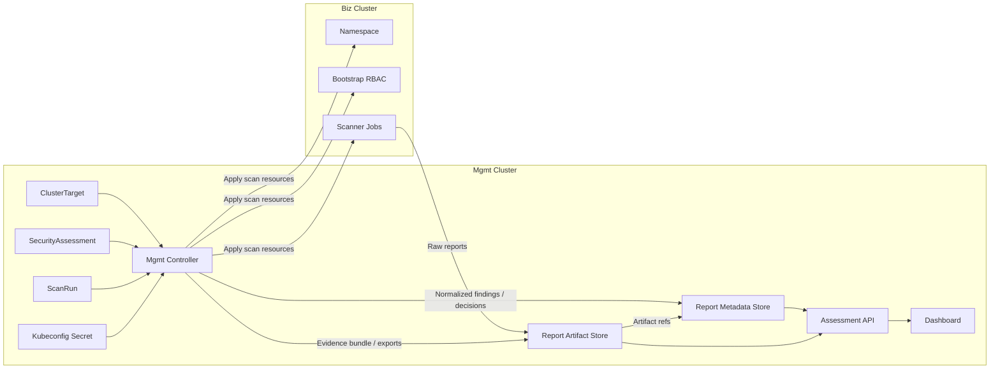

# Architecture

## Overview

kube-sentinel is centered on a management controller that runs in the Mgmt
Cluster and orchestrates final-check assessments against Biz Clusters through
stored kubeconfigs and report artifacts.

Terminology:

| Term | Meaning |
| --- | --- |
| Mgmt Cluster | The cluster where the kube-sentinel solution is installed. It stores CRDs, controller, dashboard/API, report store integration, and target credentials. |
| Biz Cluster | A business/application cluster that is inspected by kube-sentinel. It is a scan target, not a place where kube-sentinel CRDs or operators are installed. |

Biz Clusters do not run a per-cluster kube-sentinel operator and do not need the
kube-sentinel CRDs installed. They only need the namespace, RBAC, and optional
scanner Jobs that the Mgmt Cluster controller applies remotely for assessment.

Primary custom resources live in the Mgmt Cluster:

| CRD | Purpose |
| --- | --- |
| `ClusterTarget` | Biz Cluster connection, namespace, capability, and output tenant configuration. |
| `SecurityAssessment` | Desired assessment template and selected target list. |
| `ScanRun` | One execution of an assessment against one or more targets. |

The management controller reconciles these CRs into assessment Jobs,
read-only inspections, normalized findings, report artifacts, dashboard records,
and status conditions.

## Remote apply mode

Remote apply mode is the default architecture.



Design decisions:

- `ClusterTarget`, `SecurityAssessment`, and `ScanRun` exist only in the Mgmt
  Cluster.
- Biz Clusters do not install kube-sentinel CRDs.
- Biz Clusters do not run a kube-sentinel operator.
- The management controller uses each Biz Cluster's kubeconfig Secret to apply
  assessment Jobs, ConfigMaps, ServiceAccounts, Roles, RoleBindings, and
  related report resources remotely when a Biz Cluster scan requires them.
- Remote apply is limited to scan resources required to produce
  findings and reports. It must not automatically remediate or mutate customer
  application workloads.
- Assessment results are stored in two layers: immutable artifacts for audit
  and reproducibility, and metadata/index records for dashboard and API
  retrieval.
- Remote objects cannot use ownerReferences back to Mgmt Cluster CRs.
  They must be tracked by labels and annotations.

## Middleware and version baseline

This baseline separates first-scope required middleware from optional inputs and
Phase 2 extensions. Versions are a PoC validation baseline as of 2026-06-18.
Implementation must pin exact tool versions in build scripts, container image
tags, or scanner baseline reports. Do not treat floating tags such as `latest`
as a valid final-check baseline.

### First-scope platform baseline

| Area | Component | Baseline version | Requirement |
| --- | --- | --- | --- |
| Mgmt Cluster | Kubernetes API server | `v1.36.2` validated, support `v1.34`-`v1.36` | Runs kube-sentinel CRDs, controller, target credential Secrets, Report Store integration, and dashboard/API. |
| Biz Cluster | Kubernetes API server | support `v1.34`-`v1.36` | Target cluster inspected through kubeconfig. No kube-sentinel CRDs or per-cluster operator are installed. |
| CLI | `kubectl` | match target minor, `v1.36.x` for validation | Used for preflight, manual validation, and troubleshooting. |
| Controller build | Go | `1.26.4` validated, require `1.26.x` | Aligns with the Kubebuilder/controller-runtime baseline. |
| Controller scaffold | Kubebuilder | `v4.15.0` | Initial project scaffold and CRD/controller conventions. |
| Controller runtime | `sigs.k8s.io/controller-runtime` | `v0.24.1` | Reconciler, client, cache, server-side apply, status updates, envtest. |
| CRD generation | `controller-tools` / `controller-gen` | `v0.21.0` | CRD, RBAC marker, and deepcopy generation. |
| Local test API | `envtest` | Kubernetes `v1.36.x` | Controller tests must pin envtest instead of depending on the developer machine. |
| Manifest rendering | Helm | `v4.2.2` validated | Renders customer charts and kube-sentinel installation manifests. |
| Manifest rendering | Kustomize | `v5.8.1` validated | Optional render path for Kustomize-based delivery manifests. |
| Utility CLI | `jq` | `1.8.1` validated | JSON report and status processing in scripts. |
| Utility CLI | `yq` | `v4.53.3` validated | YAML manifest, Helm values, and artifact input processing. |
| Result metadata | PostgreSQL | `18.x` recommended for product mode | Queryable index for ScanRun, Finding, FinalDecision, ExceptionReview, artifact metadata, and dashboard filters. |
| Result artifact | S3-compatible object storage or filesystem | deployment-specific | Durable storage for raw reports, SBOMs, normalized finding files, evidence bundles, and exported reports. |

### First-scope scanner baseline

| Scan area | Component | Baseline version | Requirement |
| --- | --- | --- | --- |
| SAST | SonarQube Server | organization-approved LTA or managed SonarQube Cloud | Optional external integration. Semgrep/gosec remain the portable baseline. |
| SAST | Semgrep | `v1.167.0` | Source security rules and custom policies. |
| SAST | gosec | `v2.27.1` | Go-specific security anti-pattern detection. |
| Secret scan | Gitleaks | `v8.30.1` | Hardcoded secret, token, credential, and account detection. |
| Image CVE | Trivy | `v0.71.1` | Primary delivery image vulnerability and SBOM scanner. |
| Image CVE | Grype | `v0.114.0` | Secondary image vulnerability scanner or comparison source. |
| SBOM | Syft | `v1.45.1` | SBOM generation and package inventory. |
| Image signing | Cosign | `v3.1.1` | Sigstore-based signature verification when policy uses Cosign. |
| Image signing | Notation | `v1.3.2` | Notation-based signature verification when policy uses Notary Project. |
| Image digest | Crane / go-containerregistry | `v0.21.7` | Registry digest resolution and image metadata inspection. |
| Kubernetes policy | kube-linter | `v0.8.3` | Pod/workload security checks for rendered manifests. |
| Kubernetes policy | conftest / OPA | `v0.68.2` | Rego policy evaluation for Kubernetes YAML and RBAC. |
| Dockerfile | Hadolint | `v2.14.0` | Dockerfile risk checks. |
| Script | ShellCheck | `v0.11.0` | Shell script risk checks. |

### Optional first-scope inputs

| Component | Baseline version | Requirement |
| --- | --- | --- |
| Trivy Operator | `v0.31.1` | Optional read-only `VulnerabilityReport` input only. kube-sentinel does not install or operate Trivy Operator in the first MVP. |
| S3-compatible object store implementation | deployment-specific | Optional implementation choice for the required artifact store. Filesystem or CI artifact storage is acceptable for local PoC only. |

### Phase 2 only

| Component | Status |
| --- | --- |
| OpenTelemetry Collector | Phase 2 telemetry/export extension. Not required for first-scope final-check reports. |
| Loki / Mimir / Tempo / Grafana LGTM | Phase 2 observability/export extension. Report Store remains the first MVP source of truth. |
| OSQuery | Phase 2 inventory extension. |
| Runtime sensors and long-running DaemonSets | Phase 2 runtime assessment extension. |

Version governance:

- Every `ScanRun` must record scanner binary versions, vulnerability DB dates,
  policy bundle versions, and image digests for scanner images.
- Scanner images must be pinned by digest in final-check environments.
- Tool upgrades must update this baseline or record an explicit exception in
  the evidence bundle.
- A scan with missing tool version or DB/rule baseline must produce
  `scan_health=Fail` or `scan_health=Warning` according to the final-check
  policy.

## Target prerequisites

Each Biz Cluster must provide:

| Prerequisite | Purpose |
| --- | --- |
| `kube-sentinel-system` namespace | Default namespace for remote resources. It is created by a platform/bootstrap step before scans. |
| target kubeconfig or ServiceAccount token | Stored in the Mgmt Cluster and used by the management controller for remote apply. |
| bootstrap RBAC | Grants only the verbs/resources needed by enabled features. |
| image pull access | Pull scanner images when remote scanner Jobs are enabled. |
| report store access | Persist raw reports, normalized findings, evidence bundles, and final decisions. |
| capability declaration | Records whether scanner Jobs, read-only inspection, registry access, and report upload are available. |

Required target RBAC should be split by capability:

| Capability | Required access |
| --- | --- |
| Apply scanner resources | create/update/patch/delete kube-sentinel-owned Jobs, CronJobs, ConfigMaps, ServiceAccounts, Roles, RoleBindings in the target namespace |
| Inspect applied config | get/list/watch Pods, Deployments, DaemonSets, StatefulSets, ReplicaSets, RBAC, ServiceAccounts, Services, Ingresses |
| Secret references | inspect workload references only; do not read raw Secret data |

The target kubeconfig Secret is the most sensitive Mgmt Cluster asset. It
requires encryption at rest, narrow RBAC, rotation, and audit logging.

Namespace ownership decision:

- Default PoC behavior: the Biz Cluster `targetNamespace` is pre-created by a
  human or platform bootstrap process.
- The Mgmt Controller validates that `spec.targetNamespace` exists and records
  `NamespaceMissing` in `ClusterTarget.status` when it does not.
- The default Biz Cluster kubeconfig does not need `namespaces create/update`
  permission.
- Automatic namespace creation is a future/optional bootstrap capability. If
  enabled, it must be explicit on `ClusterTarget.spec.capabilities` and require
  separate RBAC review.

## Target registration and kubeconfig storage

Biz Clusters appear in the dashboard only after a `ClusterTarget` CR exists in
the Mgmt Cluster. The `ClusterTarget` stores non-secret metadata and a
reference to a kubeconfig Secret; it must not inline kubeconfig data.

Registration flow:

1. An operator creates or imports a restricted ServiceAccount in the Biz
   Cluster.
2. The target ServiceAccount token or kubeconfig is stored as a Mgmt Cluster
   Secret.
3. A `ClusterTarget` CR references that Secret through `spec.kubeconfigRef`.
4. The management controller validates connectivity and permissions.
5. The controller writes connection, capability, and discovery summary fields
   into `ClusterTarget.status`.
6. The dashboard cluster list reads `ClusterTarget` objects and status from the
   Mgmt Cluster, never kubeconfig Secret data.

Recommended Secret shape:

```yaml
apiVersion: v1
kind: Secret
metadata:
  name: dev-a-kubeconfig
  namespace: kube-sentinel-system
  labels:
    app.kubernetes.io/managed-by: kube-sentinel
    security.kube-sentinel.io/credential-type: kubeconfig
type: Opaque
data:
  kubeconfig: <base64 kubeconfig>
```

`ClusterTarget` should carry display and routing metadata only:

```yaml
apiVersion: security.kube-sentinel.io/v1alpha1
kind: ClusterTarget
metadata:
  name: dev-a
spec:
  displayName: dev-a
  environment: dev
  kubeconfigRef:
    namespace: kube-sentinel-system
    name: dev-a-kubeconfig
    key: kubeconfig
  targetNamespace: kube-sentinel-system
  namespaceAllowlist:
    - app
    - platform
  output:
    reportTenantID: dev-a
```

`ClusterTarget.status` should be the source for cluster list UI state:

| Status field | Purpose |
| --- | --- |
| `phase` | `Pending`, `Ready`, `Degraded`, `AuthFailed`, `Unreachable`, `PermissionDenied` |
| `lastValidatedAt` | Last successful connectivity and permission validation time |
| `kubernetesVersion` | Biz Cluster version from discovery |
| `capabilities` | Effective capability result for read-only inspection, scanner Job execution, report upload, image pull, and optional Trivy Operator reports |
| `namespaces` | Namespaces visible within the allowlist |
| `conditions[]` | Detailed validation failures and remediation hints |

Kubeconfig storage rules:

- Store kubeconfigs only in Mgmt Cluster Secrets or an external secret
  manager synced into Secrets.
- Enable Kubernetes encryption at rest for Secrets in the Mgmt Cluster.
- Grant Secret read access only to the kube-sentinel management controller and
  a narrow break-glass administrator role.
- Never expose kubeconfig data through dashboard APIs, logs, reports, status, or
  events.
- Rotate target credentials and record `status.lastCredentialRotationAt`.
- Prefer target ServiceAccount credentials with the minimum RBAC needed for the
  selected profiles.
- If a target is removed, delete or revoke the target credential and run
  label-based remote garbage collection.

## API examples

```yaml
apiVersion: security.kube-sentinel.io/v1alpha1
kind: ClusterTarget
metadata:
  name: dev-a
spec:
  displayName: dev-a
  environment: dev
  kubeconfigRef:
    namespace: kube-sentinel-system
    name: dev-a-kubeconfig
    key: kubeconfig
  targetNamespace: kube-sentinel-system
  namespaceAllowlist:
    - app
    - platform
  output:
    reportTenantID: dev-a
  capabilities:
    scannerJobs: true
    readOnlyInspection: true
    trivyOperatorReports: false
    hostPath: false
---
apiVersion: security.kube-sentinel.io/v1alpha1
kind: SecurityAssessment
metadata:
  name: final-check-2026-06
spec:
  targets:
    - dev-a
  profiles:
    - SourceSecurity
    - ImageSupplyChain
    - KubernetesConfig
    - RBACAndSecretReference
    - BuildAndDeploy
```

## Main components

| Component | Responsibility |
| --- | --- |
| `ClusterTarget` CRD | Biz Cluster connection, target namespace, capability, and tenant configuration. |
| `SecurityAssessment` CRD | User-facing assessment template, scan profiles, features, and target selection. |
| `ScanRun` CRD | One execution record with per-target status, scan health, and final decision summary. |
| Management controller | Reconciles desired state, remotely applies scan resources, performs label-based garbage collection, and updates status. |
| Assessment registry | Builds enabled assessment workflows in deterministic priority order. |
| Desired state store | Collects local management objects and remote scan objects before apply. |
| Remote apply client | Uses target kubeconfig Secrets to apply resources to Biz Clusters. |
| Security assessment feature | Runs delivery artifact and applied cluster configuration scans, normalizes findings, and records scan health. |
| Trivy integration | Runs delivery image scans and optionally reads Trivy Operator VulnerabilityReports when the CRD exists in a Biz Cluster. |
| Report store | Stores raw reports, normalized findings, scan health, final decisions, and evidence bundles. |
| Report metadata store | Stores queryable ScanRun, Finding, FinalDecision, ExceptionReview, and artifact index records for dashboard/API retrieval. |
| Report artifact store | Stores raw scanner reports, SBOMs, digest reports, normalized finding files, exported reports, and evidence bundles. |
| Assessment API | Reads report metadata and artifact references for dashboard, report download, and review workflows. |
| Dashboard model | Provides one Final Check Dashboard with Overview, Targets, Assessments, Findings, Reports, and Governance views. |

## Assessment reliability layer

Scanner execution is not enough for a final-check product. The first MVP must
also preserve the information required to explain why a scan is reliable,
reproducible, and safe to review.

Required first-scope support features:

| Support feature | Architecture responsibility |
| --- | --- |
| Target preflight check | Separate target environment failures from actual security findings before Biz Cluster scans run. |
| Artifact input manifest | Provide a reproducible declaration of source paths, images, digest lists, manifests, RBAC, Dockerfiles, and scripts. |
| Scanner version / DB baseline capture | Store scanner versions, vulnerability DB dates, and policy/rule versions with each ScanRun. |
| Finding stable ID / deduplication | Generate deterministic IDs and avoid duplicate counts across repeated scans or Trivy input paths. |
| Secret redaction guard | Block raw Secret values from reports, logs, dashboard records, and evidence bundles. |
| Evidence bundle export | Package raw reports, normalized findings, scan health, final decision, and exception candidates for review. |
| Exception review artifact | Track owner, reason, expiry, and approval status for findings that require exception review. |
| Scan health summary | Treat scanner errors, unsupported targets, stale baselines, and missing artifacts as reportable failures. |

Optional first-scope support features are documented in
[ASSESSMENT_SUPPORT_FEATURES.md](./ASSESSMENT_SUPPORT_FEATURES.md). Trivy
Operator `VulnerabilityReport` is one of those optional inputs and remains
inside the first-scope architecture when the CRD and read-only permission are
already available.

## Managed infrastructure boundary

The kube-sentinel management controller does not create or manage customer
application infrastructure. It also does not require Loki, Mimir, Tempo, or a
full LGTM stack for the first MVP.

The first MVP stores assessment outputs in a split Report Store:

- Report Artifact Store for raw scanner reports, normalized JSONL files, SBOMs,
  integrity reports, exported human reports, and evidence bundles.
- Report Metadata Store for queryable ScanRun, Finding, ScanHealth,
  FinalDecision, ExceptionReview, and artifact index records.
- Assessment API for loading metadata records, resolving artifact references,
  and serving dashboard/report download requests.

Grafana LGTM, OTel collectors, long-running sensors, and runtime telemetry are
Phase 2 telemetry extensions. If enabled later, they must be designed as an
optional export path from normalized findings and report events, not as the
primary source of truth for final-check results.

The `security_assessment` feature manages only assessment jobs, config, and
report volumes for the selected final-check scope. It may inspect delivery
artifacts and applied cluster configuration metadata, but it must not collect
raw Secret values.

## Feature priorities

| Priority | Feature | Reason |
| --- | --- | --- |
| 50 | `security_assessment` | Delivery artifact and applied cluster configuration findings should be normalized before dashboards evaluate delivery readiness. |
| 200 | `trivy` | Delivery image vulnerability, SBOM, digest, and optional VulnerabilityReport findings depend on Trivy reports and normalized finding output. |

## Reconcile flow

1. Add finalizer to Mgmt Cluster CRs.
2. Load `ClusterTarget`, `SecurityAssessment`, and `ScanRun` specs.
3. Resolve target kubeconfig Secret and validate target capabilities.
4. Validate scan profiles, feature names, and feature config.
5. Build active features in priority order.
6. Ask each feature to contribute management-local and target-remote resources.
7. Apply management-local objects using server-side apply.
8. Apply target-remote scan objects through the remote apply client.
9. Collect raw reports from local runners or remote scanner Jobs.
10. Write immutable raw reports, SBOMs, normalized JSONL, final-decision JSON,
    exception review artifact, and evidence bundle to the Report Artifact Store.
11. Upsert queryable ScanRun, Finding, ScanHealth, FinalDecision,
    ExceptionReview, and artifact index rows into the Report Metadata Store.
12. Garbage collect disabled or stale remote resources by labels.
13. Assess per-target readiness and patch `ClusterTarget.status` /
    `ScanRun.status`.

## Scan resource configuration policy

Scan resource configuration is allowlisted, not arbitrary patches.

Allowed scan resource config fields:

| Path | Allowed fields |
| --- | --- |
| `scanResources.securityAssessment` | `resources`, `ttlSecondsAfterFinished`, `nodeSelector`, `tolerations` |
| `scanResources.trivy` | `resources`, `scanSchedule`, `severityThreshold`, `useOperatorReports` |

Forbidden behavior:

- Adding arbitrary containers, init containers, volumes, hostPath mounts, service
  account names, image names, image pull policies, security contexts, commands,
  or arguments.
- Adding `tolerations: [{ operator: Exists }]`.
- Tolerating control-plane taints unless the assessment is configured with an
  explicit installation-time allow-control-plane setting.
- Raising privileges beyond each scan job's built-in security context.

Toleration validation must be implemented before applying scan resource config.
Invalid config sets the relevant workflow to `ConfigError` and must not be
applied.

## HostPath policy

HostPath mounts are not required for the first MVP. Code / Artifact Scan and
Biz Cluster Read-only Scan should run through scanner Jobs and Kubernetes API
inspection. Any future hostPath usage requires an architecture update, explicit
customer approval, and a security review.

## Ownership model

Remote objects are split by lifecycle.

| Lifecycle | Examples | Required labels | GC rule |
| --- | --- | --- | --- |
| Target-scoped | Shared ConfigMaps, ServiceAccounts, Roles, RoleBindings | `target`, `feature`, `scope=target` | Reconcile by `target + feature`; do not delete during per-ScanRun cleanup. |
| Run-scoped | Security Assessment Jobs, report ConfigMaps, temporary scan volumes, per-run scanner resources | `target`, `scan-run`, `feature`, `scope=run` | Reconcile and delete by `target + scan-run + feature`. |

Target-scoped remote object labels:

```yaml
metadata:
  labels:
    app.kubernetes.io/managed-by: kube-sentinel
    security.kube-sentinel.io/target: <cluster-target-name>
    security.kube-sentinel.io/feature: <feature-id>
    security.kube-sentinel.io/scope: target
  annotations:
    security.kube-sentinel.io/spec-hash: <sha256>
```

Run-scoped remote object labels:

```yaml
metadata:
  labels:
    app.kubernetes.io/managed-by: kube-sentinel
    security.kube-sentinel.io/target: <cluster-target-name>
    security.kube-sentinel.io/scan-run: <scan-run-name>
    security.kube-sentinel.io/feature: <feature-id>
    security.kube-sentinel.io/scope: run
  annotations:
    security.kube-sentinel.io/spec-hash: <sha256>
```

Remote objects cannot use ownerReferences to Mgmt Cluster CRs. Garbage
collection must use lifecycle-specific label selectors.

Target-scoped GC:

```text
security.kube-sentinel.io/target=<target>
security.kube-sentinel.io/feature=<feature>
security.kube-sentinel.io/scope=target
```

Run-scoped GC:

```text
security.kube-sentinel.io/target=<target>
security.kube-sentinel.io/scan-run=<scan-run>
security.kube-sentinel.io/feature=<feature>
security.kube-sentinel.io/scope=run
```

Server-side apply field managers should include target, feature, and lifecycle:

```text
kube-sentinel/<target>/<feature-id>/target
kube-sentinel/<target>/<feature-id>/run
```

## Result persistence and routing

Assessment data is written to both storage layers. The artifact layer preserves
the evidence; the metadata layer serves dashboard/API queries.

| Source | Input path | Artifact Store write | Metadata Store write | Decision phase |
| --- | --- | --- | --- | --- |
| Trivy | Delivery image scan report from registry digest, image tar, or optional VulnerabilityReport | raw Trivy report, SBOM, integrity report, normalized `findings.jsonl` | `image_vulnerability`, `sbom`, `integrity` finding rows and artifact references | Discovery / Priority |
| Security Assessment | Scanner reports and applied cluster configuration snapshot | raw scanner reports, applied snapshot, normalized `findings.jsonl`, scan health JSON, evidence bundle | `sast`, `secret`, `kubernetes`, `rbac`, `dockerfile`, `script`, `scan_health`, final decision, exception review rows | Discovery / Priority / Validation |
| Final report | Final decision and linked evidence | Markdown/PDF/HTML export and evidence bundle | report index row with artifact references | Validation / Exception Review |

Dashboard menus should be decision-oriented. Scanner categories should appear as
tabs or filters inside the larger menu groups, not as top-level navigation.

| Top-level menu | Primary categories and data |
| --- | --- |
| Overview | final decision, `scan_health`, Critical/High counters, exception-required counters |
| Targets | `ClusterTarget.status`, connectivity, namespace allowlist, capability status |
| Assessments | Code / Artifact workflow, Biz Cluster workflow, retry/resume state |
| Findings | `sast`, `secret`, `image_vulnerability`, `integrity`, `sbom`, `kubernetes`, `rbac`, `secret_ref`, `network`, `dockerfile`, `script` |
| Reports | final-check report, raw reports, normalized findings, scan health summary, evidence bundle |
| Governance | findings where `exception_required=true`, approved exceptions, expired exceptions, remediation tracking |

## Report store policy

The Report Store is the first MVP source of truth. It must preserve enough
evidence to reproduce the final decision without requiring a telemetry backend.

Required defaults:

- Store raw scanner reports separately from normalized findings.
- Store normalized findings with stable `finding_id` values.
- Store scan health records for scanner errors, skipped scans, unsupported
  targets, stale DB/rule baselines, and missing artifacts.
- Store final decision summaries with links to the ScanRun, target, artifacts,
  exception candidates, and evidence bundle.
- Do not store raw Secret values.
- Keep report artifact paths stable across dashboard, export, and audit views.
- Treat dashboard records as read models derived from report artifacts, not as
  the only copy of the assessment result.

### Result storage format

The best storage model is hybrid:

- Preserve raw scanner outputs as immutable artifacts.
- Store normalized findings in a versioned JSONL format.
- Store summaries and decisions as JSON documents.
- Index query fields in PostgreSQL for dashboard/API retrieval.
- Export human-readable reports separately from machine-readable records.

Recommended formats:

| Data | Format | Storage | Reason |
| --- | --- | --- | --- |
| Raw scanner output | Original scanner format: JSON, SARIF, table text, or scanner-native output | Artifact Store | Keeps auditability and allows re-normalization after parser changes. |
| Normalized findings | JSONL, one finding per line, validated by `security.finding/v1` JSON Schema | Artifact Store + Metadata Store index | Efficient append/export, diff-friendly, and easy to stream into DB/index. |
| Finding index | PostgreSQL rows with indexed columns plus `details JSONB` | Metadata Store | Fast dashboard filters by scan run, severity, category, scanner, target, image digest, namespace, and exception status. |
| Scan health | JSON document plus PostgreSQL row/index | Metadata Store + Artifact Store | Scanner failure and missing-artifact states must be queryable and exportable. |
| Final decision | JSON document, schema `security.finalDecision/v1` | Metadata Store + Artifact Store | Reproducible Pass/Fail/Warning decision with linked evidence. |
| SBOM | CycloneDX JSON by default; SPDX JSON accepted as input/export | Artifact Store | CycloneDX JSON is compact, common for scanner integration, and suitable for digest-linked storage. |
| Image digest/signature report | JSON document, schema `security.imageIntegrity/v1` | Artifact Store + indexed digest fields | Keeps digest, signature policy, verification result, and key reference together. |
| Exception review | YAML or JSON document, schema `security.exceptionReview/v1` | Metadata Store + Artifact Store | Human reviewable while still machine-validated. |
| Evidence bundle | `tar.gz` or `zip` with `manifest.json`, raw reports, normalized findings, final decision, exception review, and checksums | Artifact Store | Portable delivery/inspection evidence. |
| Human report | Markdown as source, optional PDF/HTML export | Artifact Store | Markdown is reviewable in Git and can generate PDF/HTML later. |

Normalized finding JSONL is the canonical machine-readable finding artifact.
Each line must contain at least:

```json
{
  "schema_version": "security.finding/v1",
  "finding_id": "stable-id",
  "scan_run_id": "final-check-2026-06-001",
  "scanner": "trivy",
  "category": "image_vulnerability",
  "severity": "Critical",
  "target_type": "image",
  "target_name": "registry.example.com/app/api",
  "image_digest": "sha256:...",
  "rule_id": "CVE-2026-0000",
  "message": "finding summary",
  "remediation": "upgrade package or approve exception",
  "exception_required": true,
  "scan_status": "Fail",
  "artifact_refs": ["raw/trivy/app-api.json"],
  "created_at": "2026-06-18T00:00:00Z"
}
```

Artifact path convention:

```text
reports/
  <assessment-name>/
    <scan-run-id>/
      manifest.json
      raw/<scanner>/<target>.json
      normalized/findings.jsonl
      normalized/scan-health.json
      normalized/final-decision.json
      sbom/<image-digest>.cyclonedx.json
      integrity/<image-digest>.json
      exceptions/exception-review.yaml
      exports/final-report.md
      evidence/evidence-bundle.tar.gz
```

Retrieval rule:

- Dashboard/API reads list and filter views from PostgreSQL metadata.
- Raw report, SBOM, evidence bundle, and exported report downloads use artifact
  references from the metadata store.
- Rebuilding the metadata index from artifacts must be possible. Therefore,
  artifact records must include schema version, SHA256 checksum, scanner
  version, scanner DB/rule baseline, target metadata, and generation time.

## Mgmt controller RBAC

The controller needs two permission sets:

- Mgmt Cluster RBAC for kube-sentinel CRDs, target kubeconfig Secrets, status,
  reports, and dashboard/API integration.
- Biz Cluster RBAC embedded in each target kubeconfig for remote apply and
  read-only inspection.

Kubebuilder markers apply only to Mgmt Cluster permissions. Biz Cluster
permissions are documented as bootstrap RBAC and validated through
`ClusterTarget.status`.

Mgmt Cluster resources:

- `clustertargets`: get, list, watch, create, update, patch, delete
- `clustertargets/status`: get, update, patch
- `clustertargets/finalizers`: update
- `securityassessments`: get, list, watch, create, update, patch, delete
- `securityassessments/status`: get, update, patch
- `securityassessments/finalizers`: update
- `scanruns`: get, list, watch, create, update, patch, delete
- `scanruns/status`: get, update, patch
- `scanruns/finalizers`: update
- `secrets`: get
- `configmaps`: get, list, watch, create, update, patch, delete
- `events`: create, patch

Biz Cluster remote apply resources:

- `namespaces`: get, list, watch
- `pods`: get, list, watch
- `configmaps`: get, list, watch, create, update, patch, delete
- `secrets`: do not grant by default; inspect Secret references from workload
  specs without reading raw Secret data
- `services`: get, list, watch
- `serviceaccounts`: get, list, watch, create, update, patch, delete

Workload resources:

- `apps/daemonsets`: get, list, watch
- `apps/deployments`: get, list, watch
- `apps/statefulsets`: get, list, watch
- `apps/replicasets`: get, list, watch
- `batch/jobs`: get, list, watch, create, update, patch, delete
- `batch/cronjobs`: get, list, watch, create, update, patch, delete

RBAC resources:

- `rbac.authorization.k8s.io/roles`: get, list, watch, create, update, patch, delete
- `rbac.authorization.k8s.io/rolebindings`: get, list, watch, create, update, patch, delete
- `rbac.authorization.k8s.io/clusterroles`: get, list, watch
- `rbac.authorization.k8s.io/clusterrolebindings`: get, list, watch

Optional Trivy Operator resources:

- `aquasecurity.github.io/vulnerabilityreports`: get, list, watch

Create/update/delete verbs in Biz Cluster credentials are for kube-sentinel
scan resources only. They must not be used to mutate customer
application workloads, application RBAC, Services, Ingresses, or Secrets as an
automatic remediation action.

Biz Cluster credential guardrails:

- Create/update/delete is limited to resources labeled
  `app.kubernetes.io/managed-by=kube-sentinel`.
- Role and RoleBinding creation is limited to the `ClusterTarget.spec.targetNamespace`.
- ClusterRole and ClusterRoleBinding are read-only in the first MVP.
- Secret read permission is not granted by default. If a target credential
  includes Secret read access, preflight must report it as a risk and scanner
  logic still must not read raw Secret data.
- Generated Roles must not include wildcard verbs, wildcard resources,
  `secrets get/list/watch`, or `cluster-admin` binding.

Trivy Operator `VulnerabilityReport` ingestion is a current optional input
path. If the CRD is present and the ClusterTarget has read permission, findings
from VulnerabilityReports may be normalized with delivery image scan results.
If it is absent, the assessment continues with registry digest or image tar
scans.

Runtime event sensors are Next Version extensions. They are not part of the
current final-check assessment architecture.

Secrets are not read by default. The controller must not create or mutate
customer credentials in Biz Clusters. Applied cluster configuration assessment
may report Secret references, projected volumes, `env`/`envFrom`, and
ServiceAccount token automount settings, but it must not read or persist Secret
data.

## Status model

The Mgmt Cluster status model should expose target health and scan execution
separately.

`ClusterTarget.status`:

- `status.observedGeneration`
- `status.phase`: `Pending`, `Ready`, `Degraded`, `AuthFailed`,
  `Unreachable`, or `PermissionDenied`
- `status.lastValidatedAt`
- `status.lastCredentialRotationAt`
- `status.kubernetesVersion`
- `status.capabilities`
- `status.namespaces`
- `status.conditions[]`

`ScanRun.status`:

- `status.observedGeneration`
- `status.phase`: `Pending`, `Running`, `Completed`, `Failed`, or `Canceled`
- `status.artifactScan`: Code / Artifact Scan phase, timestamps, and conditions
- `status.clusterScan`: Biz Cluster Scan phase, timestamps, and conditions
- `status.features[]`
- `status.targets[]`
- `status.remoteResources[]`
- `status.finalDecision`

`SecurityAssessment.status`:

- `status.observedGeneration`
- `status.lastRunRef`
- `status.summary`

Feature status reasons should include:

- `Disabled`
- `Ready`
- `ConfigError`
- `ApplyError`
- `NotReady`

Unknown feature names are configuration errors and must not create resources.
