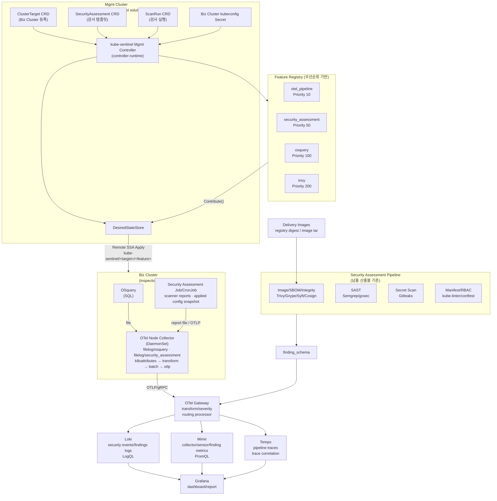

# kube-sentinel — PoC 구현 계획서 v1.2

> **도구**: OSquery · Trivy · Security Assessment
> **파이프라인**: OTel Node Collector → OTel Gateway → Grafana LGTM(Loki · Tempo · Mimir · Grafana)
> **보안 점검**: SAST · Secret Scan · Image Scan · SBOM/무결성 · Manifest/RBAC/Dockerfile/Script Scan
> **아키텍처**: Mgmt Cluster 원격 apply + Feature-as-Plugin (배열 기반 CRD + 자기등록 Registry)<br>
> **프레임워크**: CTEM Scope / Discovery / Priority / Validation 매핑  
> **비목표**: Biz Cluster operator 설치 · 인라인 차단 · Kafka · 완벽한 OCSF 정규화 · 운영 차단 정책

---

## 1. 목표 & 성공 기준

| # | 성공 기준 | 검증 방법 |
|---|----------|----------|
| G1 | `ClusterTarget`과 `SecurityAssessment` 적용으로 선택 Biz Cluster에 Security Assessment + OTel 파이프라인 자동 배치 | Mgmt Cluster에서 `ScanRun` 확인, Biz Cluster에서 Job/CronJob/Deploy/ConfigMap 생성 확인 |
| G2 | Feature 토글(`enabled: false`)로 개별 DaemonSet 생성/삭제 | CRD 수정 → DS 사라짐/생성 확인 |
| G3 | Override 적용으로 특정 도구의 리소스/tolerations 변경 | CRD override 수정 → DS spec 변경 확인 |
| G4 | 주요 점검/인벤토리 데이터가 LGTM에 CTEM 용도별 telemetry로 적재 | Loki LogQL, Mimir PromQL, Grafana dashboard 조회 |
| G5 | Grafana 대시보드 3개 동작 | 이벤트, 인벤토리, 취약점/점검 결과 dashboard 스크린샷 |
| G6 | Final Check Dashboard에서 최종점검 결과를 메뉴별로 조회 | Grafana dashboard 또는 frontend 화면 스크린샷 |
| G7 | CTEM 매핑 검증 체크리스트 통과 | 검증 항목 Pass/Fail |
| G8 | 소스코드 정적분석 기반 보안 취약 패턴과 위험 코드를 식별 | Semgrep/gosec 결과 리포트 확인 |
| G9 | 하드코딩된 Secret, Token, 계정 정보 노출을 식별 | Gitleaks 결과 리포트 확인 |
| G10 | 컨테이너 이미지 Critical 취약점과 base image 위험을 식별 | Trivy/Grype image scan 결과 확인 |
| G11 | 이미지 digest, SBOM, 서명/무결성 검증 결과를 산출 | Syft/Cosign/Crane 결과 확인 |
| G12 | `privileged`, `hostPath` 등 고위험 Kubernetes 설정을 식별 | kube-linter/conftest 결과 확인 |
| G13 | RBAC 과권한 및 불필요한 권한 부여를 식별 | conftest/rbac-police 결과 확인 |
| G14 | Dockerfile 및 배포 스크립트 내 보안 위험 요소를 식별 | hadolint/shellcheck 결과 확인 |
| G15 | 스캔 실패, 분석 불가, 필수 산출물 누락을 실패 상태로 표시 | security-assessment 결과 요약 확인 |
| G16 | 개선 권고 및 예외 검토 필요 항목을 추적 | exception review 및 remediation 목록 확인 |

### 구현 Stage Gate

PoC는 한 번에 4개 센서를 모두 붙이지 않고, 다음 세로 경로를 먼저 고정한다.

| Stage | 범위 | 통과 기준 |
|-------|------|----------|
| S0 | Mgmt/Biz Cluster 권한/BTF/hostPath/LGTM 연결 사전 검증 | Biz Cluster privileged DS 실행 가능 여부, `/sys/kernel/btf/vmlinux` 확인, Loki/Mimir/Tempo 테스트 telemetry 적재 |
| S0.5 | 납품 산출물 보안 점검 파이프라인 베이스라인 | SAST, Secret, Image, SBOM/무결성, Manifest/RBAC, Dockerfile/Script 스캔 결과 생성 |
| S1 | OTel Node/Gateway + Security Finding Schema + Trivy fixture 검증 | Security Assessment fixture가 Loki/Mimir finding telemetry로 적재 |
| S2 | `ClusterTarget` + `SecurityAssessment` -> OTel Pipeline -> Security Assessment | Mgmt controller가 Biz Cluster에 assessment Job/CronJob과 OTel 경로 remote apply |
| S3 | OSquery, Trivy, applied cluster config scan 순차 추가 | 각 Feature 별 enable/disable, status, LogQL/PromQL 검증 |
| S4 | 내부 최종점검 산출물 보안 점검 + Grafana + Override/GC 검증 | G2~G16 통과 |

---

## 2. 전체 아키텍처



아키텍처는 다음 경계를 유지한다.

- kube-sentinel management controller는 Mgmt Cluster의 `ClusterTarget`, `SecurityAssessment`, `ScanRun`을 기준으로 Biz Cluster에 리소스를 remote apply한다.
- Biz Cluster에는 kube-sentinel operator와 CRD를 설치하지 않는다.
- Biz Cluster 목록은 Mgmt Cluster의 `ClusterTarget`과 `status`를 기준으로 조회한다. kubeconfig Secret 값은 대시보드/API/로그에 노출하지 않는다.
- `security_assessment`는 현재 버전에서 납품 산출물 보안 점검을 수행하는 별도 Job/CronJob 계층으로 둔다.
- 개별 scanner 결과는 도구별 포맷 그대로 저장하지 않고 `Security Finding Schema`로 정규화한 뒤 LGTM에 적재한다.
- Loki는 finding/event 원문과 상세 메시지, Mimir는 집계 지표와 실패/통과 카운트, Tempo는 scan/pipeline 실행 추적에 사용한다.
- 최종 판정은 scanner exit code 하나에 의존하지 않고 필수 산출물 존재 여부, 분석 실패 여부, 예외 승인 상태를 함께 평가한다.
- Runtime 환경 점검은 다음 버전 범위로 분리한다.

---

## 3. CRD 설계

### ClusterTarget 샘플

```yaml
apiVersion: security.kube-sentinel.io/v1alpha1
kind: ClusterTarget
metadata:
  name: dev-a
spec:
  displayName: dev-a
  environment: dev
  kubeconfigRef:
    namespace: kube-sentinel-system
    name: dev-a-kubeconfig
    key: kubeconfig
  targetNamespace: kube-sentinel-system
  namespaceAllowlist: ["app", "platform"]
  output:
    lgtmTenantID: dev-a
  capabilities:
    privilegedDaemonSet: false
    hostPath: false
    btf: false
```

### Biz Cluster kubeconfig 저장 및 Cluster List 조회

Biz Cluster가 대시보드의 클러스터 리스트에 표시되려면 Mgmt Cluster에
두 리소스가 모두 존재해야 한다.

1. Biz Cluster 접근용 kubeconfig 또는 ServiceAccount token을 담은 Secret.
2. 해당 Secret을 참조하는 `ClusterTarget` CR.

권장 Secret 구조:

```yaml
apiVersion: v1
kind: Secret
metadata:
  name: dev-a-kubeconfig
  namespace: kube-sentinel-system
  labels:
    app.kubernetes.io/managed-by: kube-sentinel
    security.kube-sentinel.io/credential-type: kubeconfig
type: Opaque
data:
  kubeconfig: <base64 kubeconfig>
```

저장 원칙:

- kubeconfig 값은 Mgmt Cluster Secret 또는 외부 Secret Manager에서 동기화된 Secret에만 저장한다.
- Secret encryption at rest를 Mgmt Cluster에서 활성화한다.
- Secret read 권한은 kube-sentinel mgmt controller와 break-glass 관리자에게만 부여한다.
- dashboard/API/log/event/status에는 kubeconfig 값을 절대 노출하지 않는다.
- Cluster 삭제 시 target ServiceAccount token을 폐기하고 Mgmt Cluster Secret도 삭제한다.

Cluster List 조회 원칙:

- 대시보드는 `ClusterTarget` list와 `ClusterTarget.status`만 조회한다.
- 연결 상태는 `status.phase`에 `Ready`, `Degraded`, `AuthFailed`, `Unreachable`, `PermissionDenied`로 표시한다.
- Kubernetes version, namespace allowlist, capability, last validation time은 controller가 discovery 결과를 status에 기록한다.
- credential rotation 상태는 `status.lastCredentialRotationAt`만 표시하고 Secret 값은 표시하지 않는다.

### SecurityAssessment 샘플

```yaml
apiVersion: security.kube-sentinel.io/v1alpha1
kind: SecurityAssessment
metadata:
  name: final-check-2026-06
spec:
  targets: ["dev-a"]
  profiles:
    - SourceSecurity
    - ImageSupplyChain
    - KubernetesConfig
    - RBACAndSecretReference
    - BuildAndDeploy
  features:
    - name: otel_pipeline
      enabled: true
      config:
        mode: "node-to-gateway-to-lgtm"
        nodeLogBasePath: "/var/log/kube-sentinel"
        gatewayReplicas: 1

    - name: osquery
      enabled: true
      config:
        intervalSeconds: 60
        packs: ["scope-minimal"]

    - name: trivy
      enabled: true
      config:
        scanSchedule: "@every 6h"
        severityThreshold: "HIGH"

  output:
    lgtm:
      loki:
        endpoint: "http://loki-gateway.monitoring.svc:3100"
        tenantID: "kube-sentinel"
      mimir:
        remoteWriteEndpoint: "http://mimir-nginx.monitoring.svc/api/v1/push"
        tenantID: "kube-sentinel"
      tempo:
        otlpEndpoint: "http://tempo-distributor.monitoring.svc:4317"
        tenantID: "kube-sentinel"
      labels:
        cluster: "my-cluster"
        environment: "final-check"

  override:
    nodeAgent:
      tolerations:
        - key: "security.kube-sentinel.io/agent"
          operator: "Equal"
          value: "enabled"
          effect: "NoSchedule"
```

### Go 타입 정의 (핵심)

```go
type ClusterTargetSpec struct {
    DisplayName        string              `json:"displayName,omitempty"`
    Environment        string              `json:"environment,omitempty"`
    KubeconfigRef      SecretKeyRef        `json:"kubeconfigRef"`
    TargetNamespace    string              `json:"targetNamespace,omitempty"`
    NamespaceAllowlist []string            `json:"namespaceAllowlist,omitempty"`
    Output             TargetOutputSpec    `json:"output,omitempty"`
    Capabilities       TargetCapabilitySpec `json:"capabilities,omitempty"`
}

type SecurityAssessmentSpec struct {
    Targets  []string      `json:"targets"`
    Profiles []ScanProfile `json:"profiles,omitempty"`
    Features []FeatureSpec `json:"features,omitempty"`
    Output   OutputSpec    `json:"output,omitempty"`
    Override *OverrideSpec `json:"override,omitempty"`
}

type ScanRunSpec struct {
    AssessmentRef LocalObjectRef `json:"assessmentRef"`
    Targets       []string       `json:"targets,omitempty"`
}

// RawExtension → 스키마 변경 없이 새 도구 config 추가 가능
type FeatureSpec struct {
    Name    string               `json:"name"`
    Enabled bool                 `json:"enabled"`
    Config  runtime.RawExtension `json:"config,omitempty"`
}

type LGTMOutputSpec struct {
    Loki   LokiOutputSpec   `json:"loki,omitempty"`
    Mimir  MimirOutputSpec  `json:"mimir,omitempty"`
    Tempo  TempoOutputSpec  `json:"tempo,omitempty"`
    Labels map[string]string `json:"labels,omitempty"`
}

```

### Status 및 검증 정책

`RawExtension` 기반 config는 확장성은 높지만 CRD schema 검증이 약하므로, 런타임 검증 실패를 status에 명확히 노출한다.

```go
type ClusterTargetStatus struct {
    Phase                     string             `json:"phase,omitempty"` // Pending, Ready, Degraded, AuthFailed, Unreachable, PermissionDenied
    LastValidatedAt           metav1.Time        `json:"lastValidatedAt,omitempty"`
    LastCredentialRotationAt  metav1.Time        `json:"lastCredentialRotationAt,omitempty"`
    KubernetesVersion         string             `json:"kubernetesVersion,omitempty"`
    Conditions                []metav1.Condition `json:"conditions,omitempty"`
}

type ScanRunStatus struct {
    ObservedGeneration int64              `json:"observedGeneration,omitempty"`
    Phase              string             `json:"phase,omitempty"` // Pending, Running, Completed, Failed
    Features           []FeatureCondition `json:"features,omitempty"`
    Targets            []TargetRunStatus  `json:"targets,omitempty"`
    FinalDecision      FinalDecision      `json:"finalDecision,omitempty"`
}

type FeatureCondition struct {
    Name               string      `json:"name"`
    Enabled            bool        `json:"enabled"`
    Ready              bool        `json:"ready"`
    Reason             string      `json:"reason,omitempty"`  // Disabled, Ready, ConfigError, ApplyError, NotReady
    Message            string      `json:"message,omitempty"`
    ObservedGeneration int64       `json:"observedGeneration,omitempty"`
    LastTransitionTime metav1.Time `json:"lastTransitionTime,omitempty"`
}
```

검증 정책:

- 알 수 없는 `features[].name`은 `ConfigError`로 status에 기록하고 해당 feature는 적용하지 않는다.
- `SecurityAssessment.spec.targets[]`가 존재하지 않는 `ClusterTarget`을 참조하면 `ScanRun`을 `Failed`로 기록한다.
- target kubeconfig Secret 연결 실패, API server unreachable, RBAC denied는 `ClusterTarget.status`와 `ScanRun.status.targets[]`에 분리해서 기록한다.
- `Configure()` 실패는 전체 reconcile 실패로 처리하되, 이미 정상 적용된 리소스를 무리하게 삭제하지 않는다.
- feature별 기본값은 각 feature package에 두고, sample YAML은 기본값을 설명하는 용도로만 사용한다.

---

## 4. Feature-as-Plugin 아키텍처

### Feature 인터페이스

```go
type Feature interface {
    ID()        FeatureID
    Configure(raw []byte) error
    Contribute(ctx context.Context, store *DesiredStateStore) error
    OTelConfig() *OTelReceiverConfig  // nil이면 OTel 수집 불필요 (Trivy)
    Assess(ctx context.Context, c client.Client, ns string) FeatureCondition
}
```

### 우선순위 Registry

```
Priority 10   otel_pipeline  ← 수집 인프라가 센서보다 먼저 Ready
Priority 50   security_assessment  ← 납품 산출물 및 Biz Cluster 적용 설정 점검 결과 생성
Priority 100  osquery
Priority 200  trivy
```

### 새 도구 추가 = 3단계

```
1. internal/feature/<newtool>/feature.go 생성
   → Feature 인터페이스 구현
   → init()에서 feature.Register() 호출

2. cmd/main.go에 import 1줄 추가

3. 끝. Reconciler 코드 변경 없음. CRD 스키마 변경 없음.
```

---

## 5. OTel 파이프라인 — 데이터 흐름

### Node Collector 설정 (자동 합성)

| 도구 | 출력 방식 | OTel 수집 경로 | k8s 메타 소스 |
|------|-----------|---------------|--------------|
| OSquery | 파일 출력 (`/var/log/kube-sentinel/osquery/results.log`) | `filelog/osquery` | `hostIdentifier` → node 메타 |
| Security Assessment | scanner JSON / SARIF / artifact scan report | `filelog/security_assessment` 또는 OTLP logs | scan target 메타 |

### Gateway — Severity 통합 매핑

```
통합 severity    Trivy/SAST/Policy
5 (Critical)     CRITICAL
4 (High)         HIGH
3 (Medium)       MEDIUM
2 (Low)          LOW
1 (Info)         INFO/UNKNOWN
```

### LGTM 라우팅

```
security_tool: osquery              → Loki stream {category="inventory"} + Mimir inventory counters
security_tool: trivy                → Loki stream {category="vulnerability"} + Mimir vulnerability counters
security_tool: security_assessment  → Loki stream {category="security_finding"} + Mimir finding counters
```

### Trivy 적재 방식

현재 버전의 Security Assessment는 납품 이미지 tar 또는 registry digest를 기준으로 이미지 취약점, misconfiguration, SBOM 결과를 생성한다. Trivy Operator가 생성한 runtime `VulnerabilityReport` 수집은 Next Version 범위로 둔다.

```
CI/Image Trivy
  → image digest scan + SBOM
  → Security Finding Schema
  → Loki/Mimir + report artifact
```

finding id:

```
<imageRepository>/<imageDigest>/<vulnerabilityID>/<packageName>
```

M6 통과 조건은 같은 report를 2회 처리해도 동일 finding id 기준으로 Grafana 집계가 중복 증가하지 않는 것이다. Loki는 upsert 저장소가 아니므로 최신 상태 판정은 finding id와 scan timestamp 기준의 query 또는 별도 report artifact에서 수행한다.

### Security Finding Schema

모든 scanner 결과는 최소한 다음 공통 필드로 정규화한다.

| 필드 | 의미 |
|------|------|
| `finding_id` | scanner, target, rule/CVE, location을 조합한 안정 ID |
| `scanner` | `semgrep`, `gitleaks`, `trivy`, `grype`, `syft`, `cosign`, `kube-linter`, `conftest`, `hadolint`, `shellcheck` 등 |
| `category` | `sast`, `secret`, `image_vulnerability`, `sbom`, `integrity`, `kubernetes`, `rbac`, `dockerfile`, `script`, `scan_health` |
| `severity` | `Critical`, `High`, `Medium`, `Low`, `Info` |
| `target_type` | `source`, `image`, `helm`, `yaml`, `dockerfile`, `script`, `rbac`, `secret_ref` |
| `target_name` | 파일, 이미지, Kubernetes 리소스, namespace/name |
| `image_digest` | 이미지 대상이면 실제 digest |
| `rule_id` | scanner rule ID, CVE ID, policy ID |
| `message` | 위험 설명 |
| `remediation` | 개선 권고 |
| `exception_required` | 예외 검토 필요 여부 |
| `scan_status` | `Pass`, `Fail`, `Error`, `Skipped`, `Unsupported` |

---

## 6. Reconciler 흐름

```
Reconcile()
  │
  ├── 1. Mgmt Cluster CR finalizer 등록
  ├── 2. ClusterTarget, SecurityAssessment, ScanRun spec/status 이벤트 수신
  ├── 3. ClusterTarget.spec.kubeconfigRef Secret 조회
  ├── 4. Biz Cluster API 연결, discovery, RBAC, capability 검증
  ├── 5. BuildActiveFeatures() → 우선순위 순서로 Feature 목록 구성
  ├── 6. securityAssessment.scope 검증 → artifact scan 범위 확정
  ├── 7. 각 Feature.Contribute() → Mgmt-local/Biz-remote DesiredStateStore에 리소스 기여
  ├── 8. OTelConfig() 수집 → OTel Node/Gateway ConfigMap 자동 합성
  ├── 9. Override 적용 (공통 nodeAgent → 도구별 순서)
  ├── 10. Mgmt Cluster 리소스 SSA Apply
  ├── 11. Biz Cluster 리소스 Remote SSA Apply
  ├── 12. label 기반 비활성 Feature/ScanRun remote GC
  └── 13. ClusterTarget.status와 ScanRun.status 갱신
```

### Watch / Drift / Status 원칙

- `GenerationChangedPredicate`만 사용하면 Biz Cluster 연결 상태, RBAC 변경, remote resource drift를 놓칠 수 있으므로 `ClusterTarget`, `SecurityAssessment`, `ScanRun` watch와 주기적 health check를 함께 사용한다.
- spec 변경 reconcile과 status 점검 reconcile을 분리한다. spec 미변경 이벤트에서는 desired state 재합성은 허용하되, 불필요한 remote apply는 object hash 비교로 줄인다.
- 외부 상태 점검은 `RequeueAfter`로 주기 실행한다. PoC 기본값은 60초이며, kubeconfig 인증 실패, API server unreachable, RBAC denied, LGTM 연결 실패, Pod NotReady는 `Degraded` 또는 구체적인 target phase로 표시한다.
- Security Assessment는 현재 버전에서 산출물 경로와 이미지 목록을 기준으로 실행한다. Runtime scan은 Next Version 범위로 둔다.
- Status update는 별도 patch로 수행하고, `observedGeneration`은 spec 기반 apply가 성공한 뒤에만 갱신한다.

### SSA / GC 리소스 소유 전략

모든 생성 리소스에는 다음 label/annotation을 붙인다.

```yaml
metadata:
  labels:
    app.kubernetes.io/managed-by: kube-sentinel
    security.kube-sentinel.io/target: dev-a
    security.kube-sentinel.io/scan-run: final-check-2026-06-001
    security.kube-sentinel.io/feature: security_assessment
  annotations:
    security.kube-sentinel.io/spec-hash: "<sha256>"
```

- SSA field manager는 `kube-sentinel/<target>/<feature>` 형식으로 분리한다.
- apply conflict는 기본적으로 status `ApplyError`로 보고하고 강제 적용하지 않는다.
- Remote object에는 Mgmt Cluster CR을 향한 ownerReference를 걸 수 없다. GC는 label selector와 spec hash 기준으로만 수행한다.
- 비활성 feature GC는 `security.kube-sentinel.io/target=<target>`, `security.kube-sentinel.io/scan-run=<scan-run>`, `security.kube-sentinel.io/feature=<id>` 리소스 중 desired set에 없는 항목만 삭제한다.

---

## 7. 프로젝트 디렉터리 구조

```
kube-sentinel/
├── cmd/
│   └── main.go                          # Feature import + healthz + metrics
│
├── api/v1alpha1/
│   ├── clustertarget_types.go           # Biz Cluster 등록/접속/상태 CRD
│   ├── securityassessment_types.go      # 검사 템플릿 CRD
│   ├── scanrun_types.go                 # 검사 실행 CRD
│   └── zz_generated.deepcopy.go
│
├── internal/
│   ├── controller/
│   │   ├── clustertarget_controller.go  # Biz Cluster 연결/capability/status 검증
│   │   ├── securityassessment_controller.go # assessment template 검증
│   │   └── scanrun_controller.go        # remote apply 실행 단위
│   ├── target/
│   │   ├── kubeconfig.go                # Mgmt Secret에서 kubeconfig client 생성
│   │   ├── remote_apply.go              # Biz Cluster server-side apply
│   │   └── discovery.go                 # Biz Cluster discovery/RBAC/capability 검사
│   └── feature/
│       ├── feature.go                  # Feature 인터페이스
│       ├── types.go                    # OTelReceiverConfig, FeatureCondition
│       ├── registry.go                 # 우선순위 기반 Registry
│       ├── store.go                    # DesiredStateStore
│       ├── override/override.go        # 2단계 Override
│       ├── otel/config_builder.go      # OTel ConfigMap 자동 합성
│       ├── otel_pipeline/feature.go    # Priority 10
│       ├── security_assessment/feature.go # Priority 50
│       ├── osquery/feature.go          # Priority 100
│       └── trivy/feature.go            # Priority 200
│
├── config/
│   ├── crd/bases/
│   ├── lgtm/
│   │   ├── loki-values.yaml
│   │   ├── tempo-values.yaml
│   │   ├── mimir-values.yaml
│   │   └── grafana-dashboards/
│   └── samples/
│       ├── clustertarget_dev.yaml
│       ├── securityassessment_final_check.yaml
│       └── scanrun_sample.yaml
│
├── security/
│   ├── scanners/
│   │   ├── semgrep.yaml
│   │   ├── gitleaks.toml
│   │   ├── trivy.yaml
│   │   ├── kube-linter.yaml
│   │   ├── conftest/
│   │   ├── hadolint.yaml
│   │   └── shellcheckrc
│   ├── scripts/
│   │   ├── run-security-assessment.sh
│   │   ├── verify-image-digest.sh
│   │   └── normalize-findings.sh
│   └── reports/
│       └── .gitkeep
│
└── docs/
    ├── PLAN.md                         # 이 문서
    ├── SECURITY_ASSESSMENT.md          # 최종점검 실행 환경/대시보드/판정 정책
    ├── FRONTEND_ARCHITECTURE.md        # Final Check Dashboard 화면/데이터 모델
    ├── security-assessment-results.md   # 최종점검 결과
    ├── exception-review.md              # 예외 검토 및 승인 이력
    └── ctem-mapping-results.md         # 검증 결과 (M7 이후 작성)
```

---

## 8. 마일스톤

| 마일스톤 | 내용 | 기간 | Exit Criteria |
|---------|------|:---:|--------------|
| **M0** | 인프라 준비 (네임스페이스, PSA, BTF 확인, 로그 디렉터리, LGTM 연결) | 1일 | privileged Pod 배포 가능, `/sys/kernel/btf/vmlinux` 존재, Loki/Mimir/Tempo test telemetry 적재 |
| **M0.5** | 납품 산출물 보안 점검 베이스라인 | 1일 | SAST/Secret/Image/SBOM/무결성/Manifest/RBAC/Dockerfile/Script report 생성 |
| **M1** | Grafana LGTM 기반 관측 백엔드 | 2~3일 | Loki/Tempo/Mimir/Grafana datasource와 기본 dashboard 동작 |
| **M2** | Operator Core (CRD + Registry + Store + Override + SSA + Finalizer) + OTel Pipeline + Security Finding Schema | 3~4일 | CRD 적용 시 OTel Gateway/Node DS 자동 생성, finding/event telemetry 적재 확인 |
| **M3** | Security Assessment Feature 상세 구현 | 2~3일 | 산출물 scanner 실행, normalized finding, scan health 생성 |
| **M4** | Applied Cluster Configuration Scan | 2일 | Biz Cluster read-only 조회로 Workload/RBAC/Secret 참조 finding 생성 |
| **M5** | OSquery Feature (CTEM Scope 쿼리 팩) | 2일 | Grafana inventory dashboard에 system_info 유입 |
| **M6** | Trivy Feature + 이미지/SBOM/무결성 점검 | 2일 | 납품 이미지 CVE/SBOM/digest 결과 적재 |
| **M7** | Final Check Dashboard + CTEM 검증 | 2~3일 | Dashboard 메뉴별 조회, CTEM mapping 결과, 대시보드 스크린샷 |
| **M8** | Feature 토글 + Override + 최종점검 검증 | 1일 | 토글 시 DS 생성/삭제, Override 반영, 산출물 보안 점검 결과 확인 |

**총 예상 기간: 3주+ (16 working days, parser/권한 이슈 발생 시 4주 버퍼)**

```
Week 1                Week 2                Week 3
──────────────────────────────────────────────────
M0 ■                  M3 ■■■                M6 ■■
M0.5 ■                M4 ■■                 M7 ■■■
M1 ■■                 M5 ■■                 M8 ■
M2 ■■■■
```

---

## 9. CTEM 프레임워크 매핑

| CTEM 단계 | 담당 도구 | LGTM 신호 | 비고 |
|----------|---------|----------|------|
| **Scope** | OSquery + 산출물 목록 | Loki `{category="inventory"}`, Mimir inventory counters | 노드 OS/커널/포트/컨테이너 인벤토리와 납품 이미지/manifest 범위 |
| **Discovery** | Trivy + SAST + Secret Scan + Image Scan | Loki `{category="security_finding"}`, Mimir finding counters | CVE, 위험 코드, Secret 노출, 산출물 누락 |
| **Priority** | Trivy + Security Assessment | severity별 finding metrics | CVSS + policy severity + 예외 필요 여부 |
| **Validation** | 산출물 점검 결과 + applied cluster config scan | finding report + dashboard evidence | 보안 점검 결과와 증적 검증 |
| **Mobilization** | Grafana Alert | Mimir alert rule | PoC 선택사항 |

---

## 10. 보안 점검 실행 환경, 범위 및 판정 기준

내부 최종점검 환경은 고객사 인프라 적용 전 단계로 본다. 현재 버전에서는 실제 납품 대상 산출물과 Biz Cluster에 적용된 Kubernetes 설정을 기준으로 보안 위험을 점검한다. 실시간 runtime event 분석과 산출물-런타임 drift 분석은 Next Version 범위로 둔다.

### 점검 실행 환경

보안 점검 결과의 신뢰도는 scanner 실행 여부만으로 판단하지 않는다. 실제 납품 산출물, Biz Cluster read-only 접근, 이미지 접근성, 취약점 DB 기준일, 결과 보관 상태가 모두 확인되어야 한다.

| 구분 | 필요 항목 | 실패/주의 기준 |
|------|----------|---------------|
| 실행 환경 | Linux 점검 VM 또는 CI runner, Docker/nerdctl, kubectl, helm, jq/yq | scanner 실행 불가 또는 버전 확인 불가 |
| 산출물 입력 | 소스코드, Dockerfile, Helm chart, Kubernetes YAML, RBAC, 배포 스크립트, 이미지 목록, 승인 digest 목록 | 필수 산출물 누락 시 `scan_health=Fail` |
| Biz Cluster 접근 | read-only kubeconfig, namespace allowlist, Workload/RBAC/ServiceAccount/Service/Ingress 조회 권한 | 권한 부족으로 분석 불가, allowlist 외 namespace 조회 |
| 이미지 접근 | private registry 인증, image pull 권한, digest 조회 권한, offline image tar 분석 경로 | pull 실패, digest 조회 실패, tar 손상 |
| 취약점 DB/Rule | Trivy/Grype DB, Semgrep rule, Gitleaks rule, conftest policy, kube-linter config | 기준일 미기록, 업데이트 실패, rule 누락 |
| Secret 점검 | Secret 값 수집 금지, 하드코딩 값과 Secret 참조/env/mount/ServiceAccount token automount만 확인 | raw Secret value 수집 또는 report 노출 |
| 무결성 검증 | 승인된 image digest 목록, Cosign/Notation 공개키 또는 검증 정책, Crane digest 조회 | digest 불일치, 서명 검증 실패, 검증 정책 누락 |
| 결과 보관 | scanner 원본 report, normalized finding, dashboard snapshot, 예외 승인 이력, 재점검 결과 | report 누락, scanner error 미기록, 예외 만료 |

### 점검 항목

| # | 점검 항목 | 기본 도구/접근 방식 | 실패 기준 |
|---|----------|------------------|----------|
| 1 | 소스코드 정적분석 기반 보안 취약 패턴 및 위험 코드 존재 여부 | Semgrep, gosec | Critical/High rule 존재 |
| 2 | 하드코딩된 Secret, Token, 계정 정보 등 민감정보 노출 여부 | Gitleaks, Helm values/YAML 검사, applied YAML inspection | verified/high confidence secret 존재 또는 Secret 값 직접 포함 |
| 3 | 컨테이너 이미지 취약점 및 Critical 취약점 존재 여부 | Trivy, Grype | Critical CVE 존재 또는 fixable High 과다 |
| 4 | 이미지 digest 및 무결성 불일치 여부 | Syft, Cosign/Notation, Crane | 승인 digest 불일치, 서명 검증 실패, SBOM 누락 |
| 5 | `privileged`, `hostPath` 등 고위험 Kubernetes 설정 여부 | kube-linter, conftest, Biz Cluster applied YAML inspection | 고위험 policy 위반 |
| 6 | RBAC 과권한 및 불필요한 권한 부여 여부 | conftest, rbac-police, Biz Cluster applied RBAC inspection | wildcard, cluster-admin, 민감 리소스 과권한 |
| 7 | Dockerfile 및 배포 스크립트 내 보안 위험 요소 | Hadolint, ShellCheck | High 이상 rule 또는 shellcheck error 존재 |
| 8 | 스캔 실패, 분석 불가, 필수 산출물 누락 여부 | security-assessment orchestrator | 필수 report 누락 또는 scanner error |
| 9 | 개선 권고 및 예외 검토 필요 항목 | exception review | 미승인/만료 예외, 개선 권고 누락 |

### Biz Cluster 접근 정책

Biz Cluster 접근은 현재 버전에 포함하되, 실시간 런타임 탐지 목적이 아니라 적용된 설정 검수 목적으로 제한한다.

| 권한 범위 | 필요 권한 | 제한 |
|----------|----------|------|
| Workload spec | Pod, Deployment, DaemonSet, StatefulSet, ReplicaSet 조회 | spec, securityContext, volume, image, ServiceAccount 확인 |
| RBAC | Role, RoleBinding, ClusterRole, ClusterRoleBinding 조회 | wildcard, cluster-admin, 민감 리소스 권한 확인 |
| ServiceAccount | ServiceAccount 조회 | token automount, binding 관계 확인 |
| ConfigMap/Secret reference | Workload의 env/envFrom/volume 참조 확인 | Secret raw data 조회 금지 |
| Service/Ingress | Service, Ingress 조회 | 외부 노출 설정 확인 |

### 대시보드 메뉴 구성

대시보드는 여러 개로 분리하지 않고 `Final Check Dashboard` 하나로 구성한다. 메뉴는 scanner 도구명이 아니라 최종점검 의사결정 흐름 기준으로 나눈다.

상단 공통 필터:

- Environment: `dev`, `final-check`
- Target version/build
- Scan run ID
- Namespace
- Image
- Severity
- Category
- Exception status

| 메뉴 | 목적 | 주요 화면 | 기본 액션 |
|------|------|----------|----------|
| Overview | 납품 가능 여부를 빠르게 판단 | 전체 Pass/Fail, Critical/High 수, scan health, 예외 필요 항목, 마지막 스캔 시각 | 실패 원인 Top 5 drill-down |
| Source & Secrets | 코드와 설정에 직접 노출된 위험 확인 | SAST, hardcoded secret, 위험 코드 패턴, applied YAML 내 민감정보 직접 포함 | 파일/리소스 위치와 개선 가이드 확인 |
| Images & Integrity | 이미지 취약점과 무결성 확인 | Critical CVE, fixable High, base image 위험, SBOM 생성 여부, digest mismatch, 서명 검증 | 이미지별 CVE/SBOM/digest 상세 확인 |
| Kubernetes Config & RBAC | 배포 산출물과 Biz Cluster 적용 설정 위험 확인 | privileged, hostPath, hostNetwork, capability, Secret 참조, RBAC wildcard, cluster-admin | manifest와 applied resource 비교 확인 |
| Dockerfile & Scripts | 빌드/배포 과정 위험 확인 | root user, floating tag, unsafe package install, unchecked shell command, secret echo | 빌드/배포 파일별 조치 항목 확인 |
| Scan Health | 분석 결과 신뢰도 확인 | scanner status, missing artifacts, unsupported target, stale DB/rule, registry pull failure | 실패 scanner 재실행 또는 누락 산출물 확인 |
| Exceptions & Remediation | 개선/예외/재점검 추적 | 개선 권고, 예외 승인 후보, 승인/만료 예외, 재스캔 상태 | 예외 승인/만료/재점검 상태 확인 |

상세 drill-down은 finding id 기준으로 연결한다. 사용자는 대시보드에서 scanner 원본 report, 대상 파일/이미지/리소스, severity, 실패 기준, 개선 권고, 예외 승인 상태를 같은 흐름에서 확인할 수 있어야 한다.

### Next Version: Runtime Assessment

다음 버전에서는 실제 실행 중인 workload 행위와 센서 이벤트를 포함한다.

| 후보 항목 | 설명 |
|----------|------|
| Runtime image drift | 실제 실행 image digest와 승인 digest 비교 |
| Runtime event correlation | runtime sensor 이벤트와 산출물 finding 연결 |
| Runtime behavior validation | exec, privilege escalation, suspicious API call 등 행위 기반 검증 |

### 환경별 판정 정책

| 환경 | 목적 | 기본 정책 |
|------|------|----------|
| dev | 위험 조기 발견, 설정 고착 방지 | 탐지/리포트 중심, Critical만 실패 |
| final-check | 고객사 적용 전 납품 산출물 최종 확인 | Critical 실패, High는 개선 또는 예외 승인 필요 |
| prod | 지속 감시/감사 | 조직 정책에 따라 차단 또는 배포 중단 |

---

## 11. Next Version Runtime Validation

Runtime sensor 기반 runtime event validation과 MITRE ATT&CK 시나리오는
현재 최종점검 범위에서 제외하고 Next Version으로 둔다.

| 후보 항목 | 설명 |
|----------|------|
| Runtime event sensor | process, file, privilege, container escape 이벤트 탐지 |
| MITRE validation | Unix shell, Kubernetes API abuse, container escape, cron persistence 시나리오 |
| Runtime correlation | runtime event와 Security Assessment finding의 상관 분석 |

---

## 12. 리스크

| # | 리스크 | 확률 | 회피 전략 |
|---|--------|:---:|----------|
| R1 | OTel filelog JSON 파싱 실패 | 높음 | 사전 로그 샘플 수집 후 파서 테스트 |
| R2 | scanner별 결과 포맷 불일치 | 높음 | Security Finding Schema 정규화 계층 유지 |
| R3 | Biz Cluster 조회 권한 과다 | 중간 | read-only RBAC, 대상 namespace allowlist, Secret value 미수집 |
| R4 | Loki label 카디널리티 폭증 | 중간 | `finding_id`, pod UID 등 고카디널리티 값은 label이 아니라 log body에 저장 |
| R5 | Reconcile 무한 루프 | 중간 | spec hash 비교 + status patch 분리 + ObservedGeneration 패턴 |
| R6 | Trivy report 중복 집계 | 중간 | deterministic finding id + scan timestamp 기준 latest query |
| R7 | 필수 산출물 누락을 Pass로 오판 | 중간 | Scan Health를 별도 category로 두고 report 누락 시 Fail |
| R8 | Predicate 과사용으로 drift/status 변경 미감지 | 중간 | owned resource watch + RequeueAfter health check |
| R9 | runtime sensor scope creep | 중간 | Runtime sensor/MITRE는 Next Version으로 분리 |

---

## 13. 리소스 사이징 (노드당)

```
컴포넌트                   CPU req/lim     Memory req/lim
─────────────────────────────────────────────────────────
Security Assessment Job     200m / 1000m    512Mi / 2Gi
OSquery DS                   50m / 200m     128Mi / 256Mi
OTel Node DS                100m / 300m     128Mi / 256Mi
OTel Gateway                100m / 500m     256Mi / 1Gi
─────────────────────────────────────────────────────────
노드당 상주 합계             150m / 500m     256Mi / 512Mi
```

**최소 클러스터**: Control Plane 2vCPU/4GiB + Worker×2 (4vCPU/8GiB), 커널 5.15+ (BTF)
