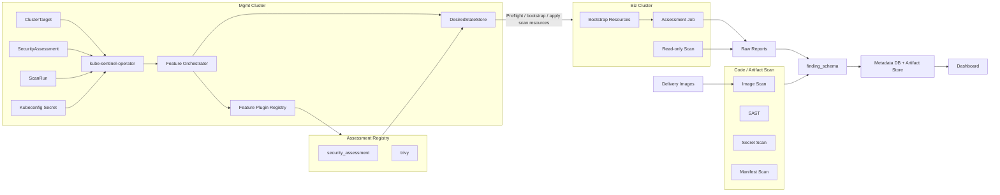

# kube-sentinel — PoC 구현 계획서 v1.2

> **도구**: Trivy · Security Assessment
> **파이프라인**: Scanner / Read-only Inspector → Finding Normalizer → PostgreSQL query store(raw_reports/findings) + Artifact Store evidence exports → Dashboard
> **보안 점검**: SAST · Secret Scan · Image Scan · SBOM/무결성 · Manifest/RBAC/Dockerfile/Script Scan
> **아키텍처**: Mgmt Cluster 단일 operator + Remote Apply + Feature-as-Plugin Registry
> **보조기능**: Target preflight · artifact input manifest · scanner baseline · stable finding ID · Secret redaction · evidence bundle · exception review · scan health
> **비목표**: Biz Cluster operator 설치 · 고객 인프라 자동 개선 · 인라인 차단 · Kafka · 완벽한 OCSF 정규화 · 운영 차단 정책

---

## 1. 목표 & 성공 기준

성공 기준은 [REQUIREMENTS.md](./REQUIREMENTS.md)를 정본으로 한다. 아래 표는 동일한
G1~G19를 구현 관점에서 옮긴 것이며, AI advisor 관련 G20/G21은 REQUIREMENTS.md와
[AI_REMEDIATION.md](./AI_REMEDIATION.md)를 따른다.

| # | 성공 기준 | 검증 방법 |
|---|----------|----------|
| G1 | `ClusterTarget`와 `SecurityAssessment` CR을 생성하면 management controller가 Code / Artifact Scan은 Mgmt-local Job으로 실행하고, Biz Cluster Scan은 read-only inspection(옵션으로 허용된 remote scanner Job)으로 실행한다. | Mgmt Cluster에서 `kubectl get clustertarget,securityassessment,scanrun`과 Mgmt-local Code / Artifact Scan Job 확인. Biz Cluster Scan을 remote Job으로 실행하도록 구성한 경우에만 Biz Cluster target namespace에서 `kubectl get job,cronjob,cm,sa,role,rolebinding` 확인 |
| G2 | Feature toggle은 feature별 managed resource를 생성하거나 제거한다. | `spec.features[].enabled` patch 후 resource 생성/삭제 확인 |
| G3 | allowlist 기반 scan resource config로 선택된 scan Job의 resource와 scheduling field를 변경할 수 있다. | `spec.scanResources` patch 후 생성된 workload spec과 거부된 금지 field 확인 |
| G4 | Trivy와 security assessment data는 PostgreSQL query record와 evidence/export artifact로 정규화된다. | `raw_reports`, `findings`, scan health, evidence/export artifact 검토 |
| G5 | Dashboard view는 finding, vulnerability, scan health, final-check security assessment 결과를 노출한다. | dashboard screenshot 캡처 |
| G6 | Final Check Dashboard는 의사결정 중심 메뉴로 assessment result를 노출한다. | dashboard screenshot 캡처 |
| G7 | scope, discovery, priority, validation, exception review에 대한 evidence/decision mapping이 통과한다. | evidence bundle, final decision summary, exception review artifact 검토 |
| G8 | 소스코드 정적분석으로 risky code와 security anti-pattern을 식별한다. | Semgrep/gosec report 검토 |
| G9 | hardcoded secret, token, credential, account information을 탐지한다. | Gitleaks report 검토 |
| G10 | 컨테이너 이미지 Critical vulnerability와 위험한 base image를 탐지한다. | Trivy/Grype image scan report 검토 |
| G11 | image digest, SBOM, signature/integrity 검증 결과를 생성한다. | Syft/Cosign/Crane output 검토 |
| G12 | Helm/YAML, RBAC, Dockerfile, deployment script의 고위험 설정을 탐지한다. | kube-linter/conftest/hadolint/shellcheck report 검토 |
| G13 | Kubernetes YAML, RBAC, Secret reference에 대한 적용된 개발 cluster 설정 위험을 탐지한다. | rendered/applied workload spec, RBAC, ServiceAccount, Service/Ingress, Secret reference path 확인 |
| G14 | scanner failure, unsupported scan, missing required artifact는 failed scan health finding으로 노출된다. | security assessment summary 검토 |
| G15 | 1차 assessment support feature는 재현 가능한 입력, scanner baseline, stable finding ID, Secret redaction, evidence bundle, exception review, scan health summary를 제공한다. | `artifact-input.yaml`, scanner baseline report, normalized finding, evidence bundle, exception review artifact, scan health summary 검토 |
| G16 | Trivy Operator `VulnerabilityReport`는 존재할 때 선택적 read-only 입력으로 지원되며 필수 의존성이 아니다. | optional `VulnerabilityReport` ingestion 또는 `optional input unavailable` scan health status 확인 |
| G17 | Mgmt Cluster 단일 operator가 Feature-as-Plugin registry를 통해 검사 기능을 오케스트레이션한다. | Reconciler 변경 없이 feature enable/disable, priority ordering, status reporting 확인 |
| G18 | Biz Cluster Scan 전 preflight가 누락된 bootstrap 항목을 식별하고, 정책상 허용된 항목만 설치한다. | namespace/RBAC/image pull/report upload/optional CRD check 결과와 bootstrap audit 확인 |
| G19 | Artifact Store는 backend plugin으로 교체 가능하며 S3/MinIO에 고정되지 않는다. | Filesystem 또는 SeaweedFS/S3-compatible backend 설정 전환 후 report artifact 조회 확인 |
| G20 | (선택) AI remediation advisor는 기본 OFF opt-in이며 advisory sidecar·provenance·redaction·`scan_health` degraded를 제공한다. AI 실패는 scan Fail이 아니다. | [AI_REMEDIATION.md](./AI_REMEDIATION.md) 검증 기준 |
| G21 | (선택) AI ON/OFF 동일 scan에서 finding count·severity·final decision이 동일하다. | AI ON/OFF A/B 비교 |

### 구현 Stage Gate

PoC는 한 번에 4개 센서를 모두 붙이지 않고, 다음 세로 경로를 먼저 고정한다.

| Stage | 범위 | 통과 기준 |
|-------|------|----------|
| S0 | Mgmt/Biz Cluster 권한과 Report Store 연결 사전 검증 | Biz Cluster kubeconfig, target namespace, read-only RBAC, image access, report store write 확인 |
| S0.5 | 납품 산출물 보안 점검 파이프라인 베이스라인 | SAST, Secret, Image, SBOM/무결성, Manifest/RBAC, Dockerfile/Script 스캔 결과 생성 |
| S1 | Report Store + Security Finding Schema + Trivy fixture 검증 | Security Assessment fixture가 PostgreSQL `raw_reports`/`findings`와 evidence export artifact로 적재 |
| S2 | `ClusterTarget` + `SecurityAssessment` -> Security Assessment | Mgmt controller가 Biz Cluster에 assessment Job/CronJob을 remote apply |
| S3 | Trivy, optional VulnerabilityReport, applied cluster config scan 순차 추가 | 각 profile enable/disable, status, report artifact 검증 |
| S4 | 내부 최종점검 산출물 보안 점검 + Dashboard + Report 검증 | G1~G19 통과 (G20/G21 AI advisor는 opt-in 시) |

---

## 2. 전체 아키텍처



아키텍처는 다음 경계를 유지한다.

- kube-sentinel management controller는 Mgmt Cluster의 `ClusterTarget`, `SecurityAssessment`, `ScanRun`을 기준으로 Biz Cluster에 리소스를 remote apply한다.
- 구현체는 Mgmt Cluster의 단일 `kube-sentinel-operator`로 구성한다. Biz Cluster별 operator를 설치하지 않는다.
- Biz Cluster에는 kube-sentinel operator와 CRD를 설치하지 않는다.
- Biz Cluster Scan 전 preflight로 namespace/RBAC/image pull/report upload/optional Trivy Operator CRD를 확인하고, 누락된 항목은 `설치 필요` 상태로 표시한다.
- 정책상 허용된 bootstrap 항목만 Mgmt operator가 설치한다. 고객 namespace, 기존 workload, 기존 app RBAC, 기존 Service/Ingress, Secret 값은 자동 수정하지 않는다.
- Biz Cluster 목록은 Mgmt Cluster의 `ClusterTarget`과 `status`를 기준으로 조회한다. kubeconfig Secret 값은 대시보드/API/로그에 노출하지 않는다.
- `security_assessment`는 현재 버전에서 납품 산출물 보안 점검을 수행하는 별도 Job/CronJob 계층으로 둔다.
- Biz Cluster remote apply는 검사/수집 리소스 배치에 한정한다. 애플리케이션 workload, RBAC, Service, Ingress, Secret 등 고객 인프라를 자동 개선하거나 수정하지 않는다.
- 개별 scanner 결과는 도구별 포맷 그대로 저장하지 않고 `Security Finding Schema`로 정규화한 뒤 Report Store에 적재한다.
- Report Store는 Metadata DB와 Artifact Store abstraction으로 나눈다. Artifact Store는 S3/MinIO에 고정하지 않고 Filesystem, S3-compatible, MinIO, SeaweedFS, NFS/PVC, OCI artifact backend plugin으로 교체 가능하게 둔다.
- 최종 판정은 scanner exit code 하나에 의존하지 않고 필수 산출물 존재 여부, 분석 실패 여부, 예외 승인 상태를 함께 평가한다.
- Runtime 환경 점검은 다음 버전 범위로 분리한다.

---

## 3. CRD 설계

### ClusterTarget 샘플

```yaml
apiVersion: security.kube-sentinel.io/v1alpha1
kind: ClusterTarget
metadata:
  name: dev-a
spec:
  displayName: dev-a
  environment: dev
  kubeconfigRef:
    namespace: kube-sentinel-system
    name: dev-a-kubeconfig
    key: kubeconfig
  targetNamespace: kube-sentinel-system
  namespaceAllowlist: ["app", "platform"]
  output:
    reportTenantID: dev-a
  capabilities:
    scannerJobs: true
    readOnlyInspection: true
    trivyOperatorReports: false
    hostPath: false
  bootstrapPolicy:
    installMissingNamespace: false
    installManagedRBAC: true
    installScannerResources: true
    attachImagePullSecretRef:
      name: scanner-pull-secret
```

### Biz Cluster kubeconfig 저장 및 Cluster List 조회

Biz Cluster가 대시보드의 클러스터 리스트에 표시되려면 Mgmt Cluster에
두 리소스가 모두 존재해야 한다.

1. Biz Cluster 접근용 kubeconfig 또는 ServiceAccount token을 담은 Secret.
2. 해당 Secret을 참조하는 `ClusterTarget` CR.

권장 Secret 구조:

```yaml
apiVersion: v1
kind: Secret
metadata:
  name: dev-a-kubeconfig
  namespace: kube-sentinel-system
  labels:
    app.kubernetes.io/managed-by: kube-sentinel
    security.kube-sentinel.io/credential-type: kubeconfig
type: Opaque
data:
  kubeconfig: <base64 kubeconfig>
```

저장 원칙:

- kubeconfig 값은 Mgmt Cluster Secret 또는 외부 Secret Manager에서 동기화된 Secret에만 저장한다.
- Secret encryption at rest를 Mgmt Cluster에서 활성화한다.
- Secret read 권한은 kube-sentinel mgmt controller와 break-glass 관리자에게만 부여한다.
- dashboard/API/log/event/status에는 kubeconfig 값을 절대 노출하지 않는다.
- Cluster 삭제 시 target ServiceAccount token을 폐기하고 Mgmt Cluster Secret도 삭제한다.

Cluster List 조회 원칙:

- 대시보드는 `ClusterTarget` list와 `ClusterTarget.status`만 조회한다.
- 연결 상태는 `status.phase`에 `Ready`, `Degraded`, `AuthFailed`, `Unreachable`, `PermissionDenied`로 표시한다.
- Kubernetes version, namespace allowlist, capability, last validation time은 controller가 discovery 결과를 status에 기록한다.
- credential rotation 상태는 `status.lastCredentialRotationAt`만 표시하고 Secret 값은 표시하지 않는다.

### SecurityAssessment 샘플

```yaml
apiVersion: security.kube-sentinel.io/v1alpha1
kind: SecurityAssessment
metadata:
  name: final-check-2026-06
spec:
  targets: ["dev-a"]
  profiles:
    - SourceSecurity
    - ImageSupplyChain
    - KubernetesConfig
    - RBACAndSecretReference
    - BuildAndDeploy
  artifactInput:
    sourceRef:
      path: ./release-src
    imageList:
      - image: registry.example.com/app/api:1.2.3
    digestList:
      - image: registry.example.com/app/api
        digest: sha256:...
    manifestRef:
      path: ./deploy/rendered
  aiRemediation:
    enabled: false
    provider: none
  features:
    - name: trivy
      enabled: true
      config:
        scanSchedule: "@every 6h"
        severityThreshold: "HIGH"
        useOperatorReports: true

  output:
    reportStore:
      tenantID: "kube-sentinel"
      retentionDays: 90

  scanResources:
    securityAssessment:
      ttlSecondsAfterFinished: 86400
```

### Go 타입 정의 (핵심)

```go
type ClusterTargetSpec struct {
    DisplayName        string              `json:"displayName,omitempty"`
    Environment        string              `json:"environment,omitempty"`
    KubeconfigRef      SecretKeyRef        `json:"kubeconfigRef"`
    TargetNamespace    string              `json:"targetNamespace,omitempty"`
    NamespaceAllowlist []string            `json:"namespaceAllowlist,omitempty"`
    Output             TargetOutputSpec    `json:"output,omitempty"`
    Capabilities       TargetCapabilitySpec `json:"capabilities,omitempty"`
    BootstrapPolicy    ClusterTargetBootstrapPolicy `json:"bootstrapPolicy,omitempty"`
}

// ClusterTargetBootstrapPolicy는 preflight에서 누락으로 판정된 항목 중
// Mgmt operator가 자동 설치/연결해도 되는 범위를 선언한다. 명시되지 않은
// 항목은 설치하지 않고 '설치 필요' 상태로만 표시한다.
type ClusterTargetBootstrapPolicy struct {
    InstallMissingNamespace  bool            `json:"installMissingNamespace,omitempty"`
    InstallManagedRBAC       bool            `json:"installManagedRBAC,omitempty"`
    InstallScannerResources  bool            `json:"installScannerResources,omitempty"`
    AttachImagePullSecretRef *LocalObjectRef `json:"attachImagePullSecretRef,omitempty"`
}

type SecurityAssessmentSpec struct {
    Targets       []string           `json:"targets"`
    Profiles      []ScanProfile      `json:"profiles,omitempty"`
    ArtifactInput *ArtifactInputSpec `json:"artifactInput,omitempty"`
    AIRemediation *AIRemediationSpec `json:"aiRemediation,omitempty"`
    Features      []FeatureSpec      `json:"features,omitempty"`
    Output        OutputSpec         `json:"output,omitempty"`
    ScanResources *ScanResourceSpec  `json:"scanResources,omitempty"`
}

// ArtifactInputSpec은 납품 산출물 입력(artifact-input manifest)을 CRD에 연결한다.
// 실제 재현 선언(artifact-input.yaml)은 Artifact Store에 보관하고 CRD에는
// 입력 위치/목록 참조만 둔다. 대용량 원문은 CRD에 인라인하지 않는다.
type ArtifactInputSpec struct {
    SourceRef   *ArtifactLocationRef `json:"sourceRef,omitempty"`   // source/Dockerfile/Helm/YAML/RBAC/script 위치
    ImageList   []ImageArtifactRef   `json:"imageList,omitempty"`   // 납품 대상 image 목록
    DigestList  []ImageDigestRef     `json:"digestList,omitempty"`  // 승인 digest 기준 목록
    ManifestRef *ArtifactLocationRef `json:"manifestRef,omitempty"` // 외부 artifact-input.yaml 위치
}

type ArtifactLocationRef struct {
    Path              string `json:"path,omitempty"`
    ArtifactStorePath string `json:"artifactStorePath,omitempty"`
    Checksum          string `json:"checksum,omitempty"`
}

type ImageArtifactRef struct {
    Image   string `json:"image"`
    Digest  string `json:"digest,omitempty"`
    TarPath string `json:"tarPath,omitempty"`
}

type ImageDigestRef struct {
    Image  string `json:"image"`
    Digest string `json:"digest"`
}

// AIRemediationSpec은 AI 조치 가이드 advisor(선택, 기본 OFF) opt-in 설정이다.
// 상세 기준은 AI_REMEDIATION.md를 따른다. RawExtension이 아니라 strongly-typed로
// 두어 egress/redaction/판정 안전성 필드를 CRD schema에서 직접 검증한다.
type AIRemediationSpec struct {
    Enabled               bool          `json:"enabled"`                       // 기본 OFF, ON은 명시적 opt-in
    Provider              string        `json:"provider,omitempty"`            // gemini | none
    APIKeySecretRef       *SecretKeyRef `json:"apiKeySecretRef,omitempty"`     // Mgmt Cluster Secret 참조 (값 미노출)
    Model                 string        `json:"model,omitempty"`               // version pin
    PromptTemplateID      string        `json:"promptTemplateID,omitempty"`    // PROMPTS.md 등록 template 버전
    SeverityFilter        []string      `json:"severityFilter,omitempty"`      // [Critical, High]
    CategoryAllowlist     []string      `json:"categoryAllowlist,omitempty"`   // [kubernetes, rbac, dockerfile, image_vulnerability]
    MaxFindingsPerScan    int32         `json:"maxFindingsPerScan,omitempty"`  // per-scan 상한
    RequestTimeoutSeconds int32         `json:"requestTimeoutSeconds,omitempty"`
    MaxConcurrency        int32         `json:"maxConcurrency,omitempty"`
    RedactionProfile      string        `json:"redactionProfile,omitempty"`    // strict 등
}

type ScanRunSpec struct {
    AssessmentRef LocalObjectRef `json:"assessmentRef"`
    Targets       []string       `json:"targets,omitempty"`
    Profiles      []ScanProfile  `json:"profiles,omitempty"` // 생략 시 SecurityAssessment.spec.profiles 사용
}

// RawExtension → 스키마 변경 없이 새 도구 config 추가 가능
type FeatureSpec struct {
    Name    string               `json:"name"`
    Enabled bool                 `json:"enabled"`
    Config  runtime.RawExtension `json:"config,omitempty"`
}

type ReportStoreSpec struct {
    TenantID      string            `json:"tenantID,omitempty"`
    RetentionDays int               `json:"retentionDays,omitempty"`
    Labels        map[string]string `json:"labels,omitempty"`
}

```

### Status 및 검증 정책

`RawExtension` 기반 config는 확장성은 높지만 CRD schema 검증이 약하므로, 런타임 검증 실패를 status에 명확히 노출한다.

```go
type ClusterTargetStatus struct {
    ObservedGeneration        int64                  `json:"observedGeneration,omitempty"`
    Phase                     string                 `json:"phase,omitempty"` // Pending, Ready, Degraded, AuthFailed, Unreachable, PermissionDenied
    LastValidatedAt           metav1.Time            `json:"lastValidatedAt,omitempty"`
    LastCredentialRotationAt  metav1.Time            `json:"lastCredentialRotationAt,omitempty"`
    KubernetesVersion         string                 `json:"kubernetesVersion,omitempty"`
    Capabilities              TargetCapabilityStatus `json:"capabilities,omitempty"`
    Namespaces                []string               `json:"namespaces,omitempty"`
    Conditions                []metav1.Condition     `json:"conditions,omitempty"`
}

type ScanRunStatus struct {
    ObservedGeneration int64               `json:"observedGeneration,omitempty"`
    Phase              string              `json:"phase,omitempty"` // Pending, Running, Completed, Failed, Canceled
    ArtifactScan       ScanPhaseStatus     `json:"artifactScan,omitempty"`
    ClusterScan        ScanPhaseStatus     `json:"clusterScan,omitempty"`
    Features           []FeatureCondition  `json:"features,omitempty"`
    Targets            []TargetRunStatus   `json:"targets,omitempty"`
    RemoteResources    []RemoteResourceRef `json:"remoteResources,omitempty"`
    FinalDecision      *FinalDecision      `json:"finalDecision,omitempty"`
}

// FinalDecision은 최종 판정을 단일 enum이 아니라 status + 근거로 표현한다.
// status는 scanner exit code 하나가 아니라 필수 산출물/분석 실패/예외 승인
// 상태를 함께 평가한 결과다. REST API는 이 객체의 status를 `final_decision`
// 문자열(snake_case)로 평면화해 노출하고, 전체 객체는 evidence/summary로 보존한다.
type FinalDecision struct {
    Status    string                `json:"status,omitempty"` // Pass, Fail, Warning
    Reasons   []FinalDecisionReason `json:"reasons,omitempty"`
    DecidedAt metav1.Time           `json:"decidedAt,omitempty"`
}

type FinalDecisionReason struct {
    Code      string `json:"code"`                 // critical_finding, secret_exposure, digest_mismatch, missing_artifact, unapproved_exception 등
    Message   string `json:"message,omitempty"`
    Severity  string `json:"severity,omitempty"`   // Critical, High, ...
    Category  string `json:"category,omitempty"`   // findings.category
    Count     int32  `json:"count,omitempty"`
    FindingID string `json:"findingID,omitempty"`  // 연결 finding (있으면)
}

// RemoteResourceRef는 Biz Cluster에 remote apply된 리소스를 추적한다.
// Remote object는 Mgmt CR에 ownerReference를 걸 수 없으므로
// label(target/feature/scope)과 spec-hash annotation 기준으로만 GC한다.
type RemoteResourceRef struct {
    Target     string `json:"target"`             // ClusterTarget 이름
    APIVersion string `json:"apiVersion"`
    Kind       string `json:"kind"`
    Namespace  string `json:"namespace,omitempty"`
    Name       string `json:"name"`
    Feature    string `json:"feature,omitempty"`  // security.kube-sentinel.io/feature
    Scope      string `json:"scope,omitempty"`    // target | run
    SpecHash   string `json:"specHash,omitempty"` // security.kube-sentinel.io/spec-hash
}

type ScanPhaseStatus struct {
    Phase      string             `json:"phase,omitempty"` // Pending, Running, Completed, Failed, Skipped
    StartedAt  metav1.Time        `json:"startedAt,omitempty"`
    FinishedAt metav1.Time        `json:"finishedAt,omitempty"`
    Conditions []metav1.Condition `json:"conditions,omitempty"`
}

type FeatureCondition struct {
    Name               string      `json:"name"`
    Enabled            bool        `json:"enabled"`
    Ready              bool        `json:"ready"`
    Reason             string      `json:"reason,omitempty"`  // Disabled, Ready, ConfigError, ApplyError, NotReady
    Message            string      `json:"message,omitempty"`
    ObservedGeneration int64       `json:"observedGeneration,omitempty"`
    LastTransitionTime metav1.Time `json:"lastTransitionTime,omitempty"`
}

// SecurityAssessmentStatus는 마지막 실행 기준 집계로 dashboard Overview/Assessments
// read model 입력이다. summary 카운터는 DATABASE scan_runs.summary JSONB와 동일 의미다.
type SecurityAssessmentStatus struct {
    ObservedGeneration int64              `json:"observedGeneration,omitempty"`
    LastRunRef         *LocalObjectRef    `json:"lastRunRef,omitempty"` // 가장 최근 ScanRun 참조
    Summary            AssessmentSummary  `json:"summary,omitempty"`
    Conditions         []metav1.Condition `json:"conditions,omitempty"`
}

type AssessmentSummary struct {
    LastDecision           string      `json:"lastDecision,omitempty"` // Pass, Fail, Warning
    CriticalCount          int32       `json:"criticalCount,omitempty"`
    HighCount              int32       `json:"highCount,omitempty"`
    ExceptionRequiredCount int32       `json:"exceptionRequiredCount,omitempty"`
    ScanHealthFailCount    int32       `json:"scanHealthFailCount,omitempty"`
    ScannerBaselineDate    string      `json:"scannerBaselineDate,omitempty"`
    LastRunAt              metav1.Time `json:"lastRunAt,omitempty"`
}
```

검증 정책:

- 알 수 없는 `features[].name`은 `ConfigError`로 status에 기록하고 해당 feature는 적용하지 않는다.
- `spec.profiles[]`는 ARCHITECTURE.md의 profile→registry feature ID 정본 표로 base set으로 확장한다. `ScanRun.spec.profiles[]`가 있으면 `SecurityAssessment.spec.profiles[]`를 override한다.
- profile base set에 `features[]`를 선언 순서대로 적용한다(`enabled=true`는 추가, `enabled=false`는 제거, 동일 feature ID의 config는 마지막 항목이 우선). 최종 enabled set = (profiles 확장 ∪ `features[].enabled=true`) − (`features[].enabled=false`).
- 알 수 없는 `profiles[]` 값은 `ConfigError`로 status에 기록하고 해당 profile만 무시한다(unknown feature와 동일).
- `SecurityAssessment.spec.targets[]`가 존재하지 않는 `ClusterTarget`을 참조하면 `ScanRun`을 `Failed`로 기록한다.
- target kubeconfig Secret 연결 실패, API server unreachable, RBAC denied는 `ClusterTarget.status`와 `ScanRun.status.targets[]`에 분리해서 기록한다.
- `Configure()` 실패는 전체 reconcile 실패로 처리하되, 이미 정상 적용된 리소스를 무리하게 삭제하지 않는다.
- feature별 기본값은 각 feature package에 두고, sample YAML은 기본값을 설명하는 용도로만 사용한다.

---

## 4. Assessment Workflow Registry 아키텍처

### Feature 인터페이스

```go
type Feature interface {
    ID() string
    Priority() int
    Validate(ctx FeatureContext) []Condition
    Preflight(ctx FeatureContext) []CheckResult
    Build(ctx FeatureContext) DesiredState
    Collect(ctx FeatureContext) []ArtifactRef
    Normalize(ctx FeatureContext) []Finding
}
```

### 우선순위 Registry

```
Priority 10   target_preflight          ← target 환경 실패와 scanner finding 분리
Priority 20   bootstrap                 ← 허용된 namespace/RBAC/scanner resource 준비
Priority 50   source_security           ← SonarQube/Semgrep/gosec
Priority 50   secret_scan               ← Gitleaks
Priority 100  image_vulnerability       ← Trivy/Grype
Priority 100  image_integrity           ← digest/signature 검증
Priority 100  sbom                      ← Syft/Trivy SBOM
Priority 150  kubernetes_manifest       ← Helm/YAML/kube-linter/conftest
Priority 150  rbac_review               ← RBAC 과권한 검사
Priority 150  dockerfile_scan           ← Hadolint
Priority 150  script_scan               ← ShellCheck
Priority 200  applied_cluster_config    ← Biz Cluster read-only workload 검사
Priority 200  secret_reference          ← Secret raw value 없는 참조 검사
Priority 200  trivy_operator_reports    ← optional VulnerabilityReport 정규화
Priority 250  remediation_enrichment    ← final decision 후 AI 조치 가이드(선택, 기본 OFF)
Priority 300  report_export             ← final report/evidence bundle 생성
```

### 새 검사 기능 추가 = 3단계

```
1. internal/feature/<newtool>/feature.go 생성
   → Feature 인터페이스 구현
   → init()에서 feature.Register() 호출

2. cmd/main.go에 import 1줄 추가

3. 끝. Reconciler 코드 변경 없음. CRD 스키마 변경 없음.
```

Reconciler는 scanner별 세부 구현을 알지 않는다. workflow/status/GC/remote apply
엔진만 담당하고, 검사 로직은 Feature가 담당한다.

---

## 5. Report/Finding 파이프라인 — 데이터 흐름

### 입력과 수집 방식

| 도구 | 출력 방식 | 수집 경로 | 메타 소스 |
|------|-----------|---------------|--------------|
| Security Assessment | scanner JSON / SARIF / artifact scan report | PostgreSQL `raw_reports` insert, evidence bundle export | scan target 메타 |
| Trivy | registry digest, image tar, SBOM, optional VulnerabilityReport | PostgreSQL `raw_reports` insert 또는 Biz Cluster read-only API 조회, SBOM/evidence export | image digest, workload image reference |

### Severity 통합 매핑

```
통합 severity    Trivy/SAST/Policy
5 (Critical)     CRITICAL
4 (High)         HIGH
3 (Medium)       MEDIUM
2 (Low)          LOW
1 (Info)         INFO/UNKNOWN
```

### Report Store 라우팅

```
security_tool: trivy                → raw report + image_vulnerability/sbom/integrity findings
security_tool: security_assessment  → raw report + security_finding/scan_health findings
```

### Artifact Store backend plugin

Artifact Store는 특정 저장소 제품에 고정하지 않는다. 구현체는 다음 interface 뒤에
둔다.

```go
type ArtifactStore interface {
    PutArtifact(ctx context.Context, ref ArtifactRef, r io.Reader) error
    GetArtifact(ctx context.Context, ref ArtifactRef) (io.ReadCloser, error)
    ListArtifacts(ctx context.Context, prefix string) ([]ArtifactRef, error)
    DeleteArtifact(ctx context.Context, ref ArtifactRef) error
    GenerateDownloadURL(ctx context.Context, ref ArtifactRef) (string, error)
}
```

| Backend | 용도 |
|------|------|
| Filesystem | 로컬 PoC |
| S3-compatible | 일반 운영 환경 |
| MinIO | 사내/PoC object storage |
| SeaweedFS | 경량 분산 file/object storage. S3 호환 또는 native filer API plugin 가능 |
| NFS/PVC | 단순 내부망 배포 |
| OCI artifact | 향후 evidence bundle 배포 후보 |

### Trivy 적재 방식

현재 버전의 Security Assessment는 납품 이미지 tar 또는 registry digest를 기준으로 이미지 취약점, misconfiguration, SBOM 결과를 생성한다. Biz Cluster에 Trivy Operator가 이미 설치되어 있고 `VulnerabilityReport` 조회 권한이 있으면 이를 선택 입력으로 함께 정규화한다.

```
CI/Image Trivy
  → image digest scan + SBOM
  → Security Finding Schema
  → Report Store + Evidence Bundle

Optional Trivy Operator
  → VulnerabilityReport read-only ingestion
  → Security Finding Schema
  → Report Store + Evidence Bundle
```

finding id:

```
<imageRepository>/<imageDigest>/<vulnerabilityID>/<packageName>
```

M5 통과 조건은 같은 report를 2회 처리해도 동일 finding id 기준으로 PostgreSQL `findings` 집계가 중복 증가하지 않는 것이다. 최신 상태 판정은 finding id와 scan timestamp 기준의 PostgreSQL query에서 수행하며, report artifact는 해당 시점의 immutable export로만 사용한다.

### 1차 보조기능 분리

1차 최종점검 MVP는 scanner 자체보다 결과의 신뢰성을 보장하는 보조기능을
같이 제공해야 한다. 상세 범위는
[ASSESSMENT_SUPPORT_FEATURES.md](./ASSESSMENT_SUPPORT_FEATURES.md)를 따른다.

| 범위 | 기능 |
|------|------|
| 1차 필수 | Target preflight, Artifact input manifest, scanner baseline capture, stable finding ID/deduplication, Secret redaction guard, Evidence bundle export, Exception review artifact, Scan health summary |
| 1차 선택 | Policy severity mapping, Finding schema validator, Namespace allowlist validator, Image digest resolver, read-only RBAC manifest generator, Trivy Operator `VulnerabilityReport`, Markdown/JSON report export |
| 후순위/2차 | Applied vs delivery manifest comparison, dashboard deep link metadata, audit log, OSQuery, OTel/LGTM telemetry, runtime event/drift, long-running DaemonSet sensor |

### Security Finding Schema

모든 scanner 결과는 최소한 다음 공통 필드로 정규화한다.

| 필드 | 의미 |
|------|------|
| `finding_id` | scanner, target, rule/CVE, location을 조합한 안정 ID |
| `scanner` | `semgrep`, `gitleaks`, `trivy`, `grype`, `syft`, `cosign`, `kube-linter`, `conftest`, `hadolint`, `shellcheck` 등 |
| `category` | `sast`, `secret`, `image_vulnerability`, `sbom`, `integrity`, `kubernetes`, `rbac`, `secret_ref`, `network`, `dockerfile`, `script`, `scan_health` |
| `severity` | `Critical`, `High`, `Medium`, `Low`, `Info` |
| `target_type` | `source`, `image`, `helm`, `yaml`, `dockerfile`, `script`, `rbac`, `secret_ref` |
| `target_name` | 파일, 이미지, Kubernetes 리소스, namespace/name |
| `image_digest` | 이미지 대상이면 실제 digest |
| `rule_id` | scanner rule ID, CVE ID, policy ID |
| `message` | 위험 설명 |
| `remediation` | 개선 권고 |
| `exception_required` | 예외 검토 필요 여부 |
| `scan_status` | `Pass`, `Fail`, `Error`, `Skipped`, `Unsupported` |

---

## 6. Workflow and Reconciler 흐름

구현은 하나의 거대한 검사 함수가 아니라 두 개의 워크플로우 runner를
조합하는 구조로 둔다.

| Workflow | 입력 | 실행 책임 | 상태 |
|----------|------|----------|------|
| Code / Artifact Workflow | `artifactInput`, source, Dockerfile, Helm/YAML, RBAC manifest, script, image list, digest list, SBOM | Mgmt Cluster preflight·artifact staging, **Mgmt-local** scanner Job 실행, PostgreSQL `raw_reports` 저장, finding 정규화 | `ScanRun.status.artifactScan` |
| Biz Cluster Workflow | `ClusterTarget`, kubeconfig Secret, namespace allowlist, Biz Cluster RBAC | preflight, Mgmt operator **read-only** applied config/RBAC/Secret reference 조회, optional **Biz-remote** scanner Job, PostgreSQL `raw_reports` 저장, finding 정규화 | `ScanRun.status.clusterScan`, `ClusterTarget.status` |
| Final Decision Workflow | PostgreSQL `findings`, scan health, exception state | 두 workflow 결과 상관 분석, 최종 판정, 예외 후보 생성 | `ScanRun.status.finalDecision` |

각 workflow는 독립 재실행이 가능해야 한다. 예를 들어 registry 장애로
Code / Artifact Workflow가 실패한 경우 Biz Cluster Workflow의 연결 상태를
덮어쓰지 않고, Biz Cluster RBAC denied는 artifact scan 결과를 실패로
오염시키지 않는다.

```
Reconcile()
  │
  ├── 1. Mgmt Cluster CR finalizer 등록
  ├── 2. SecurityAssessment 로드
  ├── 3. 선택된 ClusterTarget 로드
  ├── 4. ScanRun 실행 context 생성
  ├── 5. enabled Feature resolve → priority 순서 정렬
  ├── 6. Feature.Validate()
  ├── 7. Feature.Preflight()
  │      ├── API server 연결 확인
  │      ├── target namespace 존재 확인
  │      ├── namespace allowlist 확인
  │      ├── read-only RBAC 확인
  │      ├── image pull/report upload 확인
  │      └── optional Trivy Operator CRD 확인
  ├── 8. 허용된 bootstrap 누락 항목만 DesiredState에 포함
  ├── 9. Feature.Build() → Mgmt-local/Biz-remote DesiredStateStore에 리소스 기여
  ├── 10. scan resource config allowlist 적용
  ├── 11. Mgmt Cluster 리소스 SSA Apply
  ├── 12. Biz Cluster bootstrap 또는 Scan resource Remote SSA Apply
  │      ├── kube-sentinel-system namespace는 명시적 허용 시에만 생성
  │      ├── kube-sentinel 전용 ServiceAccount/RBAC 생성
  │      └── scanner Job/ConfigMap 생성
  ├── 13. Code / Artifact Scan과 Biz Cluster Scan 실행
  │      ├── Code / Artifact Scan: Mgmt-local Job. init container가 artifactInput을
  │      │     emptyDir로 clone/fetch(path mount/Artifact Store fetch/image tar/registry digest)
  │      ├── Biz Cluster Scan: Mgmt controller read-only applied config inspection
  │      └── Biz Cluster Scan: 필요 시 허용된 remote scanner Job Remote SSA Apply
  ├── 14. Feature.Collect() → raw artifact reference 수집
  ├── 15. Feature.Normalize() → finding/scan health 생성
  ├── 16. PostgreSQL에 raw_reports/findings/scan_health/final decision 저장 후 Artifact Store에 evidence/export 산출물 저장
  ├── 17. label 기반 비활성 Feature/ScanRun remote GC
  ├── 18. Code 결과와 Biz Cluster 결과 상관 분석
  ├── 19. Evidence Bundle과 Exception Review 후보 생성
  └── 20. ClusterTarget.status와 ScanRun.status 갱신
```

### Watch / Drift / Status 원칙

- `GenerationChangedPredicate`만 사용하면 Biz Cluster 연결 상태, RBAC 변경, remote resource drift를 놓칠 수 있으므로 `ClusterTarget`, `SecurityAssessment`, `ScanRun` watch와 주기적 health check를 함께 사용한다.
- spec 변경 reconcile과 status 점검 reconcile을 분리한다. spec 미변경 이벤트에서는 desired state 재합성은 허용하되, 불필요한 remote apply는 object hash 비교로 줄인다.
- 외부 상태 점검은 `RequeueAfter`로 주기 실행한다. PoC 기본값은 60초이며, kubeconfig 인증 실패, API server unreachable, RBAC denied, report store write 실패, scanner Job 실패는 `Degraded` 또는 구체적인 target phase로 표시한다.
- Security Assessment는 현재 버전에서 산출물 경로와 이미지 목록을 기준으로 실행한다. Runtime scan은 Next Version 범위로 둔다.
- Code / Artifact Scan 실패는 `ScanRun.status.artifactScan`에 기록하고, Biz Cluster 접속/권한/allowlist 실패는 `ScanRun.status.clusterScan`과 `ClusterTarget.status`에 기록한다.
- Code / Artifact Scan은 Biz Cluster 접근 없이도 실행 가능해야 한다. Biz Cluster Scan은 `ClusterTarget`과 kubeconfig Secret이 준비된 경우에만 실행한다.
- Status update는 별도 patch로 수행하고, `observedGeneration`은 spec 기반 apply가 성공한 뒤에만 갱신한다.

### SSA / GC 리소스 소유 전략

생성 리소스는 lifecycle에 따라 target-scoped와 run-scoped로 나눈다.
shared RBAC, ServiceAccount, ConfigMap처럼 target 단위로 유지되는
리소스는 target-scoped이고, Security Assessment Job/report처럼 검사 실행에
종속되는 리소스는 run-scoped이다.

Target-scoped 리소스 label/annotation:

```yaml
metadata:
  labels:
    app.kubernetes.io/managed-by: kube-sentinel
    security.kube-sentinel.io/target: dev-a
    security.kube-sentinel.io/feature: security_assessment
    security.kube-sentinel.io/scope: target
  annotations:
    security.kube-sentinel.io/spec-hash: "<sha256>"
```

Run-scoped 리소스 label/annotation:

```yaml
metadata:
  labels:
    app.kubernetes.io/managed-by: kube-sentinel
    security.kube-sentinel.io/target: dev-a
    security.kube-sentinel.io/scan-run: final-check-2026-06-001
    security.kube-sentinel.io/feature: security_assessment
    security.kube-sentinel.io/scope: run
  annotations:
    security.kube-sentinel.io/spec-hash: "<sha256>"
```

- SSA field manager는 `kube-sentinel/<target>/<feature>/<scope>` 형식으로 분리한다.
- apply conflict는 기본적으로 status `ApplyError`로 보고하고 강제 적용하지 않는다.
- Remote object에는 Mgmt Cluster CR을 향한 ownerReference를 걸 수 없다. GC는 label selector와 spec hash 기준으로만 수행한다.
- 비활성 target-scoped feature GC는 `target=<target>`, `feature=<id>`, `scope=target` 리소스 중 desired set에 없는 항목만 삭제한다.
- ScanRun cleanup은 `target=<target>`, `scan-run=<scan-run>`, `feature=<id>`, `scope=run` 리소스만 대상으로 한다. 이전 ScanRun cleanup이 shared RBAC 같은 target-scoped 리소스를 삭제하면 안 된다.

---

## 7. 프로젝트 디렉터리 구조

모노레포 안에 3개의 독립 모듈로 구성한다. 상세 구조와 모듈 간 경계는
[MODULES.md](./MODULES.md)를 참고한다.

```
kube-sentinel/
│
├── operator/                            # Go module: github.com/bocopile/kube-sentinel/operator
│   ├── go.mod
│   ├── cmd/main.go                      # operator 진입점, Feature import
│   ├── api/v1alpha1/                    # CRD types (ClusterTarget, SecurityAssessment, ScanRun)
│   ├── internal/
│   │   ├── controller/                  # ClusterTarget / SecurityAssessment / ScanRun reconciler
│   │   ├── feature/                     # Feature interface, registry, plugin 구현체
│   │   │   ├── target_preflight/        # Priority 10
│   │   │   ├── bootstrap/               # Priority 20
│   │   │   ├── source_security/         # Priority 50
│   │   │   ├── secret_scan/             # Priority 50
│   │   │   ├── image_vulnerability/     # Priority 100
│   │   │   ├── image_integrity/         # Priority 100
│   │   │   ├── sbom/                    # Priority 100
│   │   │   ├── kubernetes_manifest/     # Priority 150
│   │   │   ├── rbac_review/             # Priority 150
│   │   │   ├── applied_cluster_config/  # Priority 200
│   │   │   ├── secret_reference/        # Priority 200
│   │   │   ├── trivy_operator_reports/  # Priority 200
│   │   │   ├── remediation_enrichment/  # Priority 250 (선택, AI)
│   │   │   └── report_export/           # Priority 300
│   │   ├── target/                      # kubeconfig loader, remote apply, discovery, bootstrap
│   │   ├── normalizer/                  # finding_id, schema_validator, secret_redaction
│   │   ├── report/                      # store, evidence_bundle, exception_review
│   │   └── artifactstore/               # ArtifactStore interface (write+read) + backend 구현
│   └── config/                          # CRD manifest, Kustomize, sample CR
│
├── backend/                             # Go module: github.com/bocopile/kube-sentinel/backend
│   ├── go.mod
│   ├── cmd/main.go                      # API 서버 진입점
│   └── internal/
│       ├── handler/                     # REST handler (overview, findings, exceptions, ...)
│       ├── db/                          # PostgreSQL query (scan_runs, findings, exceptions, ...)
│       ├── k8s/                         # dynamic client, 경량 CR struct, ClusterTarget/ScanRun 조회
│       ├── artifactstore/               # ArtifactReader interface (GetArtifact, GenerateDownloadURL)
│       └── middleware/                  # CORS, logging
│
├── frontend/                            # npm: kube-sentinel-frontend
│   ├── package.json
│   └── src/
│       ├── app/                         # Overview / Targets / Assessments / Findings / Reports / Governance
│       ├── components/                  # filter-bar, finding-table, scan-status, exception-drawer
│       ├── api/                         # REST client (overview, scan-runs, findings, exceptions, ...)
│       └── types/                       # TypeScript 타입 (Finding, ScanRun, ClusterTarget, ...)
│
└── docs/
    ├── PLAN.md                          # 이 문서 (상위 계획)
    ├── REQUIREMENTS.md                  # 성공 기준 정본
    ├── ARCHITECTURE.md                  # 아키텍처/CRD/RBAC/결과 저장
    ├── MODULES.md                       # 3-모듈 구조, 경계, 빌드 방법
    ├── SECURITY_ASSESSMENT.md           # 최종점검 실행 환경/대시보드/판정 정책
    ├── ASSESSMENT_SUPPORT_FEATURES.md   # 1차 필수/선택/후순위 보조기능 범위
    ├── FRONTEND_ARCHITECTURE.md         # Final Check Dashboard 화면/데이터 모델
    ├── ROADMAP.md                       # stage gate / milestone
    ├── ORCHESTRATOR.md                  # orchestrator 사용 가이드
    ├── PROMPTS.md                       # milestone 구현 prompt
    └── AI_REMEDIATION.md                # AI 조치 가이드 advisor (선택)
```

---

## 8. 마일스톤

| 마일스톤 | 내용 | 기간 | Exit Criteria |
|---------|------|:---:|--------------|
| **M0** | Assessment readiness checks | 1일 | Mgmt namespace, kubeconfig Secret, target namespace, read-only RBAC, image access, report store write 확인 |
| **M0.5** | 납품 산출물 보안 점검 베이스라인 | 1일 | artifact input manifest, scanner baseline, SAST/Secret/Image/SBOM/무결성/Manifest/RBAC/Dockerfile/Script report 생성 |
| **M1** | Report Store + Dashboard backend | 1~2일 | PostgreSQL `raw_reports`/`findings`, scan health, final decision 기록, evidence bundle 저장과 기본 dashboard 조회 |
| **M2** | Mgmt Controller Core + Security Assessment Scaffold | 3~4일 | CRD, registry, desired state store, remote apply, SSA, finalizer, report writer, assessment scaffold 동작 |
| **M3** | Security Assessment Feature 상세 구현 | 2~3일 | 산출물 scanner 실행, normalized finding, scan health 생성 |
| **M4** | Applied Cluster Configuration Scan | 2일 | Biz Cluster read-only 조회로 Workload/RBAC/Secret 참조 finding 생성 |
| **M5** | Trivy Feature + 이미지/SBOM/무결성 점검 | 2일 | 납품 이미지 CVE/SBOM/digest 결과와 optional VulnerabilityReport 정규화 |
| **M6** | Optional Inventory/Telemetry Extension | 선택 | OSQuery, OTel/LGTM, runtime telemetry는 별도 설계 승인 후 진행 |
| **M7** | Final Check Dashboard | 2~3일 | Overview, Targets, Assessments, Findings, Reports, Governance 메뉴 조회 |
| **M8** | Final-check validation | 1일 | 최종 보고서, Secret redaction, exception status, evidence bundle, no-auto-remediation guardrail 확인 |
| **M9** | AI remediation advisor (선택) | 선택 | 기본 OFF opt-in. ON 시 advisory sidecar·provenance·redaction·`scan_health` degraded 생성, AI ON/OFF 판정 동일. 상세는 [AI_REMEDIATION.md](./AI_REMEDIATION.md) |

**총 예상 기간: 3주+ (16 working days, parser/권한 이슈 발생 시 4주 버퍼)**

```
Week 1                Week 2                Week 3
──────────────────────────────────────────────────
M0 ■                  M3 ■■■                M6 ■■
M0.5 ■                M4 ■■                 M7 ■■■
M1 ■■                 M5 ■■                 M8 ■
M2 ■■■■
```

---

## 9. 최종점검 의사결정 매핑

| 단계 | 담당 기능 | 증적 | 비고 |
|------|-----------|------|------|
| **Scope** | Artifact input manifest + ClusterTarget discovery | artifact manifest, `ClusterTarget.status` | 납품 이미지/manifest 범위와 Biz Cluster 접근 가능 범위 |
| **Discovery** | Trivy + SAST + Secret Scan + Image Scan + Applied Config Scan | raw report, normalized finding | CVE, 위험 코드, Secret 노출, 산출물 누락 |
| **Priority** | Policy severity mapping + stable finding ID | severity별 finding summary | CVSS + policy severity + 예외 필요 여부 |
| **Validation** | Scan health + Evidence Bundle + Dashboard | finding report, evidence bundle, screenshot | 보안 점검 결과와 증적 검증 |
| **Exception Review** | Exception review artifact | owner, reason, expiry, approval status | 자동 개선 대신 예외 승인 추적 |

---

## 10. 보안 점검 실행 환경, 범위 및 판정 기준

내부 최종점검 환경은 고객사 인프라 적용 전 단계로 본다. 현재 버전에서는 실제 납품 대상 산출물과 Biz Cluster에 적용된 Kubernetes 설정을 기준으로 보안 위험을 점검한다. 실시간 runtime event 분석과 산출물-런타임 drift 분석은 Next Version 범위로 둔다.

### 점검 실행 환경

보안 점검 결과의 신뢰도는 scanner 실행 여부만으로 판단하지 않는다. 실제 납품 산출물, Biz Cluster read-only 접근, 이미지 접근성, 취약점 DB 기준일, 결과 보관 상태가 모두 확인되어야 한다.

| 구분 | 필요 항목 | 실패/주의 기준 |
|------|----------|---------------|
| 실행 환경 | Mgmt Cluster scanner Job, scanner image, Docker/nerdctl 또는 registry/image tooling, kubectl, helm, jq/yq | Mgmt-local Job 생성 실패, scanner 실행 불가 또는 버전 확인 불가 |
| 산출물 입력 | 소스코드, Dockerfile, Helm chart, Kubernetes YAML, RBAC, 배포 스크립트, 이미지 목록, 승인 digest 목록 | 필수 산출물 누락 시 `scan_health=Fail` |
| Biz Cluster 접근 | read-only kubeconfig, namespace allowlist, Workload/RBAC/ServiceAccount/Service/Ingress 조회 권한 | 권한 부족으로 분석 불가, allowlist 외 namespace 조회 |
| 이미지 접근 | private registry 인증, image pull 권한, digest 조회 권한, offline image tar 분석 경로 | pull 실패, digest 조회 실패, tar 손상 |
| 취약점 DB/Rule | Trivy/Grype DB, Semgrep rule, Gitleaks rule, conftest policy, kube-linter config | 기준일 미기록, 업데이트 실패, rule 누락 |
| Secret 점검 | Secret 값 수집 금지, 하드코딩 값과 Secret 참조/env/mount/ServiceAccount token automount만 확인 | raw Secret value 수집 또는 report 노출 |
| 무결성 검증 | 승인된 image digest 목록, Cosign/Notation 공개키 또는 검증 정책, Crane digest 조회 | digest 불일치, 서명 검증 실패, 검증 정책 누락 |
| 결과 보관 | scanner 원본 report, normalized finding, dashboard snapshot, 예외 승인 이력, 재점검 결과 | report 누락, scanner error 미기록, 예외 만료 |

### 검사 절차 분리

현재 버전의 검사는 `Code / Artifact Scan`과 `Biz Cluster Scan`으로 분리한다.
두 절차는 입력, 권한, 실패 원인, 재실행 범위가 다르므로 `ScanRun.status`도
별도 phase로 관리한다.

| 검사 절차 | 대상 | 실행 전제 | 실패 기록 위치 |
|----------|------|----------|----------------|
| Code / Artifact Scan | 소스코드, Dockerfile, Helm/YAML, RBAC manifest, 배포 스크립트, 이미지, SBOM, digest | Mgmt Cluster scanner Job, materialized `artifactInput`, scanner image/tooling | `ScanRun.status.artifactScan` |
| Biz Cluster Scan | applied workload spec, applied RBAC, ServiceAccount, Secret reference, Service/Ingress, 실제 image reference | `ClusterTarget`, kubeconfig Secret, read-only RBAC, namespace allowlist, optional Biz-remote scanner Job 허용 정책 | `ScanRun.status.clusterScan`, `ClusterTarget.status` |

실행 순서:

```text
1. ScanRun 생성
2. Code / Artifact Scan 실행
3. Biz Cluster preflight 실행
4. Biz Cluster Scan 실행
5. finding 정규화
6. Code 결과와 Biz Cluster 결과 상관 분석
7. 최종 판정 생성
```

Code / Artifact Scan은 Biz Cluster 접근 없이 실행 가능해야 한다. Biz Cluster
Scan은 `ClusterTarget`이 `Ready`가 아니면 실행하지 않고 `clusterScan`을
`Skipped` 또는 `Failed`로 기록한다.

### 점검 항목

| # | 점검 항목 | 기본 도구/접근 방식 | 실패 기준 |
|---|----------|------------------|----------|
| 1 | 소스코드 정적분석 기반 보안 취약 패턴 및 위험 코드 존재 여부 | Semgrep, gosec | Critical/High rule 존재 |
| 2 | 하드코딩된 Secret, Token, 계정 정보 등 민감정보 노출 여부 | Gitleaks, Helm values/YAML 검사, applied YAML inspection | verified/high confidence secret 존재 또는 Secret 값 직접 포함 |
| 3 | 컨테이너 이미지 취약점 및 Critical 취약점 존재 여부 | Trivy, Grype | Critical CVE 존재 또는 fixable High 과다 |
| 4 | 이미지 digest 및 무결성 불일치 여부 | Syft, Cosign/Notation, Crane | 승인 digest 불일치, 서명 검증 실패, SBOM 누락 |
| 5 | `privileged`, `hostPath` 등 고위험 Kubernetes 설정 여부 | kube-linter, conftest, Biz Cluster applied YAML inspection | 고위험 policy 위반 |
| 6 | RBAC 과권한 및 불필요한 권한 부여 여부 | conftest, rbac-police, Biz Cluster applied RBAC inspection | wildcard, cluster-admin, 민감 리소스 과권한 |
| 7 | Dockerfile 및 배포 스크립트 내 보안 위험 요소 | Hadolint, ShellCheck | High 이상 rule 또는 shellcheck error 존재 |
| 8 | 스캔 실패, 분석 불가, 필수 산출물 누락 여부 | security-assessment orchestrator | 필수 report 누락 또는 scanner error |
| 9 | 개선 권고 및 예외 검토 필요 항목 | exception review | 미승인/만료 예외, 개선 권고 누락 |

### Biz Cluster 접근 정책

Biz Cluster 접근은 현재 버전에 포함하되, 실시간 런타임 탐지 목적이 아니라 적용된 설정 검수 목적으로 제한한다.

| 권한 범위 | 필요 권한 | 제한 |
|----------|----------|------|
| Workload spec | Pod, Deployment, DaemonSet, StatefulSet, ReplicaSet 조회 | spec, securityContext, volume, image, ServiceAccount 확인 |
| RBAC | Role, RoleBinding, ClusterRole, ClusterRoleBinding 조회 | wildcard, cluster-admin, 민감 리소스 권한 확인 |
| ServiceAccount | ServiceAccount 조회 | token automount, binding 관계 확인 |
| ConfigMap/Secret reference | Workload의 env/envFrom/volume 참조 확인 | Secret raw data 조회 금지 |
| Service/Ingress | Service, Ingress 조회 | 외부 노출 설정 확인 |

### 대시보드 메뉴 구성

대시보드는 여러 개로 분리하지 않고 `Final Check Dashboard` 하나로 구성한다. 메뉴는 scanner 도구명이 아니라 최종점검 의사결정 흐름 기준으로 나눈다.

상단 공통 필터:

- Environment: `dev`, `final-check`
- Target version/build
- Scan run ID
- Namespace
- Image
- Severity
- Category
- Exception status

| 메뉴 | 목적 | 주요 화면 | 기본 액션 |
|------|------|----------|----------|
| Overview | 납품 가능 여부를 빠르게 판단 | 전체 Pass/Fail, Critical/High 수, scan health, 예외 필요 항목, 마지막 스캔 시각 | 실패 원인 Top 5 drill-down |
| Targets | Biz Cluster 등록과 접근 상태 확인 | ClusterTarget, connection phase, namespace allowlist, capability, last validation time | cluster add/import, preflight 실패 원인 확인 |
| Assessments | 검사 실행과 workflow 상태 확인 | Code / Artifact Scan, Biz Cluster Scan, Full Final Check, retry/resume state | 실패 workflow 재실행 |
| Findings | 전체 finding 통합 분석 | Source & Secrets, Images & Integrity, Kubernetes Config & RBAC, Dockerfile & Scripts 탭 | finding 상세와 개선 가이드 확인 |
| Reports | 검사 결과 보고서와 증적 확인 | final-check report, evidence bundle, raw reports, normalized findings, scan health summary | report/evidence export |
| Governance | 개선/예외/재점검 추적 | 개선 권고, 예외 승인 후보, 승인/만료 예외, 재스캔 상태 | 예외 승인/만료/재점검 상태 확인 |

세부 검사 영역인 Source & Secrets, Images & Integrity, Kubernetes Config &
RBAC, Dockerfile & Scripts는 top-level 메뉴가 아니라 Findings 또는
Assessments 내부 탭으로 제공한다. 상세 drill-down은 finding id 기준으로
연결한다. 사용자는 대시보드에서 scanner 원본 report, 대상
파일/이미지/리소스, severity, 실패 기준, 개선 권고, 예외 승인 상태를
같은 흐름에서 확인할 수 있어야 한다.

### 환경별 판정 정책

| 환경 | 목적 | 기본 정책 |
|------|------|----------|
| dev | 위험 조기 발견, 설정 고착 방지 | 탐지/리포트 중심, Critical만 실패 |
| final-check | 고객사 적용 전 납품 산출물 최종 확인 | Critical 실패, High는 개선 또는 예외 승인 필요 |
| prod | 지속 감시/감사 | 조직 정책에 따라 차단 또는 배포 중단 |

---

## 11. Next Version Runtime Validation

Runtime sensor 기반 runtime event validation과 MITRE ATT&CK 시나리오는
현재 최종점검 범위에서 제외하고 Next Version으로 둔다.

| 후보 항목 | 설명 |
|----------|------|
| Runtime event sensor | process, file, privilege, container escape 이벤트 탐지 |
| MITRE validation | Unix shell, Kubernetes API abuse, container escape, cron persistence 시나리오 |
| Runtime correlation | runtime event와 Security Assessment finding의 상관 분석 |

---

## 12. 리스크

| # | 리스크 | 확률 | 회피 전략 |
|---|--------|:---:|----------|
| R1 | scanner별 결과 포맷 불일치 | 높음 | Security Finding Schema 정규화 계층과 schema validator 유지 |
| R2 | scanner DB/rule 기준일 누락 | 중간 | scanner baseline capture를 ScanRun report에 포함 |
| R3 | Biz Cluster 조회 권한 과다 | 중간 | read-only RBAC, 대상 namespace allowlist, Secret value 미수집 |
| R4 | Secret 원문 report 노출 | 중간 | Secret redaction guard와 raw Secret data 미조회 정책 적용 |
| R5 | Reconcile 무한 루프 | 중간 | spec hash 비교 + status patch 분리 + ObservedGeneration 패턴 |
| R6 | Trivy report 중복 집계 | 중간 | deterministic finding id + scan timestamp 기준 latest query |
| R7 | 필수 산출물 누락을 Pass로 오판 | 중간 | Scan Health를 별도 category로 두고 report 누락 시 Fail |
| R8 | Predicate 과사용으로 drift/status 변경 미감지 | 중간 | owned resource watch + RequeueAfter health check |
| R9 | runtime sensor scope creep | 중간 | Runtime sensor/MITRE는 Next Version으로 분리 |

---

## 13. 리소스 사이징

```
컴포넌트                   CPU req/lim     Memory req/lim
─────────────────────────────────────────────────────────
Security Assessment Job     200m / 1000m    512Mi / 2Gi
Report writer               50m / 200m      128Mi / 512Mi
─────────────────────────────────────────────────────────
Biz Cluster 상주 합계        0m / 0m         0Mi / 0Mi
```

**최소 클러스터**: Control Plane 2vCPU/4GiB + Worker×2 (4vCPU/8GiB). 1차 MVP는 BTF 또는 privileged DaemonSet을 요구하지 않는다.
